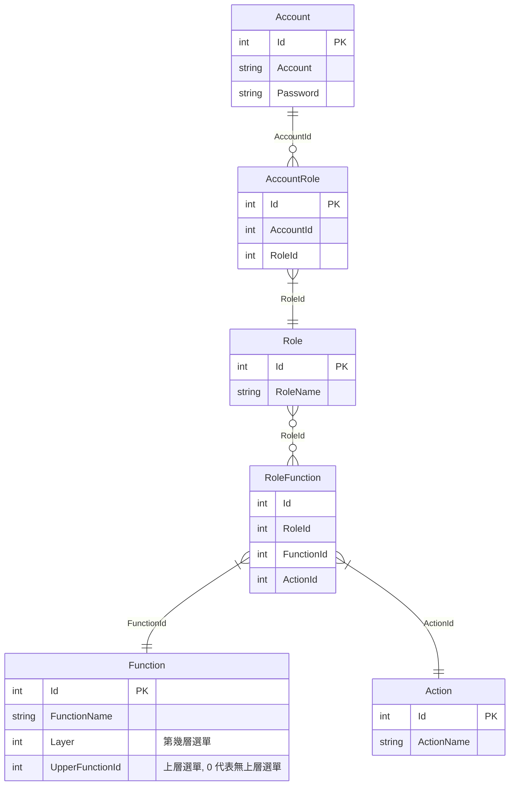

# 在 .Net Core WebApi 使用自訂的 Authentication handler 驗證 JWT

接續[在 .Net Core WebApi 使用 JWT 驗證](api_jwt.md)，總有些情況我們會想自訂驗證方式，例如
- jwt 不放在 header 的 Authorization 欄位，想放另一個自訂欄位
- 定義自己的驗證方式
- 設計在開發期間方便測試的後門
- 想改變驗證不過的回傳訊息

定義自己的 Authentication Handler
```csharp
public class MyAuthHandler : AuthenticationHandler<MyAuthenticationSchemeOptions>
{
    private static readonly Regex _regex = new(@"Bearer\s([\w\W]*)", RegexOptions.Compiled);
    private readonly IConfiguration _configuration;
    private readonly AuthSetting _authSetting;
    private readonly IList<Claim> _backdoorClaims;

    /// <inheritdoc />
    public MyAuthHandler(IConfiguration configuration, IOptionsMonitor<MyAuthenticationSchemeOptions> options, ILoggerFactory logger,
        UrlEncoder encoder, ISystemClock clock) : base(options, logger, encoder, clock)
    {
        _configuration = configuration;
        _authSetting = _configuration.GetSection("AuthSetting").Get<AuthSetting>();

        // 塞入後門 token
        _backdoorClaims = new List<Claim>()
        {
            new Claim("iss", _authSetting.Issuer),
            new Claim(JwtRegisteredClaimNames.Sub, "9999"),
            new Claim("role", MyRole.Administrator.ToString()),
            new Claim("role", MyRole.Teacher.ToString()),
            new Claim("role", MyRole.Student.ToString()),
        };
    }

    /// <inheritdoc />
    protected override async Task<AuthenticateResult> HandleAuthenticateAsync()
    {
        await Task.CompletedTask;
        
        // 取得自定義的欄位
        var hello = base.Options.Hello;
        
        // skip authentication if endpoint has [AllowAnonymous] attribute
        var endpoint = Context.GetEndpoint();
        if (endpoint?.Metadata?.GetMetadata<IAllowAnonymous>() != null)
            return AuthenticateResult.NoResult();

        var authToken = string.Empty;
        var key = Encoding.ASCII.GetBytes(_authSetting.Secret);

        // 撿查有沒有帶後門 token
        Request.Headers.TryGetValue(_authSetting.BackdoorHeaderName, out var backdoor);
        if (backdoor == _authSetting.BackdoorKeyword)
        {
            var identity = new ClaimsIdentity(_backdoorClaims, Scheme.Name, JwtRegisteredClaimNames.Sub, "role");
            var claims = new ClaimsPrincipal(new ClaimsIdentity(identity));
            return AuthenticateResult.Success(new AuthenticationTicket(claims, Scheme.Name));
        }

        if (!Request.Headers.TryGetValue(_authSetting.AuthorizationHeaderName, out var authValue))
        {
            var error = "token 格式錯誤";
            await WriteErrorResponse(StatusCodes.Status401Unauthorized, error);
            return AuthenticateResult.Fail(error);
        }

        var match = _regex.Match(authValue);
        if (match.Success)
            authToken = match.Groups[1].Value;

        var handler = new JwtSecurityTokenHandler();
        JwtSecurityToken jwtSecurityToken;
        try
        {
            jwtSecurityToken = handler.ReadJwtToken(authToken);
        }
        catch
        {
            var error = "Token Not Found.";
            await WriteErrorResponse(StatusCodes.Status401Unauthorized, error);
            return AuthenticateResult.Fail(error);
        }

        var validationParameters = new TokenValidationParameters
        {
            IssuerSigningKey = new SymmetricSecurityKey(key),
            ValidateIssuer = true,
            ValidIssuer = _authSetting.Issuer,
            ValidateAudience = true,
            ValidAudience = _authSetting.Audience,
            ValidateLifetime = true
        };

        try
        {
            handler.ValidateToken(authToken, validationParameters, out var validatedSecurityToken);
            var identity = new ClaimsIdentity(jwtSecurityToken.Claims, Scheme.Name, JwtRegisteredClaimNames.Sub, "role");
            var claims = new ClaimsPrincipal(identity);
            return AuthenticateResult.Success(new AuthenticationTicket(claims, Scheme.Name));
        }
        catch (SecurityTokenExpiredException)
        {
            var error = "Token 過期";
            await WriteErrorResponse(StatusCodes.Status401Unauthorized, error);
            return AuthenticateResult.Fail(error);
        }
        catch (SecurityTokenNotYetValidException)
        {
            var error = "查無 SecurityToken";
            await WriteErrorResponse(StatusCodes.Status406NotAcceptable, error);
            return AuthenticateResult.Fail(error);
        }
        catch (SecurityTokenValidationException ex)
        {
            var error = "驗證失敗";
            await WriteErrorResponse(StatusCodes.Status401Unauthorized, error);
            return AuthenticateResult.Fail(error);
        }
        catch (Exception ex)
        {
            var error = "Token 解析失敗";
            await WriteErrorResponse(StatusCodes.Status406NotAcceptable, error);
            return AuthenticateResult.Fail(error);
        }        
    }

    private async Task WriteErrorResponse(int statusCode, string error)
    {
        Context.Response.StatusCode = statusCode;
        var result = JsonSerializer.Serialize(new { error = error });
        Context.Response.ContentType = "application/json";
        await Context.Response.WriteAsync(result);
    }    
}
```

<br/>定義自己的 AuthenticationSchemeOptions, 可以帶自定義的值進去
```csharp
public class MyAuthenticationSchemeOptions: AuthenticationSchemeOptions
{
    public string Hello { get; set; }
}
```

<br/>在 program.cs 指定使用自己的 handler 作驗證
```csharp
public static class AuthenticationExtension
{
    public static IServiceCollection AddMyTokenAuthentication(this IServiceCollection services, IConfiguration config)
    {
        services.AddAuthentication("MyAuth") // 預設 schema
            .AddScheme<MyAuthenticationSchemeOptions, MyAuthHandler>("MyAuth", o =>
            {
                // 傳入自定義的欄位
                o.Hello = "Hello World!";
            });
    }

    return services;
}
```

```csharp
var configuration = builder.Configuration;

// Add services to the container.
builder.Services.AddControllers();
builder.Services.AddMyTokenAuthentication(configuration);
```

---

<br/>如此就可以使用原生的角色驗證方式

不過做到目前為止，還沒有看到在公司的專案有在用原生的角色驗證方式，或許是不夠彈性吧，而且 Roles 須傳入字串，不好維護的關係吧。

比較常看到的設計自己的 Role、Function、Action 的表
- 定義該帳號有哪些 Role
- 該 Role 有哪些 Function 
- 該 Role 在這個 Function 有哪些 Action，例如全部、新增、編輯、刪除、查詢、審核
- 以上述表格產出該帳號能看到的選單

todo 底下待 review

<br/>例如設計以下的 DB 關連


<br/>建立 Table 語法
```sql
CREATE TABLE [dbo].[MyAccount](
	[Id] [int] NOT NULL IDENTITY,	
	[Account] [varchar](250) NOT NULL,
PRIMARY KEY CLUSTERED 
(
	[Id] ASC
)WITH (PAD_INDEX  = OFF, STATISTICS_NORECOMPUTE  = OFF, IGNORE_DUP_KEY = OFF, ALLOW_ROW_LOCKS  = ON, ALLOW_PAGE_LOCKS  = ON) ON [PRIMARY]
) ON [PRIMARY]

INSERT [dbo].[MyAccount] ([Account]) VALUES (N'Curator'),
	(N'Mary'),
	(N'John')
GO

CREATE TABLE [dbo].[MyRole](
	[Id] [int] NOT NULL,	
	[Name] [nvarchar](250) NOT NULL,
PRIMARY KEY CLUSTERED 
(
	[Id] ASC
)WITH (PAD_INDEX  = OFF, STATISTICS_NORECOMPUTE  = OFF, IGNORE_DUP_KEY = OFF, ALLOW_ROW_LOCKS  = ON, ALLOW_PAGE_LOCKS  = ON) ON [PRIMARY]
) ON [PRIMARY]

INSERT [dbo].[MyRole] ([Id], [Name]) VALUES (1, N'Administrator'),
	(2, N'Teacher'),
	(3, N'Student')
GO

CREATE TABLE [dbo].[MyFunction](
	[Id] [int] NOT NULL,
	[Name] [nvarchar](250) NOT NULL,
	[Layer] int NOT NULL,
	[UpperFunctionId] int NOT NULL	
PRIMARY KEY CLUSTERED 
(
	[Id] ASC
)WITH (PAD_INDEX  = OFF, STATISTICS_NORECOMPUTE  = OFF, IGNORE_DUP_KEY = OFF, ALLOW_ROW_LOCKS  = ON, ALLOW_PAGE_LOCKS  = ON) ON [PRIMARY]
) ON [PRIMARY]

INSERT [dbo].[MyFunction] ([Id], [Name], [Layer], [UpperFunctionId]) VALUES (1, N'行政', 1, 0), 
	(2, N'增加帳號', 2, 1),
	(3, N'解鎖帳號', 2, 1),
	(4, N'請假', 2, 1),
	(5, N'課程', 1, 0),
	(6, N'設定課程', 2, 5),
	(7, N'取消課程', 2, 5),
	(8, N'加修課程', 2, 5),
	(9, N'退選課程', 2, 5)
GO

CREATE TABLE [dbo].[MyAction](
	[Id] [int] NOT NULL,
	[Name] [nvarchar](250) NOT NULL,
PRIMARY KEY CLUSTERED 
(
	[Id] ASC
)WITH (PAD_INDEX  = OFF, STATISTICS_NORECOMPUTE  = OFF, IGNORE_DUP_KEY = OFF, ALLOW_ROW_LOCKS  = ON, ALLOW_PAGE_LOCKS  = ON) ON [PRIMARY]
) ON [PRIMARY]

INSERT [dbo].[MyAction] ([Id], [Name]) VALUES (1, N'全部'), 
	(2, N'新增'),
	(3, N'編輯'),
	(4, N'刪除'),
	(5, N'查詢'),
	(6, N'審核')
GO

CREATE TABLE [dbo].[MyAccountRole](
	[Id] [int] NOT NULL IDENTITY,	
	[AccountId] [int] NOT NULL,
	[RoleId] [int] NOT NULL
PRIMARY KEY CLUSTERED 
(
	[Id] ASC
)WITH (PAD_INDEX  = OFF, STATISTICS_NORECOMPUTE  = OFF, IGNORE_DUP_KEY = OFF, ALLOW_ROW_LOCKS  = ON, ALLOW_PAGE_LOCKS  = ON) ON [PRIMARY]
) ON [PRIMARY]

INSERT [dbo].[MyAccountRole] ([AccountId], [RoleId]) VALUES (1, 1),
	(2, 2),
	(3, 3)
GO

CREATE TABLE [dbo].[MyRoleFunction](
	[Id] [int] NOT NULL IDENTITY,		
	[RoleId] [int] NOT NULL,
	[FunctionId] [int] NOT NULL,
	[ActionId] [int] NOT NULL
PRIMARY KEY CLUSTERED 
(
	[Id] ASC
)WITH (PAD_INDEX  = OFF, STATISTICS_NORECOMPUTE  = OFF, IGNORE_DUP_KEY = OFF, ALLOW_ROW_LOCKS  = ON, ALLOW_PAGE_LOCKS  = ON) ON [PRIMARY]
) ON [PRIMARY]

INSERT [dbo].[MyRoleFunction] ([RoleId], [FunctionId], [ActionId]) VALUES (1, 2, 1),
	(1, 3, 1),
	(1, 4, 1),
	(1, 6, 1),
	(1, 7, 1),
	(1, 8, 1),
	(1, 9, 1),
	(2, 4, 1),
	(2, 6, 1),
	(2, 7, 1),
	(3, 4, 1),
	(3, 8, 1),
	(3, 9, 1)
GO


```

<br/>就可以用以下的 sql 撈出該帳號擁有的角色和功能
```sql
DECLARE @account VARCHAR(250) = 'John'

SELECT a.Account,
       rf.RoleId,
       r.Name AS 'RoleName',
       rf.id  AS 'RoleFunctionId',
       rf.FunctionId,
       f.UpperFunctionId,
       f.Name AS 'FunctionName',
	   action.Name AS 'ActionName'
FROM MyRoleFunction rf
		JOIN MyAction action
              ON rf.ActionId = action.Id
         JOIN MyFunction f
              ON rf.FunctionId = f.Id
         JOIN MyAccountRole ar
              ON rf.RoleId = ar.RoleId
         JOIN MyRole r
              ON ar.RoleId = r.Id
         JOIN MyAccount a
              ON ar.AccountId = a.Id
WHERE a.Account = @account
```

<br/>再以下的 sql 撈出該帳號擁有的選單列表
```sql
DECLARE @account NVARCHAR(250) = 'Mary';

WITH MenuCTE(Account, Id, Layer, UpperFunctionId, Name) AS
         (SELECT a.Account, f.Id, f.Layer, f.UpperFunctionId, f.Name
          FROM MyFunction f
                   JOIN MyRoleFunction rf
                        ON f.Id = rf.FunctionId
                   JOIN MyAccountRole ar
                        ON rf.RoleId = ar.RoleId
				   JOIN MyAccount a
   				        ON ar.AccountId = a.Id
		  WHERE a.Account = @account
          UNION ALL
          SELECT a.Account, f.Id, f.Layer, f.UpperFunctionId, f.Name
          FROM MyFunction AS f
                   JOIN MyAccount a
                        ON a.Account = @account
                   INNER JOIN MenuCTE AS mc
                              ON f.Id = mc.UpperFunctionId)
SELECT DISTINCT Account, Id AS FunctionId, Layer, UpperFunctionId, Name
FROM MenuCTE;
```

todo 加上範例 code，在 action 上掛 filter, 檢查符合 Function, Action 的用戶才可使用