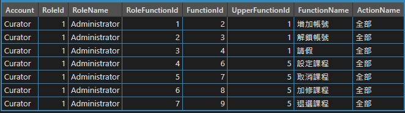
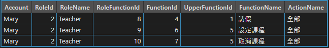
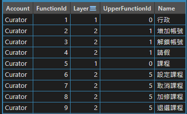
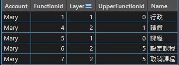
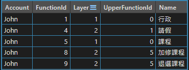

# 在 .Net Core WebApi 使用自訂的 Authentication handler 驗證 JWT

接續[在 .Net Core WebApi 使用 JWT 驗證](api_jwt.md)，總有些情況我們會想自訂驗證方式，例如
- jwt 不放在 header 的 Authorization 欄位，想放另一個自訂欄位
- 定義自己的驗證方式
- 設計在開發期間方便測試的後門
- 想改變驗證不過的回傳訊息

## 自訂 Authentication handler

定義自己的 Authentication Handler
```csharp
public class MyAuthHandler : AuthenticationHandler<MyAuthenticationSchemeOptions>
{
    private static readonly Regex _regex = new(@"Bearer\s([\w\W]*)", RegexOptions.Compiled);
    private readonly IConfiguration _configuration;
    private readonly AuthSetting _authSetting;
    private readonly IList<Claim> _backdoorClaims;

    /// <inheritdoc />
    public MyAuthHandler(IConfiguration configuration, IOptionsMonitor<MyAuthenticationSchemeOptions> options, ILoggerFactory logger,
        UrlEncoder encoder, ISystemClock clock) : base(options, logger, encoder, clock)
    {
        _configuration = configuration;
        _authSetting = _configuration.GetSection("AuthSetting").Get<AuthSetting>();

        // 塞入後門 token
        _backdoorClaims = new List<Claim>()
        {
            new Claim("iss", _authSetting.Issuer),
            new Claim(JwtRegisteredClaimNames.Sub, "9999"),
            new Claim("role", MyRole.Administrator.ToString()),
            new Claim("role", MyRole.Teacher.ToString()),
            new Claim("role", MyRole.Student.ToString()),
        };
    }

    /// <inheritdoc />
    protected override async Task<AuthenticateResult> HandleAuthenticateAsync()
    {
        await Task.CompletedTask;
        
        // 取得自定義的欄位
        var hello = base.Options.Hello;
        
        // skip authentication if endpoint has [AllowAnonymous] attribute
        var endpoint = Context.GetEndpoint();
        if (endpoint?.Metadata?.GetMetadata<IAllowAnonymous>() != null)
            return AuthenticateResult.NoResult();

        var authToken = string.Empty;
        var key = Encoding.ASCII.GetBytes(_authSetting.Secret);

        // 撿查有沒有帶後門 token
        Request.Headers.TryGetValue(_authSetting.BackdoorHeaderName, out var backdoor);
        if (backdoor == _authSetting.BackdoorKeyword)
        {
            var identity = new ClaimsIdentity(_backdoorClaims, Scheme.Name, JwtRegisteredClaimNames.Sub, "role");
            var claims = new ClaimsPrincipal(new ClaimsIdentity(identity));
            return AuthenticateResult.Success(new AuthenticationTicket(claims, Scheme.Name));
        }

        if (!Request.Headers.TryGetValue(_authSetting.AuthorizationHeaderName, out var authValue))
        {
            var error = "token 格式錯誤";
            await WriteErrorResponse(StatusCodes.Status401Unauthorized, error);
            return AuthenticateResult.Fail(error);
        }

        var match = _regex.Match(authValue);
        if (match.Success)
            authToken = match.Groups[1].Value;

        var handler = new JwtSecurityTokenHandler();
        JwtSecurityToken jwtSecurityToken;
        try
        {
            jwtSecurityToken = handler.ReadJwtToken(authToken);
        }
        catch
        {
            var error = "Token Not Found.";
            await WriteErrorResponse(StatusCodes.Status401Unauthorized, error);
            return AuthenticateResult.Fail(error);
        }

        var validationParameters = new TokenValidationParameters
        {
            IssuerSigningKey = new SymmetricSecurityKey(key),
            ValidateIssuer = true,
            ValidIssuer = _authSetting.Issuer,
            ValidateAudience = true,
            ValidAudience = _authSetting.Audience,
            ValidateLifetime = true
        };

        try
        {
            handler.ValidateToken(authToken, validationParameters, out var validatedSecurityToken);
            var identity = new ClaimsIdentity(jwtSecurityToken.Claims, Scheme.Name, JwtRegisteredClaimNames.Sub, "role");
            var claims = new ClaimsPrincipal(identity);
            return AuthenticateResult.Success(new AuthenticationTicket(claims, Scheme.Name));
        }
        catch (SecurityTokenExpiredException)
        {
            var error = "Token 過期";
            await WriteErrorResponse(StatusCodes.Status401Unauthorized, error);
            return AuthenticateResult.Fail(error);
        }
        catch (SecurityTokenNotYetValidException)
        {
            var error = "查無 SecurityToken";
            await WriteErrorResponse(StatusCodes.Status406NotAcceptable, error);
            return AuthenticateResult.Fail(error);
        }
        catch (SecurityTokenValidationException ex)
        {
            var error = "驗證失敗";
            await WriteErrorResponse(StatusCodes.Status401Unauthorized, error);
            return AuthenticateResult.Fail(error);
        }
        catch (Exception ex)
        {
            var error = "Token 解析失敗";
            await WriteErrorResponse(StatusCodes.Status406NotAcceptable, error);
            return AuthenticateResult.Fail(error);
        }        
    }

    private async Task WriteErrorResponse(int statusCode, string error)
    {
        Context.Response.StatusCode = statusCode;
        var result = JsonSerializer.Serialize(new { error = error });
        Context.Response.ContentType = "application/json";
        await Context.Response.WriteAsync(result);
    }    
}
```

<br/>定義自己的 AuthenticationSchemeOptions, 可以帶自定義的值進去
```csharp
public class MyAuthenticationSchemeOptions: AuthenticationSchemeOptions
{
    public string Hello { get; set; }
}
```

<br/>在 program.cs 指定使用自己的 handler 作驗證
```csharp
public static class AuthenticationExtension
{
    public static IServiceCollection AddMyTokenAuthentication(this IServiceCollection services, IConfiguration config)
    {
        services.AddAuthentication("MyAuth") // 預設 schema
            .AddScheme<MyAuthenticationSchemeOptions, MyAuthHandler>("MyAuth", o =>
            {
                // 傳入自定義的欄位
                o.Hello = "Hello World!";
            });
    }

    return services;
}
```

```csharp
var configuration = builder.Configuration;

// Add services to the container.
builder.Services.AddControllers();
builder.Services.AddMyTokenAuthentication(configuration);
```

<br/>如此就可以使用原生的角色驗證方式，想改寫回傳值可在 MyAuthHandler 內修改

在 header 裡帶上 ``` Backdoor: Wakanda Forever ``` 也可以存取任何 Action

---

## 自訂權限表

不過做到目前為止，還沒有在公司的專案看到有在用原生的角色驗證方式，猜想是以下原因：
- Roles 須傳入字串，不好維護的關係
- 不好盤點某 Role 有什麼權限，也就不好動態產生選單

比較常看到的設計自己的 Role、Function、Action 的資料表
- 定義該帳號有哪些 Role
- 該 Role 有哪些 Function 
- 該 Role 在這個 Function 有哪些 Action，例如全部、新增、編輯、刪除、查詢、審核
- 以上述表格產出該帳號能看到的選單

<br/>例如設計以下的 DB 關連


<br/>建立帳號 Table 語法
```sql
CREATE TABLE [dbo].[MyAccount](
	[Id] [int] NOT NULL IDENTITY,	
	[Account] [varchar](250) NOT NULL,
PRIMARY KEY CLUSTERED 
(
	[Id] ASC
)WITH (PAD_INDEX  = OFF, STATISTICS_NORECOMPUTE  = OFF, IGNORE_DUP_KEY = OFF, ALLOW_ROW_LOCKS  = ON, ALLOW_PAGE_LOCKS  = ON) ON [PRIMARY]
) ON [PRIMARY]

INSERT [dbo].[MyAccount] ([Account]) VALUES (N'Curator'),
	(N'Mary'),
	(N'John')
GO
```

<br/>建立權限 Table 語法
```sql
CREATE TABLE [dbo].[MyRole](
	[Id] [int] NOT NULL,	
	[Name] [nvarchar](250) NOT NULL,
PRIMARY KEY CLUSTERED 
(
	[Id] ASC
)WITH (PAD_INDEX  = OFF, STATISTICS_NORECOMPUTE  = OFF, IGNORE_DUP_KEY = OFF, ALLOW_ROW_LOCKS  = ON, ALLOW_PAGE_LOCKS  = ON) ON [PRIMARY]
) ON [PRIMARY]

INSERT [dbo].[MyRole] ([Id], [Name]) VALUES (1, N'Administrator'),
	(2, N'Teacher'),
	(3, N'Student')
GO

CREATE TABLE [dbo].[MyFunction](
	[Id] [int] NOT NULL,
	[Name] [nvarchar](250) NOT NULL,
	[Layer] int NOT NULL,
	[UpperFunctionId] int NOT NULL	
PRIMARY KEY CLUSTERED 
(
	[Id] ASC
)WITH (PAD_INDEX  = OFF, STATISTICS_NORECOMPUTE  = OFF, IGNORE_DUP_KEY = OFF, ALLOW_ROW_LOCKS  = ON, ALLOW_PAGE_LOCKS  = ON) ON [PRIMARY]
) ON [PRIMARY]

INSERT [dbo].[MyFunction] ([Id], [Name], [Layer], [UpperFunctionId]) VALUES (1, N'行政', 1, 0), 
	(2, N'增加帳號', 2, 1),
	(3, N'解鎖帳號', 2, 1),
	(4, N'請假', 2, 1),
	(5, N'課程', 1, 0),
	(6, N'設定課程', 2, 5),
	(7, N'取消課程', 2, 5),
	(8, N'加修課程', 2, 5),
	(9, N'退選課程', 2, 5)
GO

CREATE TABLE [dbo].[MyAction](
	[Id] [int] NOT NULL,
	[Name] [nvarchar](250) NOT NULL,
PRIMARY KEY CLUSTERED 
(
	[Id] ASC
)WITH (PAD_INDEX  = OFF, STATISTICS_NORECOMPUTE  = OFF, IGNORE_DUP_KEY = OFF, ALLOW_ROW_LOCKS  = ON, ALLOW_PAGE_LOCKS  = ON) ON [PRIMARY]
) ON [PRIMARY]

INSERT [dbo].[MyAction] ([Id], [Name]) VALUES (1, N'全部'), 
	(2, N'新增'),
	(3, N'編輯'),
	(4, N'刪除'),
	(5, N'查詢'),
	(6, N'審核')
GO
```

<br/>建立權限對應表 Table 語法
```sql
CREATE TABLE [dbo].[MyAccountRole](
	[Id] [int] NOT NULL IDENTITY,	
	[AccountId] [int] NOT NULL,
	[RoleId] [int] NOT NULL
PRIMARY KEY CLUSTERED 
(
	[Id] ASC
)WITH (PAD_INDEX  = OFF, STATISTICS_NORECOMPUTE  = OFF, IGNORE_DUP_KEY = OFF, ALLOW_ROW_LOCKS  = ON, ALLOW_PAGE_LOCKS  = ON) ON [PRIMARY]
) ON [PRIMARY]

INSERT [dbo].[MyAccountRole] ([AccountId], [RoleId]) VALUES (1, 1),
	(2, 2),
	(3, 3)
GO

CREATE TABLE [dbo].[MyRoleFunction](
	[Id] [int] NOT NULL IDENTITY,		
	[RoleId] [int] NOT NULL,
	[FunctionId] [int] NOT NULL,
	[ActionId] [int] NOT NULL
PRIMARY KEY CLUSTERED 
(
	[Id] ASC
)WITH (PAD_INDEX  = OFF, STATISTICS_NORECOMPUTE  = OFF, IGNORE_DUP_KEY = OFF, ALLOW_ROW_LOCKS  = ON, ALLOW_PAGE_LOCKS  = ON) ON [PRIMARY]
) ON [PRIMARY]

INSERT [dbo].[MyRoleFunction] ([RoleId], [FunctionId], [ActionId]) VALUES (1, 2, 1),
	(1, 3, 1),
	(1, 4, 1),
	(1, 6, 1),
	(1, 7, 1),
	(1, 8, 1),
	(1, 9, 1),
	(2, 4, 1),
	(2, 6, 1),
	(2, 7, 1),
	(3, 4, 1),
	(3, 8, 1),
	(3, 9, 1)
GO
```

<br/>就可以用以下的 sql 撈出該帳號擁有的角色和功能
```sql
DECLARE @account VARCHAR(250) = 'John';

SELECT a.Account,
       rf.RoleId,
       r.Name AS 'RoleName',
       rf.id  AS 'RoleFunctionId',
       rf.FunctionId,
       f.UpperFunctionId,
       f.Name AS 'FunctionName',
	   action.Name AS 'ActionName'
FROM MyRoleFunction rf
		JOIN MyAction action
              ON rf.ActionId = action.Id
         JOIN MyFunction f
              ON rf.FunctionId = f.Id
         JOIN MyAccountRole ar
              ON rf.RoleId = ar.RoleId
         JOIN MyRole r
              ON ar.RoleId = r.Id
         JOIN MyAccount a
              ON ar.AccountId = a.Id
WHERE a.Account = @account
```

Administrator 權限<br/>


Teacher 權限<br/>


Student 權限<br/>


<br/>再以下的 sql 撈出該帳號擁有的選單列表
```sql
DECLARE @account NVARCHAR(250) = 'Mary';

WITH MenuCTE(Account, Id, Layer, UpperFunctionId, Name) AS
         (SELECT a.Account, f.Id, f.Layer, f.UpperFunctionId, f.Name
          FROM MyFunction f
                   JOIN MyRoleFunction rf
                        ON f.Id = rf.FunctionId
                   JOIN MyAccountRole ar
                        ON rf.RoleId = ar.RoleId
				   JOIN MyAccount a
   				        ON ar.AccountId = a.Id
		  WHERE a.Account = @account
          UNION ALL
          SELECT a.Account, f.Id, f.Layer, f.UpperFunctionId, f.Name
          FROM MyFunction AS f
                   JOIN MyAccount a
                        ON a.Account = @account
                   INNER JOIN MenuCTE AS mc
                              ON f.Id = mc.UpperFunctionId)
SELECT DISTINCT Account, Id AS FunctionId, Layer, UpperFunctionId, Name
FROM MenuCTE;
```

Administrator 選單<br/>


Teacher 選單<br/>


Student 選單<br/>


<br/>修改 UserInfo model
```
public class UserInfo
{
    public string UserId { get; set; }
    public string DisplayName { get; set; }
    public string Email { get; set; }
    public List<string> Roles { get; set; }
    public Dictionary<MyFunction, MyAction[]> FunctionDict;
}
```

<br/>修改 JwtHelper，修改將角色、權限表放入 token 的方式，
```csharp
public class JwtHelper
{
    private readonly AuthSetting _authSetting;

    public JwtHelper(IConfiguration config)
    {
        _authSetting = config.GetSection("AuthSetting").Get<AuthSetting>();
    }
    
    public string GenerateSecurityToken(int userId, string userDisplayName, string email, List<MyRole> roles,
        Dictionary<MyFunction, MyAction[]> functionDict)
    {
        var tokenHandler = new JwtSecurityTokenHandler();
        var key = Encoding.ASCII.GetBytes(_authSetting.Secret);

        var claims = new List<Claim>()
        {
            new Claim(JwtRegisteredClaimNames.Sub, userId.ToString()),
            new Claim("display_name", userDisplayName),
            new Claim(JwtRegisteredClaimNames.Iss, _authSetting.Issuer),
            new Claim(JwtRegisteredClaimNames.Jti, Guid.NewGuid().ToString()),
            new Claim(ClaimTypes.Email, email),
            new Claim(ClaimTypes.Role, JsonSerializer.Serialize(roles)),
            new Claim("function", JsonSerializer.Serialize(functionDict)),
        };
        
        var tokenDescriptor = new SecurityTokenDescriptor
        {
            Subject = new ClaimsIdentity(claims.ToArray()),
            Audience = _authSetting.Audience,
            Expires = DateTime.UtcNow.AddMinutes(_authSetting.ExpirationInMinutes),
            SigningCredentials = new SigningCredentials(new SymmetricSecurityKey(key), SecurityAlgorithms.HmacSha256Signature)
        };

        var token = tokenHandler.CreateToken(tokenDescriptor);

        return tokenHandler.WriteToken(token);
    }
}
```

<br/>因為放 token 的方式變了，FetchUserInfoAttribute 也須修改
```
public class FetchUserInfo2Attribute : ActionFilterAttribute
{
    /// <inheritdoc />
    public override void OnActionExecuting(ActionExecutingContext context)
    {
        if (!context.HttpContext.User.Identity.IsAuthenticated)
        {
            return;
        }
        
        var userInfo = new UserInfo2()
        {
            UserId = context.HttpContext.User.Identity?.Name,
            DisplayName = context.HttpContext.User.Claims.Where(c => c.Type == "display_name").FirstOrDefault()?.Value,
            Email = context.HttpContext.User.Claims.Where(c => c.Type == ClaimTypes.Email).FirstOrDefault()?.Value,
            Roles = context.HttpContext.User.Claims.Where(c => c.Type == ClaimTypes.Role).Select(c => c.Value).ToList(),
            FunctionDict = JsonSerializer.Deserialize<Dictionary<MyFunction, MyAction[]>>(context.HttpContext.User.Claims.Where(c => c.Type == "function").FirstOrDefault()?.Value)
        };
        context.HttpContext.Items["user_info"] = userInfo;
    }
}
```

<br/>增加 MyPermissionAttribute，從 token 取出權限表並做驗證
```csharp
public class MyPermissionAttribute : AuthorizeAttribute, IAuthorizationFilter
{
     private readonly MyFunction _functionEnum;
     private readonly MyAction[] _actionEnums;
     
     public MyPermissionAttribute(MyFunction functionEnum, MyAction[] actionEnums)
     {
          _functionEnum = functionEnum;
          _actionEnums = actionEnums;
     }
     
     /// <inheritdoc />
     public void OnAuthorization(AuthorizationFilterContext context)
     {
          var userFunctionDict = JsonSerializer.Deserialize<Dictionary<MyFunction, MyAction[]>>(context.HttpContext.User.Claims.Where(c => c.Type == "function").FirstOrDefault()?.Value);
          
          if (userFunctionDict == null)
          {
               context.Result = new MyMethodNotAllowedResult();
               return;
          }

          if (!userFunctionDict.ContainsKey(_functionEnum))
          {
               context.Result = new MyMethodNotAllowedResult();
               return;
          }
          
          var userActions = userFunctionDict[_functionEnum];
          if (!userActions.Any(u => _actionEnums.Contains(u)))
          {
               context.Result = new MyMethodNotAllowedResult();
               return;
          }
          
          // 符合權限
          return;
     }
}

/// <summary>
/// A <see cref="StatusCodeResult"/> that when
/// executed will produce a Bad Request (405) response.
/// </summary>
[DefaultStatusCode(DefaultStatusCode)]
public class MyMethodNotAllowedResult : StatusCodeResult
{
     private const int DefaultStatusCode = StatusCodes.Status405MethodNotAllowed;

     /// <summary>
     /// Creates a new <see cref="MyMethodNotAllowedResult"/> instance.
     /// </summary>
     public MyMethodNotAllowedResult()
          : base(DefaultStatusCode)
     {
     }
}
```

<br/>加入 FetchUserInfoAttribute，解析 token 並將資料放進 HttpContext.Items，如此就可供同個 request 做後續使用
```csharp
public class FetchUserInfoAttribute : ActionFilterAttribute
{
    [MyPermission(MyFunction.SetCourse, new MyAction[] { MyAction.All })]
    [HttpPost, Route("set_course")]
    [FetchUserInfo]
    public IActionResult SetCourse([FromBody] Course course)
    {
        var userInfo = HttpContext.Items["user_info"] as UserInfo;
        var courseService = new CourseService();
        courseService.Add(userInfo, course);
        
        return Ok($"{nameof(SetCourse)} OK");
    }
}
```

這樣的做法會讓權限設定移到 DB 資料表，也讓 jwt 的長度變長(雖然可以有 4K 的長度)。如果想讓 jwt 只帶角色，又想在 DB 設定權限表，就要讓服務在驗證權限時去讀取 DB。

若再進一步為了效能考量，可將 DB 的權限表放入記憶體或 Redis，也想要更新機制，例如定時更新 Redis 的權限表、更新某個角色的權限表後，要使所有含有該角色的帳號皆使用新設定。越想越麻煩...