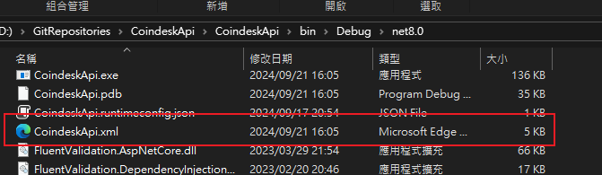
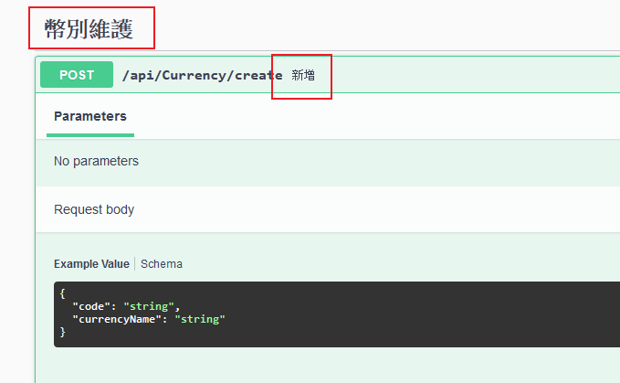
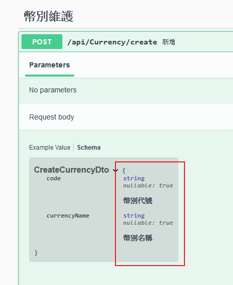
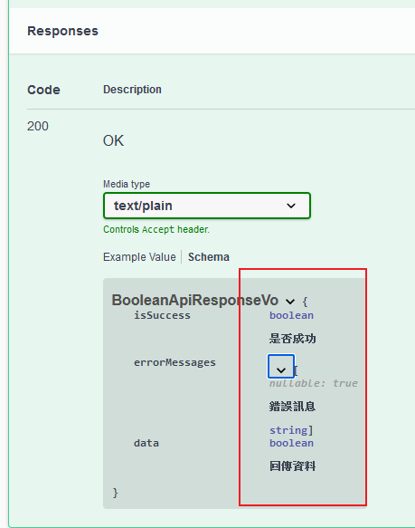

# [套件]Swagger - 讓 Swagger 可以抓到 summary 的描述

設定 .csproj 加上 `GenerateDocumentationFile`，讓它在 build 時會依據 summary 產生 xml 文件  

```xml
<PropertyGroup>
    <TargetFramework>net8.0</TargetFramework>
    <Nullable>enable</Nullable>
    <ImplicitUsings>enable</ImplicitUsings>
    <GenerateDocumentationFile>True</GenerateDocumentationFile>
    <DockerDefaultTargetOS>Linux</DockerDefaultTargetOS>
</PropertyGroup>
```

這裡用預設的路徑產出 xml 文件檔的路徑，可以在 {專案資料夾}\bin\Debug\net8.0  的{專案名稱}.xml 找到，當然你也可以指定產出的路徑  

  

在 program.cs 注入 swagger 時，指定去讀取該 xml 文件  

```csharp
builder.Services.AddSwaggerGen(c =>
{
    c.EnableAnnotations();
    c.IncludeXmlComments(Path.Combine(AppDomain.CurrentDomain.BaseDirectory, $"CoindeskApi.xml"));
});
```

在程式碼中加上 summary 的描述  

Controller Action

```csharp
/// <summary>
/// 新增
/// </summary>
/// <param name="createCurrencyDto"></param>
/// <returns></returns>
[HttpPost("create")]
[SwaggerOperation(Tags = new[] { "幣別維護" })]
[ProducesResponseType(typeof(ApiResponseVo<bool>), 200)]
public async Task<IActionResult> Create([FromBody] CreateCurrencyDto createCurrencyDto)
{
    await _currencyService.CreateAsync(createCurrencyDto);
        
    return Ok(ApiResponseVo<bool>.CreateSuccess(true));
}
```

Request Model

```csharp
public class CreateCurrencyDto
{
    /// <summary>
    /// 幣別代號
    /// </summary>
    public string Code { get; set; }

    /// <summary>
    /// 幣別名稱
    /// </summary>
    public string CurrencyName { get; set; }
}
```

Response Model

```csharp
public class ApiResponseVo<T>
{
    /// <summary>
    /// 是否成功
    /// </summary>
    public bool IsSuccess { get; set; }
    
    /// <summary>
    /// 錯誤訊息
    /// </summary>
    public List<string> ErrorMessages { get; set; }
    
    /// <summary>
    /// 回傳資料
    /// </summary>
    public T Data { get; set; }
}
```

執行專案後，打開 swagger 就可以看到 summary 的描述  

swagger 在 Controller Action 會出現 summary 的描述  
  

swagger 在 Request Model 會出現 summary 的描述  
  

swagger 在 Response Model 會出現 summary 的描述  
  


優點：  
註解不用寫兩次，寫在 summary 標籤裡，讓程式和 swagger 都會出現。就不用掛 `SwaggerOperation`、`SwaggerParameter`、`SwaggerSchema` 之類的 attribute

缺點：  
會出現很多 warning ，[CS1591]遺漏公用可見類型或成員 'XXX' 的 XML 註解，提示你要補上 summary，不過這應該調整規則去忽略掉

>[CS1591] 遺漏公用可見類型或成員 'CoindeskController' 的 XML 註解  
[CS1591] 遺漏公用可見類型或成員 'CoindeskController.CoindeskController(ICurrencyService)' 的 XML 註解  
[CS1591] 遺漏公用可見類型或成員 'CurrencyController' 的 XML 註解  
[CS1591] 遺漏公用可見類型或成員 'CurrencyController.CurrencyController(ICurrencyService)' 的 XML 註解  
[CS1591] 遺漏公用可見類型或成員 'TestController' 的 XML 註解  
[CS1591] 遺漏公用可見類型或成員 'TestController.TestController(ICurrencyRepository)' 的 XML 註解  
