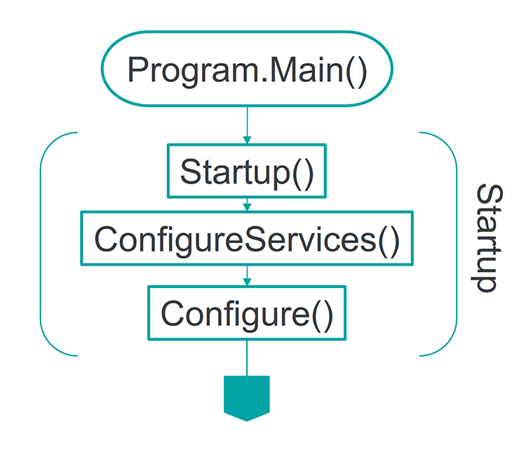
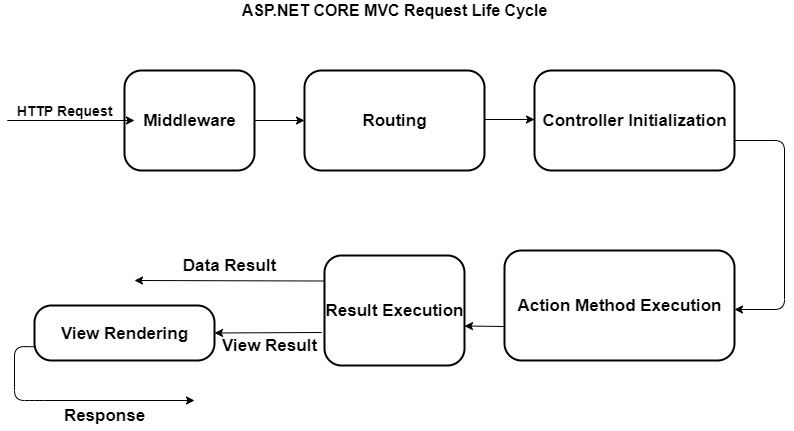
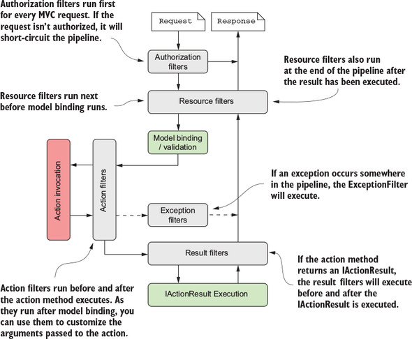

# [.Net Core]Request Life Cycle

## Startup

## MVC Request Life Cycle

## Filter Pipeline

根據 [MSDN(Filters in ASP.NET Core)](https://learn.microsoft.com/en-us/aspnet/core/mvc/controllers/filters?view=aspnetcore-8.0#exception-filters)

Model binding / validation 不過，不會經過 Action Filter，但會經過 Result Filter  
Actuin Filter 出例外，會經過 Exception Filter，Result Filter 出例外，不會經過 Exception Filter  

IAcionFilter, IAasyncFilter 選一個實作即可，在執行階段若框架發現你兩個都有實作，會執行非同步介面的實作而略過同步介面的實作。所以選適合的介面實作即可。  
