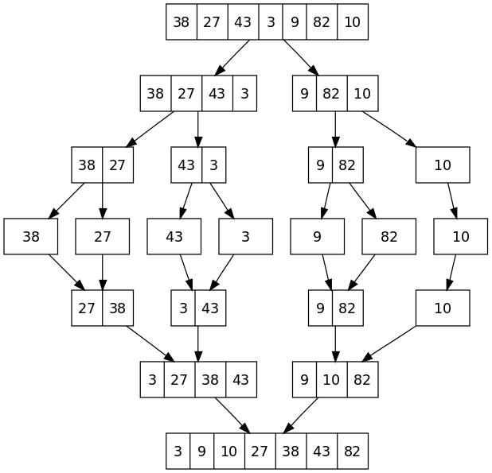

# Merge Sort

是一種 Divide and Conquer 的排序方式  
不斷地將資料分成兩等分，直到每份的資料量小到一個程度後，各自排序後再一一合併起來。  

假設現在有 n 筆資料需要進行排序。  
 
 則我們首先會將這 n 筆資料分成兩等分（大小皆為 n/2）；接著，再將這兩堆大小為 n/2 的資料各自分為兩等分（大小皆為 n/4）；同樣的，我們再將這四堆大小為 n/4 的資料各自分為兩等分（大小皆為 n/8）。  
 
如此進行下去，直到每堆的資料量足夠小（例如：每堆只剩 1 筆資料）之後，我們就分別將每堆資料進行排序，再將這些資料堆兩兩一對進行合併，直到排序完成為止。  

時間複雜度固定為 O(n * log(n))  
需要額外的空間  



C# 程式碼  
```csharp
public Main()
{
    var nums = new int [] { 3, 2, 1, 5, 6, 4 };
    MergeSort(nums);
}

private void MergeSort(int[] nums)
{
    Merge(nums, 0, nums.Length - 1);
}

private void Merge(int[] nums, int start, int end)
{
    if (start == end)
    {
        return;
    }
    
    var center = (start + end) / 2;
    Merge(nums, start, center);
    Merge(nums, center + 1, end);
    var temp = new int [end - start + 1];
    var index = 0;
    var left = start;
    var right = center + 1;
    
    while (left <= center && right <= end)
    {
        if (nums[left] < nums[right])
        {
            temp[index] = nums[left];
            left++;
            index++;
        }
        else
        {
            temp[index] = nums[right];
            right++;
            index++;
        }
    }
    
    while (left <= center)
    {
        temp[index] = nums[left];
        left++;
        index++;
    }
    
    while (right <= end)
    {
        temp[index] = nums[right];
        right++;
        index++;
    }
                
    Array.Copy(temp, 0, nums, start, temp.Length);
}
```