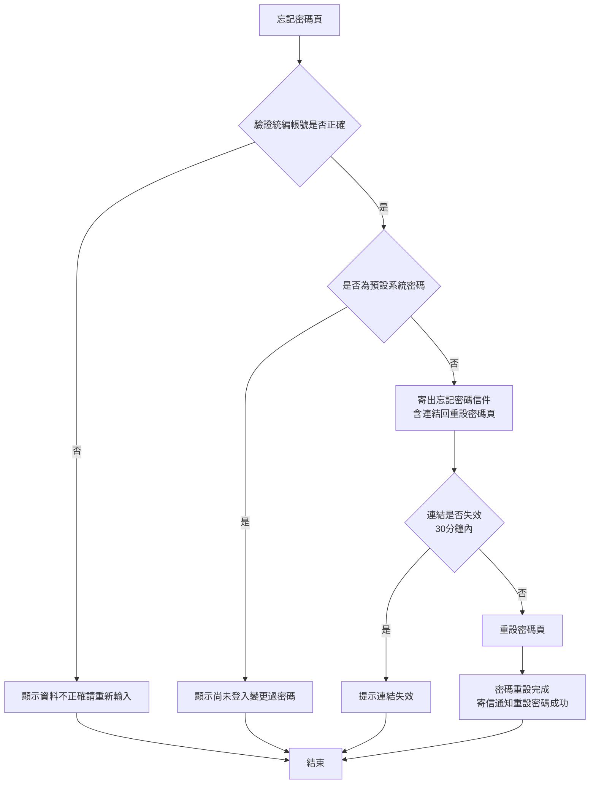
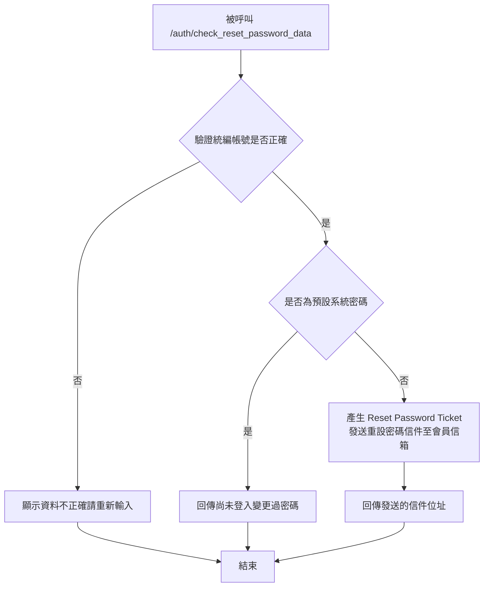

# 忘記密碼流程

## 忘記密碼

### Sequence Diagram

```mermaid
sequenceDiagram
participant User
participant FE
participant BE
participant Redis
participant DataBase

User ->>+ FE: 點選忘記密碼
FE ->>+ User: 顯示忘記密碼畫面
User ->>+ FE: 輸入統編、帳號
FE ->>+ BE: /auth/check_reset_password_data
BE ->>+ BE: 發送重設密碼信件至會員信箱<br/>產生 Reset Password Ticket
BE ->>+ Redis: 儲存 Reset Password Ticket
Redis ->>+ BE: 
BE ->>+ FE: 回傳發送的信箱位置
FE ->>+ User: 提示會員去收信

User ->>+ FE: 點選信中的重設密碼連結
FE ->>+ BE: 帶上重設密碼連結中的 Reset Password Ticket<br/>/auth/check_reset_password_token
BE ->>+ Redis: 確認 Reset Password Ticket 是否存在
Redis ->>+ BE: 
BE ->>+ FE: 回傳 Reset Password Ticket 是否仍有效

alt Reset Password Ticket 已失效
  FE ->>+ User: 提示連結失效，請重新申請重設密碼
else 仍有效
  FE ->>+ User: 顯示重設密碼畫面
  User ->>+ FE: 輸入新密碼
  FE ->>+ BE: 加上重設密碼連結中的 Reset Password Ticket<br/>/auth/change_password
end

BE ->>+ Redis: 以 Reset Password Ticket 取回帳號
Redis ->>+ BE: 
BE ->>+ DataBase: 更新帳號資料
DataBase ->>+ BE: 
BE ->>+ BE: 發重設密碼成功信至會員信箱
BE ->>+ Redis: 刪除 Reset Password Ticket
Redis ->>+ BE: 
BE ->>+ FE: 回傳更改密碼成功
FE ->>+ User: 提示更改密碼成功
```

### Flow Chart

```mermaid
flowchart TD
A[忘記密碼頁] --> B{驗證統編帳號是否正確}
B --> |是| C{是否為預設系統密碼}
B --> |否| D[顯示資料不正確請重新輸入] --> K[結束]
C --> |是| E[顯示尚未登入變更過密碼] --> K
C --> |否| F[寄出忘記密碼信件<br/>含連結回重設密碼頁]
F --> G{連結是否失效\n30分鐘內}
G --> |是| H[提示連結失效] --> K
G --> |否| I[重設密碼頁]
I --> J[密碼重設完成<br/>寄信通知重設密碼成功]
J --> K
```

先往失敗的情況(會立即結束))寫, 再寫成功的情況(較長)

```mermaid
flowchart TD
A[被呼叫 /auth/check_reset_password_data] --> B{驗證統編帳號是否正確}
B --> |否| C[顯示資料不正確請重新輸入] --> K[結束]
B --> |是| D{是否為預設系統密碼}
D --> |是| E[回傳尚未登入變更過密碼] --> K
D --> |否|F[產生 Reset Password Ticket<br/>發送重設密碼信件至會員信箱]
F --> G[回傳發送的信件位址] --> K
```

---