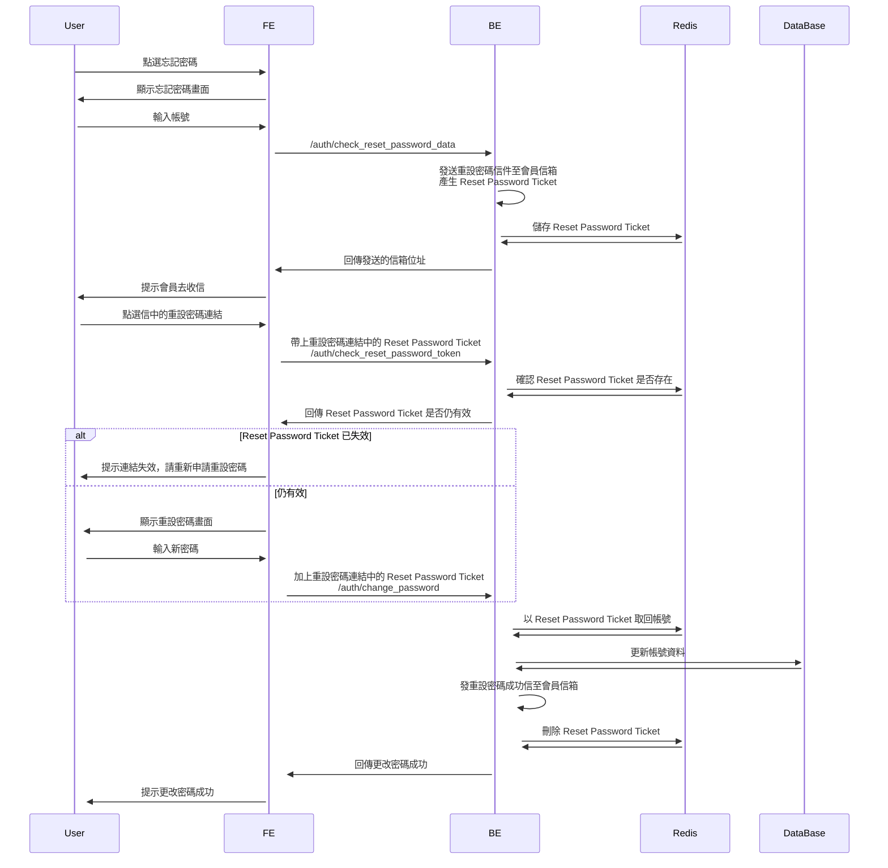
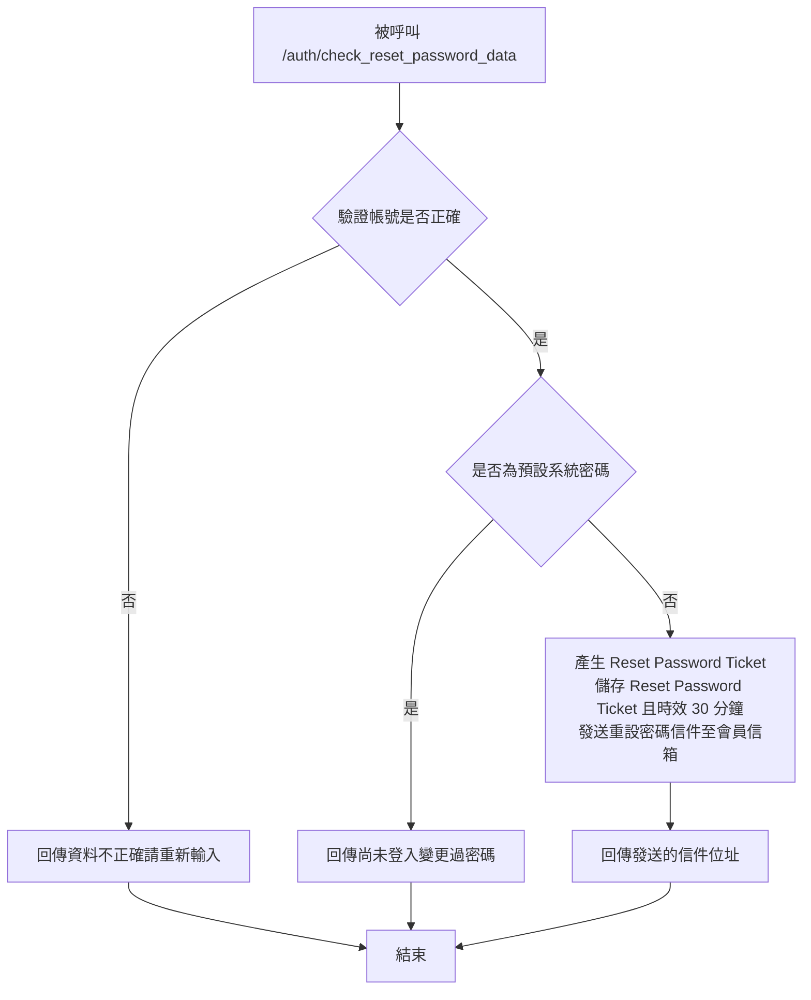
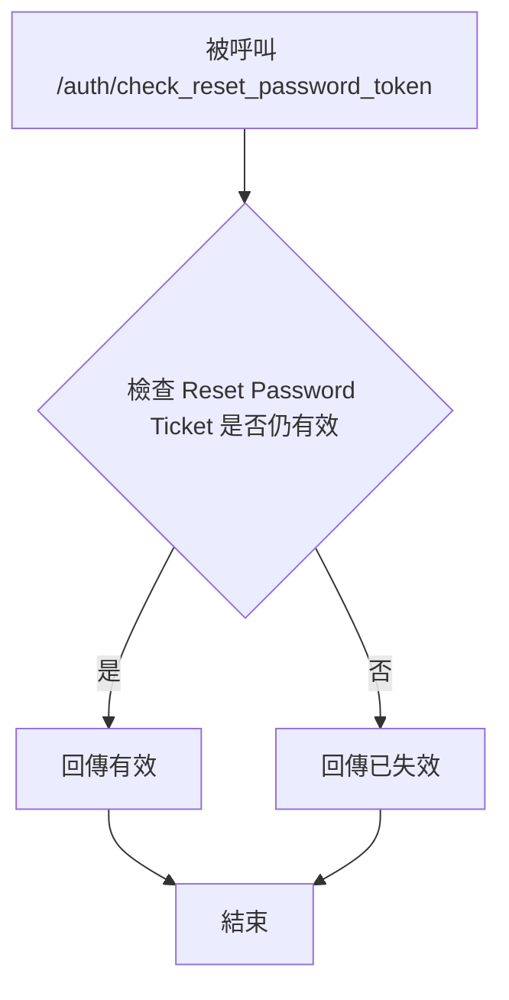
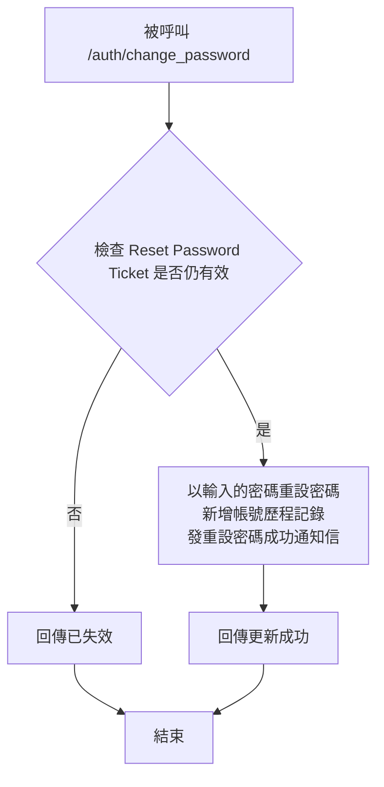

# 忘記密碼流程

## 忘記密碼

### Sequence Diagram

```mermaid
sequenceDiagram
participant User
participant FE
participant BE
participant Redis
participant DataBase

User ->>+ FE: 點選忘記密碼
FE ->>+ User: 顯示忘記密碼畫面
User ->>+ FE: 輸入帳號
FE ->>+ BE: /auth/check_reset_password_data
BE ->>+ BE: 發送重設密碼信件至會員信箱<br/>產生 Reset Password Ticket
BE ->>+ Redis: 儲存 Reset Password Ticket
Redis ->>+ BE: 
BE ->>+ FE: 回傳發送的信箱位址
FE ->>+ User: 提示會員去收信

User ->>+ FE: 點選信中的重設密碼連結
FE ->>+ BE: 帶上重設密碼連結中的 Reset Password Ticket<br/>/auth/check_reset_password_token
BE ->>+ Redis: 確認 Reset Password Ticket 是否存在
Redis ->>+ BE: 
BE ->>+ FE: 回傳 Reset Password Ticket 是否仍有效

alt Reset Password Ticket 已失效
  FE ->>+ User: 提示連結失效，請重新申請重設密碼
else 仍有效
  FE ->>+ User: 顯示重設密碼畫面
  User ->>+ FE: 輸入新密碼
  FE ->>+ BE: 加上重設密碼連結中的 Reset Password Ticket<br/>/auth/change_password
end

BE ->>+ Redis: 以 Reset Password Ticket 取回帳號
Redis ->>+ BE: 
BE ->>+ DataBase: 更新帳號資料
DataBase ->>+ BE: 
BE ->>+ BE: 發重設密碼成功信至會員信箱
BE ->>+ Redis: 刪除 Reset Password Ticket
Redis ->>+ BE: 
BE ->>+ FE: 回傳更改密碼成功
FE ->>+ User: 提示更改密碼成功
```

### Flow Chart

#### /auth/check_reset_password_data

```mermaid
flowchart TD
A[被呼叫 /auth/check_reset_password_data] --> B{驗證帳號是否正確}
B --> |否| C[回傳資料不正確請重新輸入] --> K[結束]
B --> |是| D{是否為預設系統密碼}
D --> |是| E[回傳尚未登入變更過密碼] --> K
D --> |否| F[產生 Reset Password Ticket<br/>儲存 Reset Password Ticket 且時效 30 分鐘<br/>發送重設密碼信件至會員信箱]
F --> G[回傳發送的信件位址] --> K
```

#### /auth/check_reset_password_token

```mermaid
flowchart TD
A[被呼叫 /auth/check_reset_password_token] --> B{檢查 Reset Password Ticket 是否仍有效}
B --> |是| C[回傳有效] --> D[結束]
B --> |否| E[回傳已失效] --> D
```

#### /auth/change_password

```mermaid
flowchart TD
A[被呼叫 /auth/change_password] --> B{檢查 Reset Password Ticket 是否仍有效}
B --> |否| C[回傳已失效] --> D[結束]
B --> |是| E[以輸入的密碼重設密碼<br/>新增帳號歷程記錄<br/>發重設密碼成功通知信]
E --> F[回傳更新成功] --> D
```

---