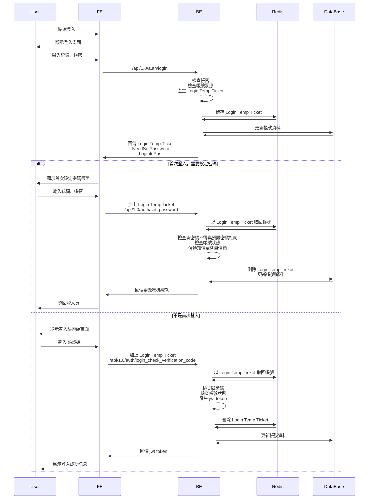
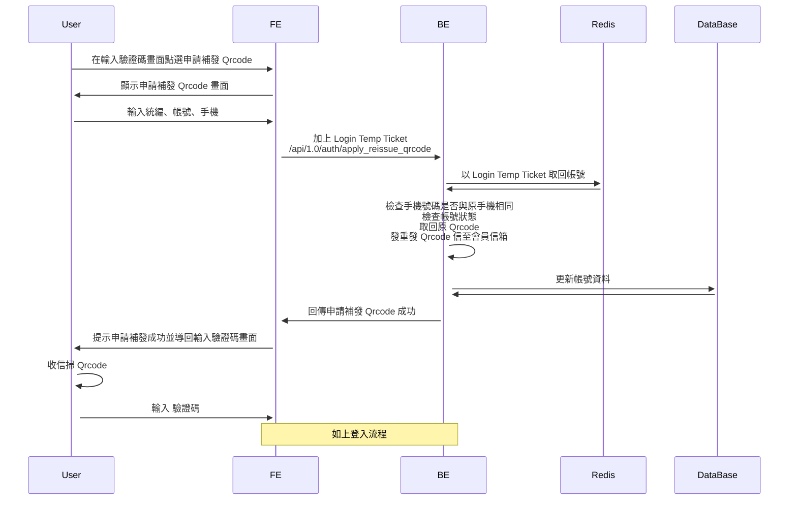

# 登入流程

## 登入

### Sequence Diagram

```mermaid
sequenceDiagram
participant User
participant FE
participant BE
participant Redis
participant DataBase

User ->>+ FE: 點選登入
FE ->>+ User: 顯示登入畫面
User ->>+ FE: 輸入統編、帳密
FE ->>+ BE: /api/1.0/auth/login
BE ->>+ BE: 檢查帳密<br/>檢查帳號狀態<br/>產生 Login Temp Ticket
BE ->>+ Redis: 儲存 Login Temp Ticket
Redis ->>+ BE: 
BE ->>+ DataBase: 更新帳號資料
DataBase ->>+ BE: 
BE ->>+ FE: 回傳 Login Temp Ticket<br/>NeedSetPassword<br/>LoginInPast

alt 首次登入，需要設定密碼
  FE ->>+ User: 顯示首次設定密碼畫面
  User ->>+ FE: 輸入統編、帳密
  FE ->>+ BE: 加上 Login Temp Ticket<br/>/api/1.0/auth/set_password
  BE ->>+ Redis: 以 Login Temp Ticket 取回帳號
  Redis ->>+ BE: 
  BE ->>+ BE: 檢查新密碼不得與預設密碼相同<br/>檢查帳號狀態<br/>發通知信至會員信箱
  BE ->>+ DataBase: 刪除 Login Temp Ticket<br/>更新帳號資料
  DataBase ->>+ BE: 
  BE ->>+ FE: 回傳更改密碼成功
  FE ->>+ User: 導回登入頁
else 不是首次登入
  FE ->>+ User: 顯示輸入驗證碼畫面
  User ->>+ FE: 輸入 驗證碼
  FE ->>+ BE: 加上  Login Temp Ticket<br/>/api/1.0/auth/login_check_verification_code
  BE ->>+ Redis: 以 Login Temp Ticket 取回帳號
  Redis ->>+ BE: 
  BE ->>+ BE: 檢查驗證碼<br/>檢查帳號狀態<br/>產生 jwt token
  BE ->>+ Redis: 刪除 Login Temp Ticket
  Redis ->>+ BE: 
  BE ->>+ DataBase: 更新帳號資料
  DataBase ->>+ BE: 
  BE ->>+ FE: 回傳 jwt token
  FE ->>+ User: 顯示登入成功訊息
end
```

### Flow Chart

---

## 申請重發 QrCpoe

### Sequence Diagram

```mermaid
sequenceDiagram
participant User
participant FE
participant BE
participant Redis
participant DataBase

User ->>+ FE: 在輸入驗證碼畫面點選申請補發 Qrcode
FE ->>+ User: 顯示申請補發 Qrcode 畫面
User ->>+ FE: 輸入統編、帳號、手機
FE ->>+ BE: 加上 Login Temp Ticket<br/>/api/1.0/auth/apply_reissue_qrcode
BE ->>+ Redis: 以 Login Temp Ticket 取回帳號
Redis ->>+ BE: 
BE ->>+ BE: 檢查手機號碼是否與原手機相同<br/>檢查帳號狀態<br/>取回原 Qrcode<br/>發重發 Qrcode 信至會員信箱
BE ->>+ DataBase: 更新帳號資料
DataBase ->>+ BE: 
BE ->>+ FE: 回傳申請補發 Qrcode 成功
FE ->>+ User: 提示申請補發成功並導回輸入驗證碼畫面
User ->>+ User: 收信掃 Qrcode
User ->>+ FE: 輸入 驗證碼
Note over FE, BE: 如上登入流程
```

### Flow Chart

---

## 申請更新 QrCpoe

### Sequence Diagram

```mermaid
sequenceDiagram
participant User
participant FE
participant BE
participant Redis
participant DataBase

User ->>+ FE: 在輸入驗證碼畫面點選申請更新 Qrcode
FE ->>+ User: 顯示申請更新 Qrcode 畫面
User ->>+ FE: 輸入統編、帳號、手機
FE ->>+ BE: 加上 Login Temp Ticket<br/>/api/1.0/auth/apply_update_qrcode
BE ->>+ Redis: 以 Login Temp Ticket 取回帳號
Redis ->>+ BE: 
BE ->>+ BE: 檢查手機號碼是否與原手機相同<br/>檢查帳號狀態<br/>產生新 Qrcode<br/>發更新 Qrcode 信至會員信箱
BE ->>+ DataBase: 更新帳號資料
DataBase ->>+ BE: 
BE ->>+ FE: 回傳申請更新 Qrcode 成功
FE ->>+ User: 提示申請更新成功並導回輸入驗證碼畫面
User ->>+ User: 收信掃 Qrcode
User ->>+ FE: 輸入 驗證碼
Note over FE, BE: 如上登入流程
```

### Flow Chart