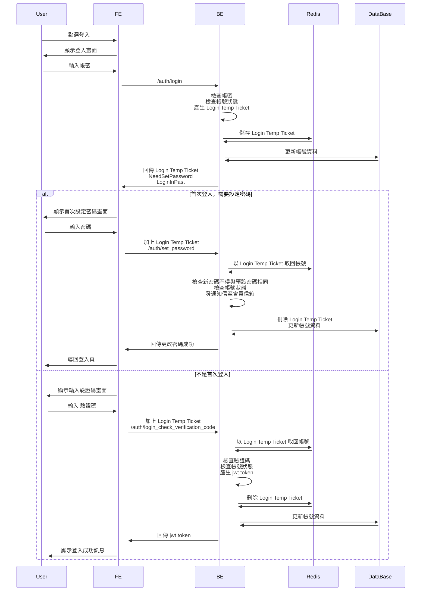
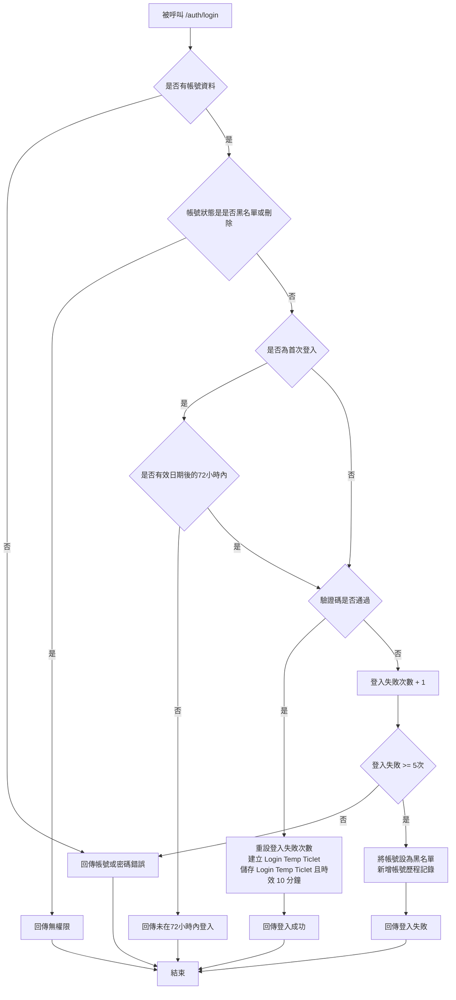
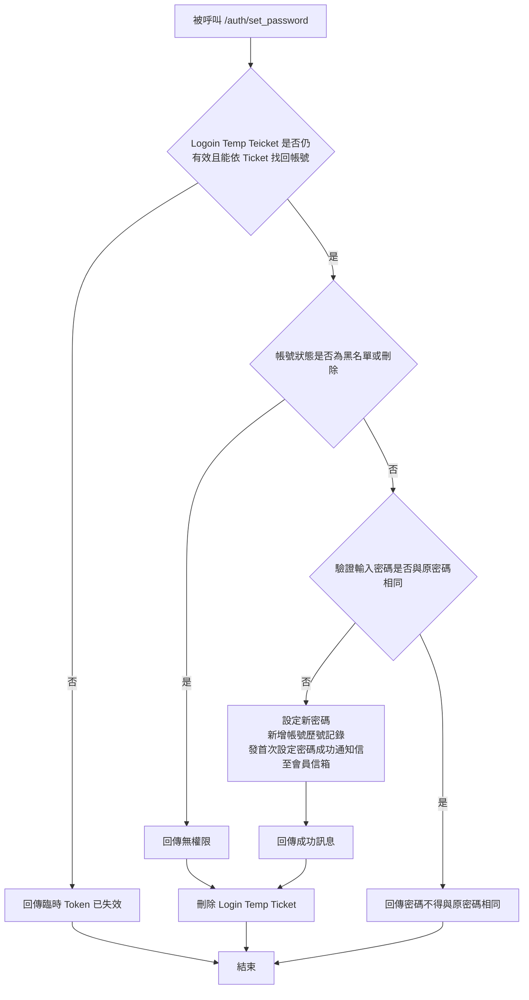
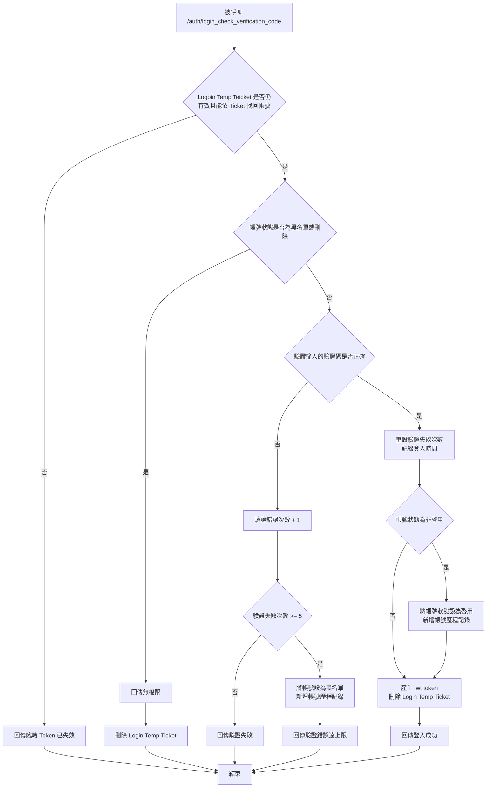
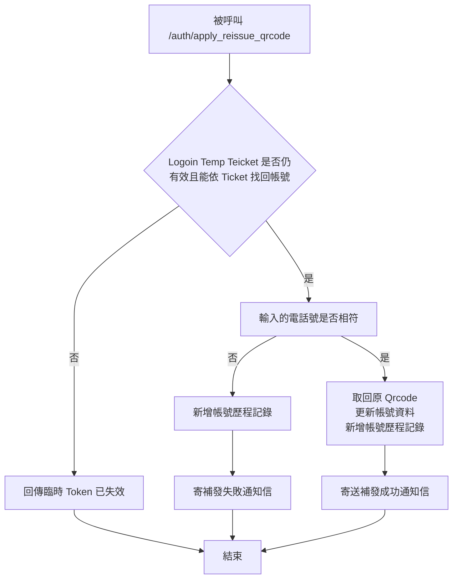
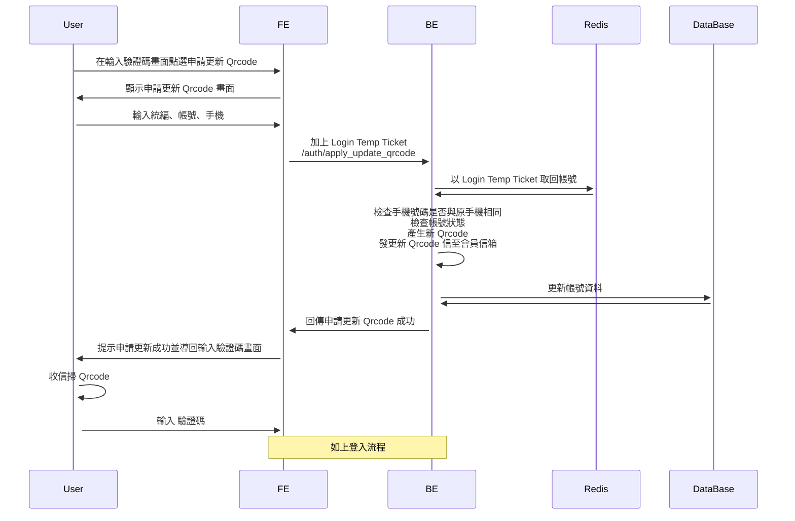

# 登入流程

## 登入

### Sequence Diagram

### Flow Chart

#### /auth/login

#### /auth/set_password

#### /auth/login_check_verification_code

---

## 申請重發 QrCpoe

### Sequence Diagram

### Flow Chart

---

## 申請更新 QrCpoe

### Sequence Diagram

### Flow Chart

