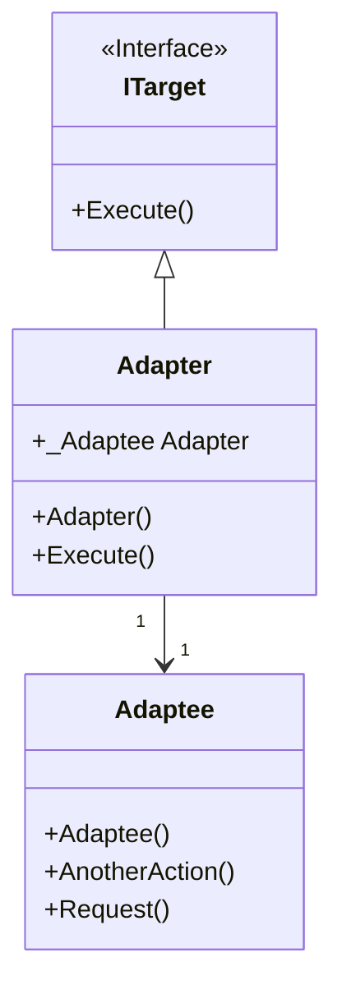

# Design Pattern - Abstract Factory

```mermaid
classDiagram
class ITarget {
    <<Interface>>
    +Execute()
}

class Adapter {
    +_Adaptee Adapter
    +Adapter()
    +Execute()
}

class Adaptee {
    +Adaptee()
    +AnotherAction()
    +Request()
}

ITarget <|-- Adapter
Adapter "1" --> "1" Adaptee
```

