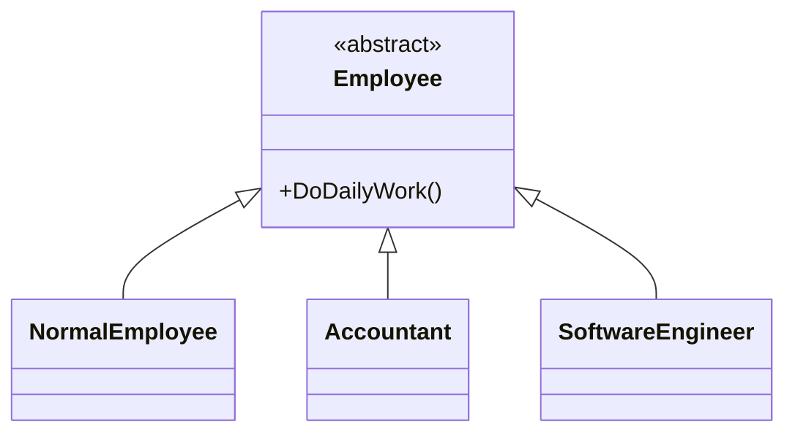
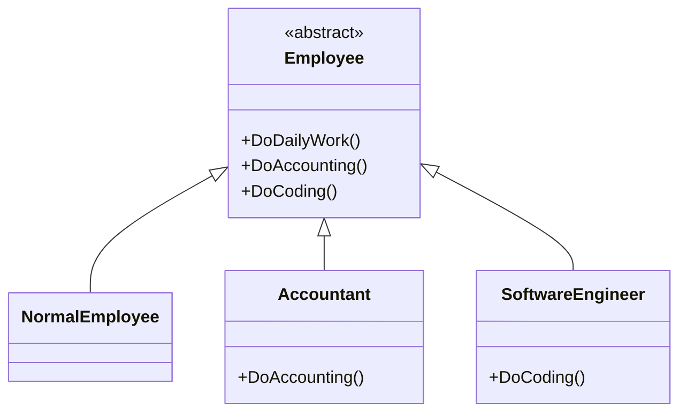
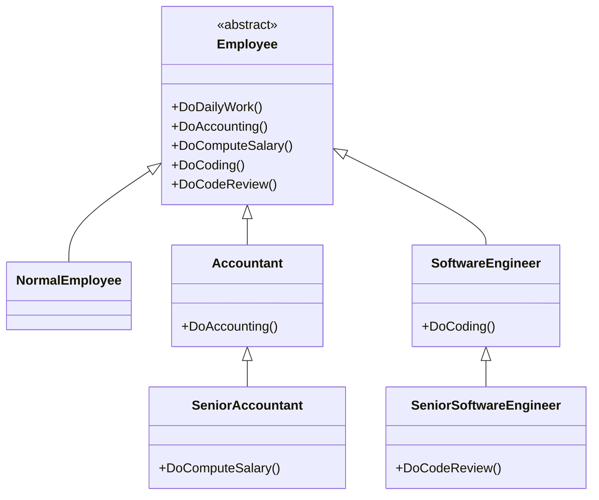
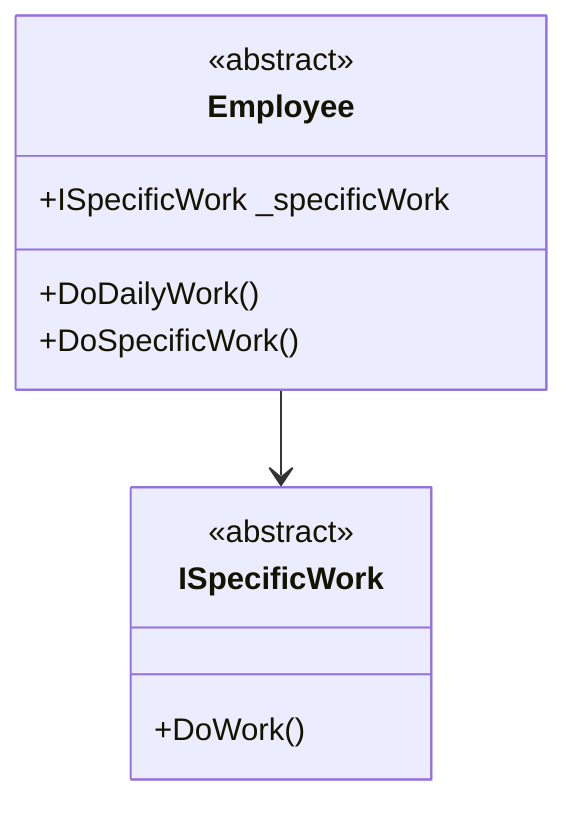
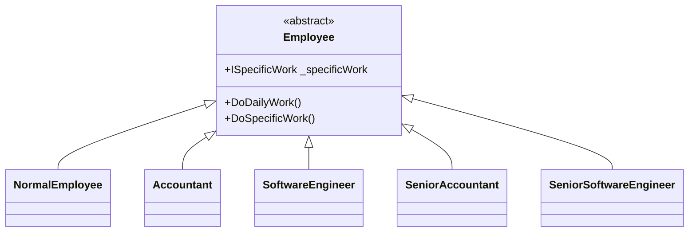
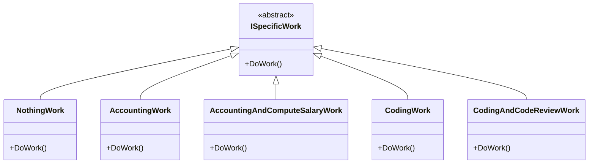

# 多用組合，少用繼承

這我應該在面試時被考了兩次這樣的觀念，當下我沒有多想，就是見招拆招，所以兩次我都沒有回答得很好。現在回想才知道是考這觀念。

## 情境題

請你設計三個員工類別：一般員工、會計、軟體工程師，且每個類別都同樣有日常工作要做。同時我們希望客戶端使用我們程式時，只需使用一個共同的類別。
<br/>我們自然會這樣設計，讓三個類別都繼承 Employee 去達到程式碼的共用



<br/>那麼客戶端只需這樣做用
```csharp
var employees = new List<Employee>()
{
    new NormalEmployee(),
    new Accountant(),
    new SoftwareEngineer(),
}

foreach(var employee in employees)
{
    employee.DailyWork();
}
```

<br/>

#### 需求變更
如果此時需求增加，會計除了日常工作還要做算帳，軟體工程師也要做寫程式。
<br/>那我們會改成這樣設計類別，為了讓客戶端仍使用 Employee 類別，在 Employee 開接口 Accounting, Coding 並將函式主題寫上 NotImplementException。然後讓會計類別實作 Accounting、軟體工程師類別實作 Coding。



<br/>然後客戶端也多呼叫新增的接口
```csharp
var employees = new List<Employee>()
{
    new NormalEmployee(),
    new Accountant(),
    new SoftwareEngineer(),
}

foreach(var employee in employees)
{
    employee.DoDailyWork();
    employee.DoAccountant();
    employee.DoCoding();
}
```

<br/>這樣的設計有個問題，客戶端若只看 Employee 類別時，會認為所有員工都會日常工作、記帳、寫程式，除非客戶端將所有實作都看完才會知道哪種員工會什麼工作。這不是個很好的設計。
<br/>我們也無法將記帳、寫程式下放至會計、軟體工程師類別，這會讓客戶端無法只使用 Employee 類別 ...


<br/>客戶端程式碼就改成
```csharp
foreach(var employee in employees)
{
    employee.DoDailyWork();
    employee.DoAccountant();
    employee.DoComputeSalary();
    employee.DoCoding();
    employee.DoCodeReview();
}
```

<br/>這讓我們看到越來越複雜的繼承關係，我們若想更動 CodeReview 的內容，我們需要查看 Employee、軟體工程師、資深軟體工程師才知道實作在哪裡並修改。以及未來若有需求變更，我們應該又會更改繼承關係，並在 Employee 增加更多的接口(例如增加軟體工程師主管、會計主管的類別)
<br/>這代表我們沒做到這件事：「把變化的部份封裝出來，以便日後可以輕鬆修改或擴展，而不影響其他部份」。所以我們應該將變化的部份找出來並將他們獨立出來，不要跟不會變化的部份混在一起。
<br/>在此例中，變化的部份是各類別的特定工作，我們可以用聚合的方式將它們獨立出來

<br/>讓 Employee 類別依賴 ISpecificWork 類別


<br/>各個員工類別皆繼承自 Employee


<br/>各個特定工作自 ISpecificWork


DoSpecificWork 實作的程式碼可能類似這樣
```csharp
public class Employee
{
    private readonly ISpecificWork _specificWork;
    public Employee(ISpecificWork specificWork)
    {
        _specificWork = specificWork;
    }

    public DoSpecificWork()
    {
        _specificWork.DoWork();
    }
}
```

<br/>那麼客戶端程式就是這樣
```csharp
var employees = new List<Employee>()
{
    new NormalEmployee(new NothingWork()),
    new Accountant(new AccountingWork()),
    new SeniorAccountant(new AccountingAndComputeSalaryWork()),
    new SoftwareEngineer(new CodingWork()),
    new SeniorSoftwareEngineer(new CodingAndCodeReviewWork()),
}

foreach(var employee in employees)
{
    employee.DoDailyWork();
    employee.DoSpecificWork();
}
```

## 結語

繼承雖然可以讓程式碼共用，但如果繼承層次過深，將導致程式碼過於複雜(需要跳來跳去看程式碼)，影響到程式碼的可維護性，那應該考慮用聚合。
<br/>這也不代表永遠應該使用聚合，如果類別之間繼承關係穩定，關係不複雜，那我們就可以使用繼承。反之就用組合來代表繼承