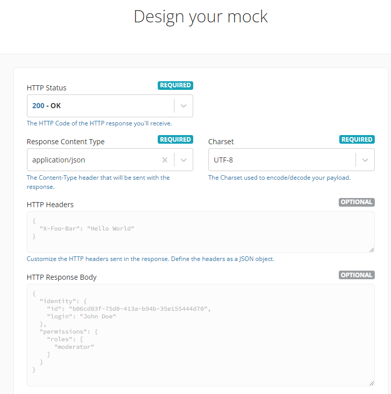
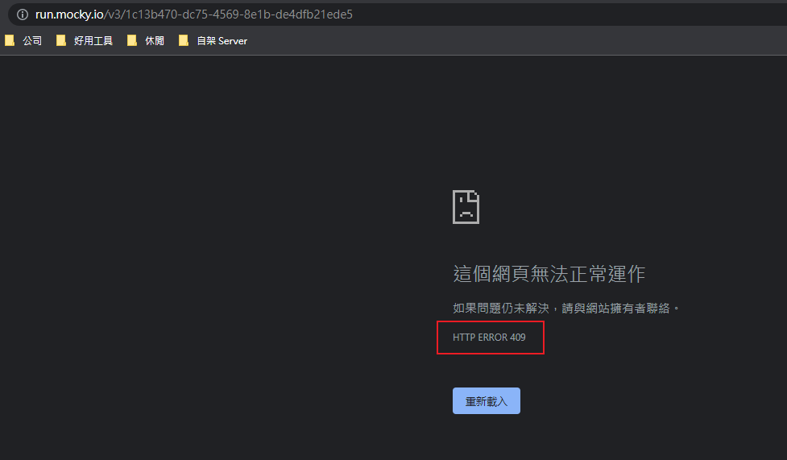
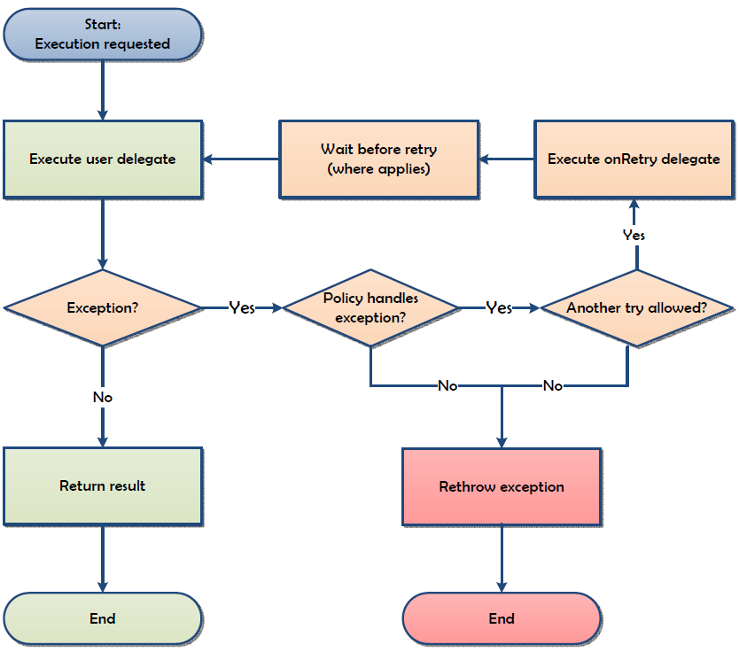
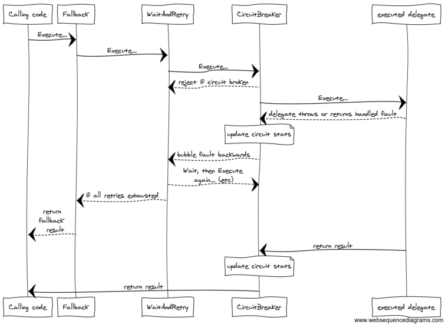

# Polly
在官方文件作了這樣的介紹:
<br>Polly is a .NET resilience and transient-fault-handling library that allows developers to express policies such as Retry, Circuit Breaker, Timeout, Bulkhead Isolation, Rate-limiting and Fallback in a fluent and thread-safe manner.

<br/>Polly 是 .Net 開發用的瞬間故障處理的函式庫，它以流暢和線程安全的方式提提供(Retry)、斷路(Circuit-breaker)、超時(Timeout)、隔離(Bulkhead Isolation)、限流(Rate-limiting)、回退(Fallback) 等機制

<br/>先以其中一個用法重試做為介紹吧!!
平常我們呼叫第三方服務，為了避免網路問題，可以這樣針對呼叫動作加入重試機制

```csharp
private static int retryCount = 3;
private static void doRetry(int second, Action action)
{
    while (true)
    {
        try
        {
            action(); // do something
            break; 
        }
        catch
        {
            if (--retryCount == 0)
                throw;
            Thread.Sleep(1000 * second);
        }
    }
}
```

<br/>底下用範例表示搭配 polly 後，程式碼會變怎樣
<br/>我用 mocky 建立假的 server，再寫程式去呼叫它

<br>先到 mocky 建立假 server，只會傳 409

<br>建立成功

<br>把網址貼到瀏覽器試試


<br/>接下來寫 code !!
```csharp
public static void Main(string[] args)
{
    Policy
    // 故障處理 : 要 handle 什麼樣的異常
        .Handle<HttpRequestException>()
        .OrResult<HttpResponseMessage>(result => result.StatusCode != HttpStatusCode.OK)
        // 重試策略 : 異常發生時要進行的重試次數及重試機制
        .Retry(3,
            onRetry: (exception, retryCount) =>
            {
                Console.WriteLine($"[App|Polly] : 呼叫 API 異常, 進行第{retryCount} 次重試, Error :{exception.Result.StatusCode}";
            }
        // 要執行的任務
        .Execute(DoMockHttpRequest);

    Console.WriteLine("結束退出");
    Console.ReadKey();
}
```

```csharp
static HttpResponseMessage DoMockHttpRequest()
{
    Console.WriteLine($"[App] {DateTime.Now.ToString(CultureInfo.InvariantCulture)}: 開始發送 Request");

    HttpResponseMessage result;
    using (HttpClient client = new HttpClient())
    {
        result = client.GetAsync("https://run.mocky.io/v3/1c13b470-dc75-4569-8e1b-de4dfb21ede5").Result;
    }

    return result;
}
```

<br/>輸出結果
>[App] 06/04/2022 20:18:26: 開始發送 Request
<br/>[App|Polly] : 呼叫 API 異常, 進行第 1 次重試, Error :Conflict
<br/>[App] 06/04/2022 20:18:27: 開始發送 Request
<br/>[App|Polly] : 呼叫 API 異常, 進行第 2 次重試, Error :Conflict
<br/>[App] 06/04/2022 20:18:28: 開始發送 Request
<br/>[App|Polly] : 呼叫 API 異常, 進行第 3 次重試, Error :Conflict
<br/>[App] 06/04/2022 20:18:29: 開始發送 Request
<br/>結束退出

<br/>對我來說，就是在自己的程式碼看不到迴圈的使用(但實際上還是有迴圈)

借用官方的圖講解他們的重試功能


## PolicyWrap
官方文件的解說挺詳細的，policy 之中可以再包另一個 policy

## Polly 搭配 .NET Core 的 DI
官方文件的解說挺詳細的，這樣就不再贅述
```chsarp
var policyWrap = fallback.Wrap(cache).Wrap(retry).Wrap(breaker).Wrap(bulkhead).Wrap(timeout);
// or (functionally equivalent)
var policyWrap = fallback.Wrap(cache.Wrap(retry.Wrap(breaker.Wrap(bulkhead.Wrap(timeout)))));
```
上述程式碼的效果如同下圖


## 參考
[[NETCore] 使用 Polly 實現重試 (Retry) 策略](https://marcus116.blogspot.com/2019/06/netcore-polly-retry.html)