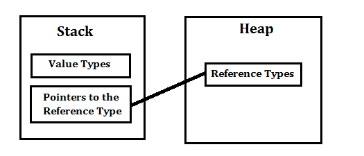

# [C#]Value Type & Reference Type

## Value Type 實質型別

A data type is a value type if it holds a data value within its own memory space. It means the variables of these data types directly contain values.

簡單型別因為是固定大小(如：int, double, float ...)，還有 struct，都是 Value Type

## Reference Type 參考型別

A reference type doesn't store its value directly. Instead, it stores the address where the value is being stored. In other words, a reference type contains a pointer to another memory location that holds the data.

string, array, class, delegate，都是 Reference Type

下圖說明了 Value Type 和 Reference Type 的差異  

boxing_and_unboxing.md

[[C#]Boxing & Unboxing](equality_operator.md)  
[[C#]== Operator - Equality operator](equality_operator.md)