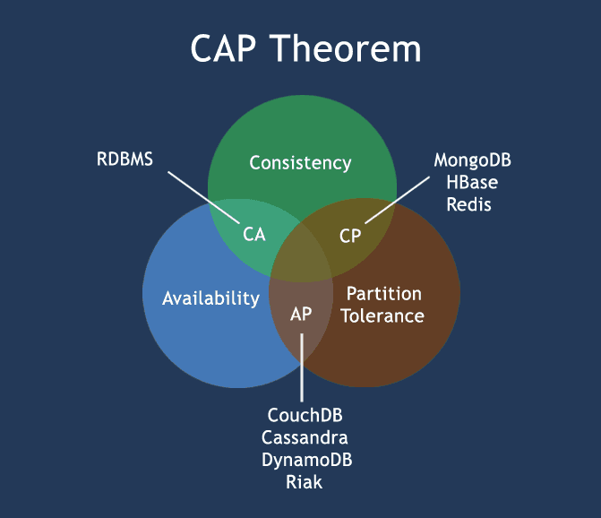

# 資料庫 分散式系統 CAP 定理 CAP Theorem

 CAP TTherrem 

 分散式系統是將資料儲存在不止一個節點上，在設定分散式系統時都會考慮到 CAP 定理，分別代表：Consistency、Availability、Partition Tolerance。

### Consistency

Consistency means that all clients see the same data at the same time, no matter which node they connect to. For this to happen, whenever data is written to one node, it must be instantly forwarded or replicated to all the other nodes in the system before the write is deemed 'successful'.
 只要資料寫入成功，使用者不管在哪個節點都會讀到相同的資料。

### Availability

Availability means that that any client making a request for data gets a response, even if one or more nodes are down. Another way to state this—all working nodes in the distributed system return a valid response for any request, without exception.
 使用者在能運作的節點發動請求，總是能拿到成功的回應。

### Partition Tolerance

A partition is a communications break within a distributed system—a lost or temporarily delayed connection between two nodes. Partition tolerance means that the cluster must continue to work despite any number of communication breakdowns between nodes in the system.
 當節點互相之間無法溝通，即產生分區的情況，該系統在此情況仍能運作。

---

在設計分散式系統中，CAP 定理告訴我們，這三個特性至多只有兩個能同時存在。

想像兩個節點分處分區兩側。允許至少一個節點更新狀態會導致數據不一致，即喪失了 Consistency 性質。如果為了保證數據一致性，將分區一側的節點設置為不可用，那麼又喪失了 Availability 性質。除非兩個節點可以互相通信，才能既保證 Consistency 又保證 Availability ，這又會導致喪失 partition 性質。

因為是分散式系統，一般會考慮 CP 或 AP

### CP - MongoDB
MongoDB 採用 single-master，每個 replica set 會有一個 master，其它皆為 slave，只有 master 能接受寫入的要求，slave 定時從 master 取得 operation log 去操作自己的資料而達到資料同步。
如果 master 變得不可用，會從 slave 之間選出新的 master，在其它 slave 跟新的 master 保持同步的期間，使用者無法發動成功的寫入要求

### AP - Cassandra
Cassandra 沒有 master 的機制，使用者可對任何節點發動寫入的請求，然後 Cassandra 用 eventual consistency 的機制讓資料最終保持一致。如果產生分區，那麼這分區之間無法溝通，將發生資料不致，直到分區之間的溝通修復為止

---

參考自
- [w3resource](https://www.w3resource.com/mongodb/nosql.php)