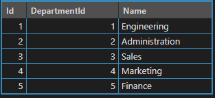
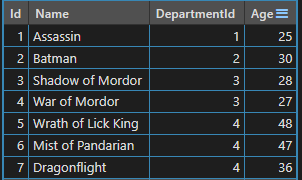
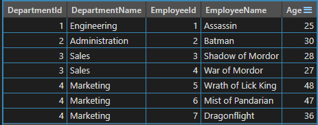
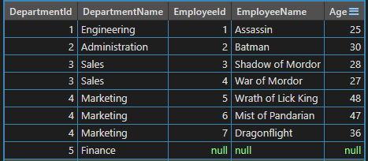
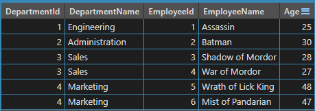
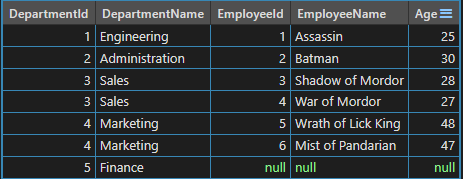

# SQL Server Apply 語法

apply 能做到與 join 一樣的功能，且能簡化語法  
cross apply 類似 inner join  
outer apply 類似 left join  

使用 join 時，會將兩張表中符合條件的行進行組合，形成一個虛擬表，這個虛擬表包含兩張表中符合條件的行，這個操作只需進行一次

使用 apply 運算子，母查詢的每一行都會讓子查詢跑一次，將子查詢的結果連接到母查詢的每一行。  
若為 cross apply 則只有子查詢有符合條件時才會列出對應的母查詢，  
若為 outer apply 則即使子查詢有不符合條件也會列出對應的母查詢。

如果子查詢不需要過濾資料或是只需要簡單的過濾，那用 join 跟 apply 都可以達成且易讀，如果子查詢需要較複雜的過濾，例如只取第一筆、或是取取後兩筆，那麼一羨用 join 跟 apply 都可以達成目標，不過 apply 會比較易讀。  

apply 可用在 table valued function，但 join 不行

使用以下腳本建立 table 和初始資料
```sql
CREATE TABLE [dbo].[MyDepartment](
	[Id] [int] NOT NULL IDENTITY,
	[DepartmentId] [int] NOT NULL,
	[Name] [varchar](250) NOT NULL,
PRIMARY KEY CLUSTERED 
(
	[Id] ASC
)WITH (PAD_INDEX  = OFF, STATISTICS_NORECOMPUTE  = OFF, IGNORE_DUP_KEY = OFF, ALLOW_ROW_LOCKS  = ON, ALLOW_PAGE_LOCKS  = ON) ON [PRIMARY]
) ON [PRIMARY]
GO

INSERT [dbo].[MyDepartment] ([DepartmentId], [Name]) VALUES (1, N'Engineering')
INSERT [dbo].[MyDepartment] ([DepartmentId], [Name]) VALUES (2, N'Administration')
INSERT [dbo].[MyDepartment] ([DepartmentId], [Name]) VALUES (3, N'Sales')
INSERT [dbo].[MyDepartment] ([DepartmentId], [Name]) VALUES (4, N'Marketing')
INSERT [dbo].[MyDepartment] ([DepartmentId], [Name]) VALUES (5, N'Finance')
GO

CREATE TABLE [dbo].[MyEmployee](
	[Id] [int] NOT NULL IDENTITY,
	[Name] [varchar](250) NOT NULL,
	[DepartmentId] [int] NOT NULL,
	[Age] [int] NOT NULL,
PRIMARY KEY CLUSTERED 
(
	[Id] ASC
)WITH (PAD_INDEX  = OFF, STATISTICS_NORECOMPUTE  = OFF, IGNORE_DUP_KEY = OFF, ALLOW_ROW_LOCKS  = ON, ALLOW_PAGE_LOCKS  = ON) ON [PRIMARY]
) ON [PRIMARY]
GO

INSERT [dbo].[MyEmployee] ([Name], [DepartmentID], [Age]) VALUES (N'Assassin', 1, 25)
INSERT [dbo].[MyEmployee] ([Name], [DepartmentID], [Age]) VALUES (N'Batman', 2, 30)
INSERT [dbo].[MyEmployee] ([Name], [DepartmentID], [Age]) VALUES (N'Shadow of Mordor', 3, 28)
INSERT [dbo].[MyEmployee] ([Name], [DepartmentID], [Age]) VALUES (N'War of Mordor', 3, 27)
INSERT [dbo].[MyEmployee] ([Name], [DepartmentID], [Age]) VALUES (N'Wrath of Lick King', 4, 48)
INSERT [dbo].[MyEmployee] ([Name], [DepartmentID], [Age]) VALUES (N'Mist of Pandarian', 4, 47)
INSERT [dbo].[MyEmployee] ([Name], [DepartmentID], [Age]) VALUES (N'Dragonflight', 4, 36)
GO
```

MyDepartment<br/>


MyEmployee<br/>


<br/>如果需求是列出所有部門底下的員工，並且排除沒有員工的部門，用 inner join 或 corss apply 都可以輕鬆達成需求

使用　join 語法
```sql
SELECT D.DepartmentId, 
       D.Name AS DepartmentName, 
       E.Id AS EmployeeId, 
       E.Name AS EmployeeName, 
       E.Age
FROM MyDepartment D
INNER JOIN MyEmployee E
ON D.DepartmentID = E.DepartmentID
GO
```

使用　apply 語法
```sql
SELECT D.DepartmentId, 
       D.Name AS DepartmentName, 
       E.Id AS EmployeeId, 
       E.Name AS EmployeeName, 
       E.Age
FROM MyDepartment D
CROSS APPLY (
   SELECT * FROM MyEmployee E
   WHERE E.DepartmentID = D.DepartmentID
) E
GO
```

join 和 cross apply 的結果<br/>


<br/>如果需求改成連沒有員工的部門也要列出，那將上述語法改用 left join 或 outer apply 都可以輕鬆達成需求

使用　join 語法
```sql
SELECT D.DepartmentId, 
       D.Name AS DepartmentName, 
       E.Id AS EmployeeId, 
       E.Name AS EmployeeName, 
       E.Age
FROM MyDepartment D
LEFT JOIN MyEmployee E
ON D.DepartmentID = E.DepartmentID
GO
```

使用　apply 語法
```sql
SELECT D.DepartmentId, 
       D.Name AS DepartmentName, 
       E.Id AS EmployeeId, 
       E.Name AS EmployeeName, 
       E.Age
FROM MyDepartment D
OUTER APPLY (
   SELECT * FROM MyEmployee E
   WHERE E.DepartmentID = D.DepartmentID
) E
GO
```

left join 和 outer apply 的結果<br/>


<br/>如果需求改成列出該部門年紀最大的 2 位員工，並排除沒有員工的部門，那用 join 會變得複雜些，相較之下，cross apply 顯示得較簡單
<br/>如果資料量超過百萬，那麼用 apply 較好，因為有先做篩選，而 Join 則是所有行都組合起來才做篩選

使用　join 語法會較複雜，另一個方法是用 CTE
```sql
SELECT D.DepartmentId, 
       D.Name AS DepartmentName, 
       E.Id AS EmployeeId, 
       E.Name AS EmployeeName, 
       E.Age
FROM MyDepartment D
INNER JOIN (
    SELECT *,
           ROW_NUMBER() OVER (PARTITION BY DepartmentId ORDER BY Age DESC) AS Row 
    FROM MyEmployee
    ) E
ON D.DepartmentID = E.DepartmentID
WHERE E.Row <= 2
GO
```

使用　apply 語法
```sql
SELECT D.DepartmentId, 
       D.Name AS DepartmentName, 
       E.Id AS EmployeeId, 
       E.Name AS EmployeeName, 
       E.Age
FROM MyDepartment D
CROSS APPLY (
   SELECT TOP 2 * 
   FROM MyEmployee E
   WHERE E.DepartmentID = D.DepartmentID
   ORDER BY E.Age DESC
) E
GO
```

列出該部門年紀最大的 2 位員工，並排除沒有員工的部門<br/>


<br/>如果需求改為不排除沒有員工的部門，那可改用 left join 和 outer apply，一樣 apply 也是較簡單的語法

使用　join 語法會較複雜，另一個方法是用 CTE
```sql
SELECT D.DepartmentId, 
       D.Name AS DepartmentName, 
       E.Id AS EmployeeId, 
       E.Name AS EmployeeName, 
       E.Age
FROM MyDepartment D
LEFT JOIN (
    SELECT *, 
           ROW_NUMBER() OVER (PARTITION BY DepartmentId ORDER BY Age DESC) AS Row 
    FROM MyEmployee
    ) E
ON D.DepartmentID = E.DepartmentID
WHERE E.Row <= 2 
OR E.Row is null
GO
```

使用　apply 語法
```sql
SELECT D.DepartmentId, 
       D.Name AS DepartmentName, 
       E.Id AS EmployeeId, 
       E.Name AS EmployeeName, 
       E.Age
FROM MyDepartment D
OUTER APPLY (
   SELECT TOP 2 * 
   FROM MyEmployee E
   WHERE E.DepartmentID = D.DepartmentID
   ORDER BY E.Age DESC
) E
GO
```

列出該部門年紀最大的 2 位員工，包含沒有員工的部門<br/>
