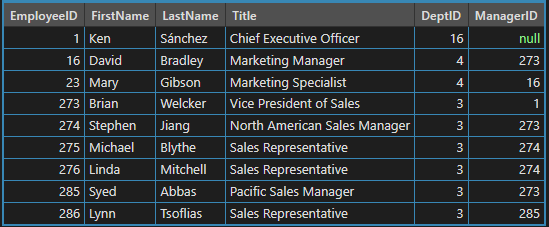
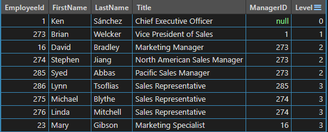
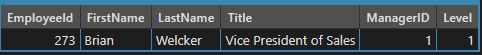
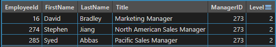
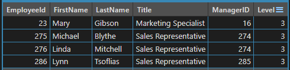

# SQL Server - CTE 遞迴(Common Table Expression Recursive)

遞迴查詢，直到沒有資料回傳為止

CTE 包含 3 個部份
- Anchor member, 錨點成員：初始結果，可視作第 0 次的遞回成員的結果
- 
- Recrusive member, 遞迴成員：一直被呼叫並參考上次的遞迴成員的結果

- Termination check, 終止檢查：為隱含條件，在撰寫過程不會指定，當遞迴成員沒有回傳資料時即停止

如果終止條件沒設定好，會造成無窮迴圈，這點要注意

建立測試資料
```sql
CREATE TABLE dbo.MyEmployees
(
    EmployeeID smallint NOT NULL,
    FirstName nvarchar(30)  NOT NULL,
    LastName  nvarchar(40) NOT NULL,
    Title nvarchar(50) NOT NULL,
    DeptID smallint NOT NULL,
    ManagerID int NULL,
 CONSTRAINT PK_EmployeeID PRIMARY KEY CLUSTERED (EmployeeID ASC) 
);

-- Populate the table with values.
INSERT INTO dbo.MyEmployees VALUES 
 (1, N'Ken', N'Sánchez', N'Chief Executive Officer',16,NULL)
,(273, N'Brian', N'Welcker', N'Vice President of Sales',3,1)
,(274, N'Stephen', N'Jiang', N'North American Sales Manager',3,273)
,(275, N'Michael', N'Blythe', N'Sales Representative',3,274)
,(276, N'Linda', N'Mitchell', N'Sales Representative',3,274)
,(285, N'Syed', N'Abbas', N'Pacific Sales Manager',3,273)
,(286, N'Lynn', N'Tsoflias', N'Sales Representative',3,285)
,(16,  N'David',N'Bradley', N'Marketing Manager', 4, 273)
,(23,  N'Mary', N'Gibson', N'Marketing Specialist', 4, 16);
```

<br/>MyEmployees 資料<br/>



<br/>撰寫 CTE
```sql
WITH DirectReports (EmployeeId, FirstName, LastName, Title, ManagerID, Level)
AS
(
    -- 在 UNIUO ALL 前面即為 Anchor member
    SELECT e.EmployeeId, e.FirstName, e.LastName, e.Title, e.ManagerID, 0 AS Level
    FROM dbo.MyEmployees AS e
    WHERE ManagerID IS NULL
    UNION ALL
    -- -- 在 UNIUO ALL 前面即為 Recursive member
    SELECT e.EmployeeId, e.FirstName, e.LastName, e.Title, e.ManagerID, Level + 1 AS Level
    FROM dbo.MyEmployees e
    INNER JOIN DirectReports AS d
        ON e.ManagerID = d.EmployeeID
)
-- Statement that executes the CTE
SELECT EmployeeId, FirstName, LastName, Title, ManagerID, Level
FROM DirectReports;
GO
```

<br/>cte 結果<br/>


錨點成員(第 0 次遞迴結果)<br/>


第 1 次遞迴結果<br/>


第 2 次遞迴結果<br/>


第 3 次遞迴結果<br/>


---

參考自
- [使用一般資料表運算式的遞迴查詢](https://learn.microsoft.com/zh-tw/previous-versions/sql/sql-server-2008-r2/ms186243(v=sql.105)?redirectedfrom=MSDN)