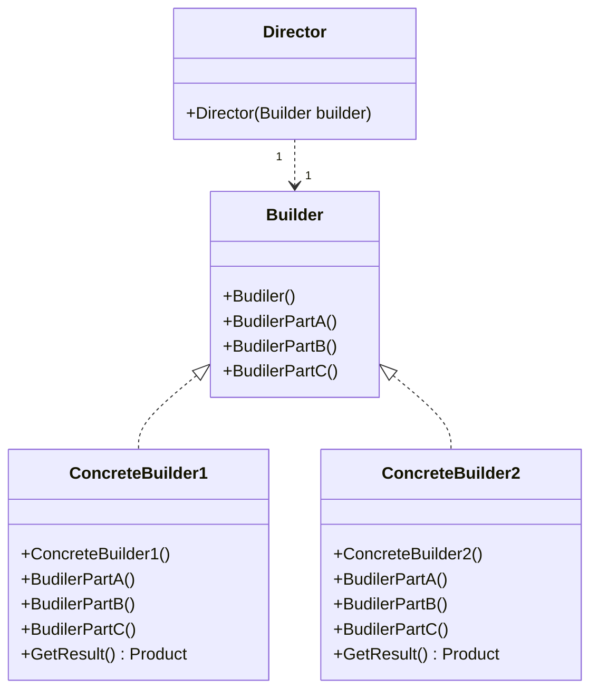

# Design Pattern - Builder

```mermaid
classDiagram
class Director {
    +Director(Builder builder)
}
class Builder {
    +Budiler()
    +BudilerPartA()
    +BudilerPartB()
    +BudilerPartC()
}
class ConcreteBuilder1 {
    +ConcreteBuilder1()
    +BudilerPartA()
    +BudilerPartB()
    +BudilerPartC()
    +GetResult() Product
}
class ConcreteBuilder2 {
    +ConcreteBuilder2()
    +BudilerPartA()
    +BudilerPartB()
    +BudilerPartC()
    +GetResult() Product
}

Director "1" ..> "1" Builder
Builder <|.. ConcreteBuilder1
Builder <|.. ConcreteBuilder2
```