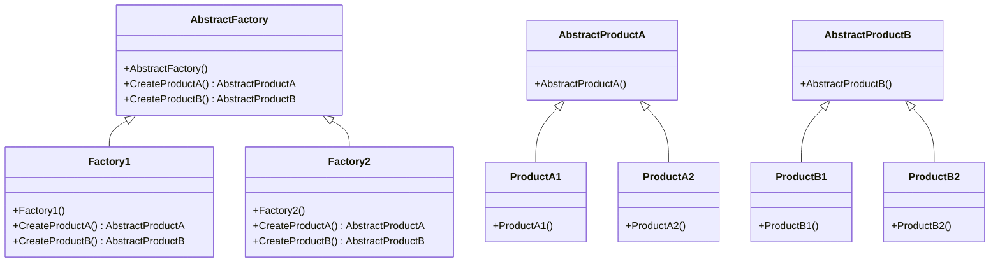

# Design Pattern - Abstract Factory

- [Design Pattern - Abstract Factory](#design-pattern---abstract-factory)
  - [概觀](#概觀)
  - [類別圖](#類別圖)
    - [pseudo code](#pseudo-code)
---
## 概觀
+ 以同一個介面來建立一整族相關或相依的物件，並且不需要指定它們的具體型別。
+ 適用於多產品族，而且這些產品族是整族切換的情境。

---
## 類別圖


+ AbastractFactory
  + 定義工廠的共用介面，介面主要職責為產生符合AbstractProduct 介面的執行個體。
  + 就是會定義幾個產生屬於同一產品族的操作職責。
+ AbstractProduct
  + 定義產品的共用介面，工廠所生成的物件必須符合此介面。
  + 通常為介面(interface)或是抽象類別(abstract class)
  + 抽象工廠的應用場景通常會有兩個以上的 AbstractProduct
+ Product
  + 依照AbstractProduct 介面實作的具體產品類別(圖中的 ProductA1、ProductB1 與 ProductA2、ProductB2 )。
+ Factory
  + 依照AbstractFactory 介面實作的具體工廠類別(圖中的 Factory1 和 Factory2)，具現實際產生具體產品的職責。

<br/>

### pseudo code
抽象工廠的一般化
```csharp
public abstract class AbstractFactory
{
    public abstract AbstractChassis CreateChassis();    
    public abstract AbstractBattery CreateBattery();
}
```

<br/>Apple 工廠，產生同一族的機殼和電池
```csharp
public class AppleFactory : AbstractFactory
{
    public override AbstractChassis CreateChassis()
    {
        return new AppleChassis();
    }
    public override AbstractBattery CreateBattery()
    {
        return new AppletBattery();
    }
}
```

<br/>Samsung 工廠，產生同一族的機殼和電池
```csharp
public class SamsungFactory : AbstractFactory
{
    public override AbstractChassis CreateChassis()
    {
        return new SamsungChassis();
    }
    public override AbstractBattery CreateBattery()
    {
        return new SamsungBattery();
    }
}
```

<br/>機殼產品的一般化
```csharp
public abstract class AbstractChassis
{ }

public class AppleChassis : AbstractChassis
{ }

public class SamsungChassis : AbstractChassis
{ }
```

<br/>電池產品的一般化
```csharp
public abstract class AbstractBattery
{ }

public class AppletBattery : AbstractBattery
{ }

public class SamsungBattery : AbstractBattery
{ }
```

<br/>Client 端程式碼，切換工廠即可切換生產線
```csharp
AbstractFactory factory = new AppleFactory();
AbstractChassis chassis = new factory.CreateChassis();
AbstractBattery battery = new factory.CreateBattery();
```