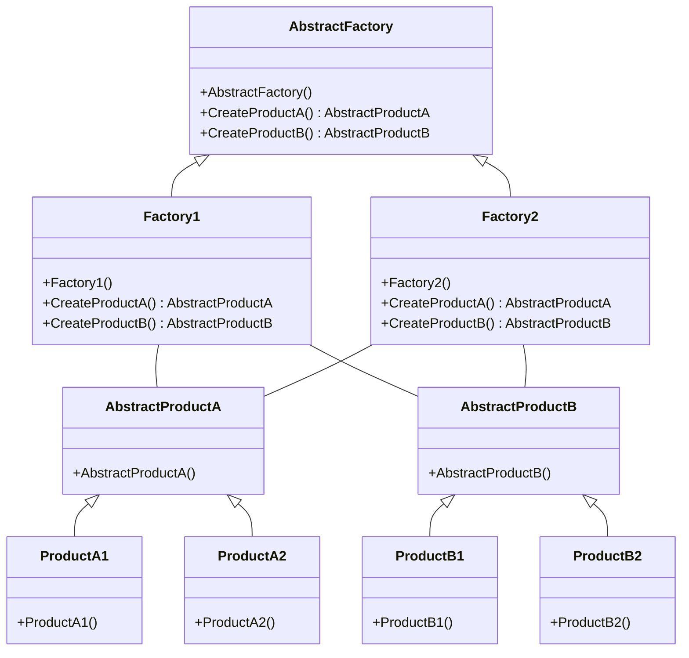

# Design Pattern - Abstract Factory

```mermaid
classDiagram
class AbstractFactory {
    +AbstractFactory()
    +CreateProductA() AbstractProductA
    +CreateProductB() AbstractProductB
}

class Factory1 {
    +Factory1()
    +CreateProductA() AbstractProductA
    +CreateProductB() AbstractProductB
}

class Factory2 {
    +Factory2()
    +CreateProductA() AbstractProductA
    +CreateProductB() AbstractProductB
}

class AbstractProductA {
    +AbstractProductA()
}

class ProductA1 {
    +ProductA1()
}

class ProductA2 {
    +ProductA2()
}

class AbstractProductB {
    +AbstractProductB()
}

class ProductB1 {
    +ProductB1()
}

class ProductB2 {
    +ProductB2()
}

AbstractFactory <|-- Factory1
AbstractFactory <|-- Factory2

AbstractProductA <|-- ProductA1
AbstractProductA <|-- ProductA2

AbstractProductB <|-- ProductB1
AbstractProductB <|-- ProductB2

Factory1 -- AbstractProductA
Factory1 -- AbstractProductB

Factory2 -- AbstractProductA
Factory2 -- AbstractProductB
```
