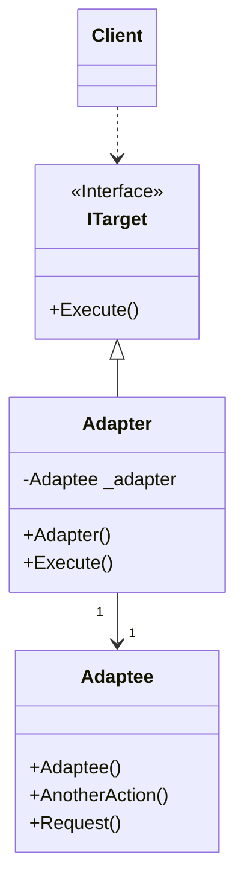
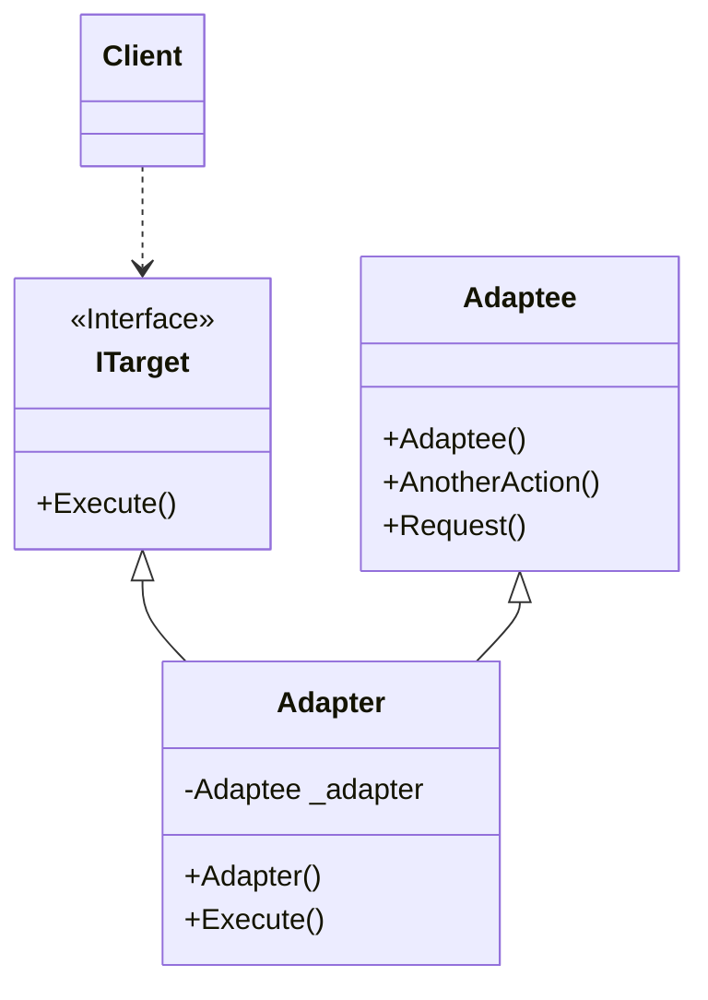

# Design Pattern - Adapter

- [Design Pattern - Adapter](#design-pattern---adapter)
  - [概觀](#概觀)
  - [Object Adapter](#object-adapter)
    - [類別圖](#類別圖)
    - [pseudo code](#pseudo-code)
  - [Class Adapter](#class-adapter)
    - [類別圖](#類別圖-1)
    - [pseudocode](#pseudocode)
  - [範例 - Tcp 和 Serial Port 的 Adapter](#範例---tcp-和-serial-port-的-adapter)
    - [Object Adapter](#object-adapter-1)
    - [Class Adapter](#class-adapter-1)
---
## 概觀
使用 Adapter 的理由
+ 兩個或以上的類別做相同或類似的事情，但擁有不同的介面
+ 如果這些類別擁有一個共同的介面，客戶端程式碼可以更簡潔、更容易維護
+ 你要使用某一個第三方類別庫，或是既有的框架；而你無法改變它們的程式碼來適應你已經寫好的客戶端程式。

可分為 Object Adapter 和 Class Adapter

---
## Object Adapter
### 類別圖
Adapter 類別裡包含 Adaptee 類別的實體並繼承和實作 ITarget 介面，讓 Client 端程式呼叫 Execute 即可使用 Adaptee 類別的實體 



+ Client
  + 在圖上指的就是 Program class，這個角色呼叫符合 ITarget 介面的物件。
+ ITarget
  + 定義 Client 端程式碼所需要的公開介面形式，也可能以類別(class) – 通常是抽象類別的形式呈現。
+ Adapter
  + 具體實作 ITagert 的介面定義，通常會持有 Adaptee 的執行個體；藉此將 Adaptee 轉換成 Client 可以使用的 ITarget。
+ Adaptee
  + 既有存在但無法符合 ITarget 定義的物件，需要被轉換才能為 Client 所使用。

<br/>

### pseudo code
Adaptee 類別，既有類別，假設無法更改
```csharp
public class Adaptee
{
    public void Request()
    { }

    public void AnotherAction()
    { }
}
```

<br/>ITarget 介面
```csharp
public interface ITarget
{
    void Execute();
}
```

<br/>Adapter 實作類別，繼承 ITarget
```csharp
public class Adapter : ITarget
{
    private Adaptee _adaptee;

    public Adapter()
    {
        _adaptee = new Adaptee();
    }

    public void Execute()
    {
        _adaptee.Request();
    }
}
```

<br/>Client 端程式
```csharp
ITarget target = new Adapter();
target.Execute();
```
---
## Class Adapter
Adapter 類別繼承了 ITarget 介面和 Adaptee 類別。
<br/>**講師特別說明 C# 不要這樣用**

<br/>

### 類別圖


<br/>

### pseudocode
Adaptee 類別，既有類別，假設無法更改
```csharp
public class Adaptee
{
    public void Request()
    { }

    public void AnotherAction()
    { }
}
```

<br/>ITarget 介面
```csharp
public interface ITarget
{
    void Execute();
}
```

<br/>Adapter 實作類別，繼承 Adaptee, ITarget
```csharp
public class Adapter : Adaptee, ITarget
{
    Private Adaptee _adaptee;

    public void Execute()
    {
        this.Request();
    }
}
```

<br/>Client 端程式
```csharp
ITarget target = new Adapter();
target.Execute();
```
---
## 範例 - Tcp 和 Serial Port 的 Adapter
+ 客戶需要一個通訊程式，需要同時支援 Tcp 與Serial Port 通訊。
+ 創建一個介面讓客戶端程式能夠不直接切換 .Net Framework 中的 Socket class 與 Serialport class。並且在新增通訊需求時，能夠讓客戶端程式的變動最小化。

<br/>

### Object Adapter
ICommunication 介面，這就是一個 Target (Adapter 的抽象)
```csharp
public interface ICommunication
{
    bool Connect(string target);
    void Disconnect();
    void Send(byte[] buffer);
    byte[] Receive();
}
```

<br/>TcpCommunication 類別，Tcp Adapter
```csharp
public class TcpCommunication : ICommunication, IDisposable
{
    private Socket client;

    public TcpCommunication()
    {
        client = new Socket(AddressFamily.InterNetwork, SocketType.Stream, ProtocolType.Tcp);
        //...設定 client 所需的資訊
    }

    public bool Connect(string target)
    {
        string[] data = target.Split(':');
        IPAddress ip;
        int port;
        if (IPAddress.TryParse(data[0], out ip) && int.TryParse(data[1], out port))
        {
            client.Connect(ip, port);
        }
        return client.Connected;
    }

    public void Disconnect()
    {
        if (client.Connected)
        {
            client.Disconnect(true);
        }
    }

    public void Dispose()
    {
        if (client != null)
        {
            client.Dispose();
        }
    }

    public byte[] Receive()
    {
        if (client.Connected)
        {
            byte[] buffer = new byte[1024];
            int receiveSize = client.Receive(buffer);
            Array.Resize(ref buffer, receiveSize);
            return buffer;
        }
        else
        {
            return null;
        }
    }

    public void Send(byte[] buffer)
    {
        if (client.Connected)
        {
            client.Send(buffer);
        }
    }
}
```

<br/>SerialCommunication，Serialport Adapter (這個 Sample 沒有測過，僅為示意)
```csharp
public class SerialCommunication : ICommunication, IDisposable
{
    private SerialPort client;

    public SerialCommunication()
    {
        client = new SerialPort();
        // ... 其他...
    }

    public bool Connect(string target)
    {
        client.PortName = target;
        client.DataBits = 8;
        // ....
        client.Open();
        return client.IsOpen;
    }

    public void Disconnect()
    {
        if (client.IsOpen)
        {
            client.Close();
        }
    }

    public void Dispose()
    {
        if (client != null)
        {
            client.Dispose();
        }
    }

    public byte[] Receive()
    {
        if (client.IsOpen)
        {
            byte[] buffer = new byte[1024];
            int receiveSize = client.Read(buffer, 0, buffer.Length);
            Array.Resize(ref buffer, receiveSize);
            return buffer;
        }
        else
        {
            return null;
        }
    }

    public void Send(byte[] buffer)
    {
        if (client.IsOpen)
        {
            client.Write(buffer, 0, buffer.Length);
        }
    }
}
```

<br/>Client 端程式，想切換連線方式只要更換 ICommunication 的實例和 Connect 函式的參數
```csharp
ICommunication tcp = new TcpCommunication();
tcp.Connect("127.0.0.1:7");

byte[] sendBuffer = GetSendBuffer();
tcp.Send(sendBuffer);

byte[] receiveBuffer = tcp.Receive();
tcp.Disconnect();
Console.WriteLine(GetReceiveString(receiveBuffer));
```
```csharp
private static byte[] GetSendBuffer()
{
    string data = "Hello!";
    return Encoding.UTF8.GetBytes(data);
}
```
```csharp
public static string GetReceiveString(byte[] buffer)
{
    return Encoding.UTF8.GetString(buffer);
}
```

<br/>

### Class Adapter
**C# 不要使用這種形式**
<br/>ICommunication 介面，這就是一個 Target (Adapter 的抽象)
```csharp
public interface ICommunication
{
    bool Connect(string target);
    void Disconnect();
    void Send(byte[] buffer);
    byte[] Receive();
}
```

<br/>TcpCommunication，Tcp Adapter
```csharp
public class TcpCommunication : Socket, ICommunication
{
    public TcpCommunication() : base(AddressFamily.InterNetwork, SocketType.Stream, ProtocolType.Tcp)
    {
    }

    public bool Connect(string target)
    {
        string[] data = target.Split(':');
        IPAddress ip;
        int port;
        if (IPAddress.TryParse(data[0], out ip) && int.TryParse(data[1], out port))
        {
            this.Connect(ip, port);
        }
        return this.Connected;
    }

    public void Disconnect()
    {
        if (this.Connected)
        {
            this.Disconnect(true);
        }
    }

    public byte[] ReceiveData()
    {
        if (this.Connected)
        {
            byte[] buffer = new byte[1024];
            int receiveSize = this.Receive(buffer);
            Array.Resize(ref buffer, receiveSize);
            return buffer;
        }
        else
        {
            return null;
        }
    }

    public void SendData(byte[] buffer)
    {
        if (this.Connected)
        {
            this.Send(buffer);
        }
    }
}
```

<br/>SerialCommunication，Serialport Adapter (這個 Sample 沒有測過，僅為示意)
```csharp
public class SerialCommunication : SerialPort, ICommunication
{
    public bool Connect(string target)
    {
        this.PortName = target;
        this.DataBits = 8;
        // ....
        this.Open();
        return this.IsOpen;
    }

    public void Disconnect()
    {
        if (this.IsOpen)
        {
            this.Close();
        }
    }

    public byte[] ReceiveData()
    {
        if (this.IsOpen)
        {
            byte[] buffer = new byte[1024];
            int receiveSize = this.Read(buffer, 0, buffer.Length);
            Array.Resize(ref buffer, receiveSize);
            return buffer;
        }
        else
        {
            return null;
        }
    }

    public void SendData(byte[] buffer)
    {
        if (this.IsOpen)
        {
            this.Write(buffer, 0, buffer.Length);
        }
    }
}
```

<br/>Client 端程式
```csharp
ICommunication tcp = new TcpCommunication();
tcp.Connect("127.0.0.1:7");

byte[] sendBuffer = GetSendBuffer();
tcp.Send(sendBuffer);

byte[] receiveBuffer = tcp.Receive();
tcp.Disconnect();
Console.WriteLine(GetReceiveString(receiveBuffer));
```
```csharp
private static byte[] GetSendBuffer()
{
    string data = "Hello!";
    return Encoding.UTF8.GetBytes(data);
}
```
```csharp
public static string GetReceiveString(byte[] buffer)
{
    return Encoding.UTF8.GetString(buffer);
}
```