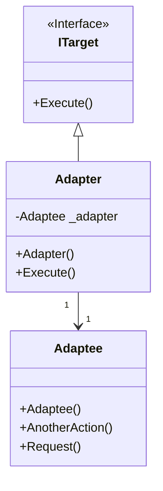
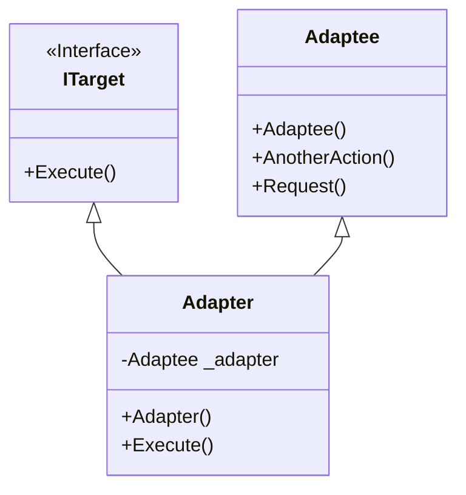

# Design Pattern - Abstract Factory

+ 兩個或以上的類別做相同或類似的事情，但擁有不同的介面
+ 如果這些類別擁有一個共同的介面，客戶端程式碼可以更簡潔、更容易維護
+ 你要使用某一個第三方類別庫，或是既有的框架；而你無法改變它們的程式碼來適應你已經寫好的客戶端程式。

## Object Adapter
Adapter 類別裡包含 Adaptee 類別的實體並繼承和實作 ITarget 介面，讓 Client 端程式呼叫 Execute 即可使用 Adaptee 類別的實體 



+ Client
  + 在圖上指的就是 Program class，這個角色呼叫符合 ITarget 介面的物件。
+ ITarget
  + 定義Client 端程式碼所需要的公開介面形式，也可能以類別(class) – 通常是抽象類別的形式呈現。
+ Adapter
  + 具體實作 ITagert 的介面定義，通常會持有 Adaptee 的執行個體；藉此將 Adaptee 轉換成 Client 可以使用的 ITarget。
+ Adaptee
  + 既有存在但無法符合 ITarget 定義的物件，需要被轉換才能為Client 所使用。

Adaptee 類別
<br/>既有類別，假設無法更改
```csharp
public class Adaptee
{
    public void Request()
    { }

    public void AnotherAction()
    { }
}
```

<br/>Adapter 抽象類別
```csharp
public interface ITarget
{
    void Execute();
}
```

<br/>Adapter 實作類別
```csharp
public class Adapter : ITarget
{
    Private Adaptee _adaptee;

    public Adapter()
    {
        _adaptee = new Adaptee();
    }

    public void Execute()
    {
        _adaptee.Request();
    }
}
```

<br/>Client 端程式
```csharp
ITarget target = new Adapter();
target.Execute();
```

## Class Adapter
Adapter 類別繼承了 ITarget 介面和 Adaptee 類別。講師特別說明 C# 不要這樣用



Adaptee 類別
<br/>既有類別，假設無法更改
```csharp
public class Adaptee
{
    public void Request()
    { }

    public void AnotherAction()
    { }
}
```

<br/>Adapter 抽象類別
```csharp
public interface ITarget
{
    void Execute();
}
```

<br/>Adapter 實作類別
```csharp
public class Adapter : Adaptee, ITarget
{
    Private Adaptee _adaptee;

    public void Execute()
    {
        this.Request();
    }
}
```

<br/>Client 端程式
```csharp
ITarget target = new Adapter();
target.Execute();
```