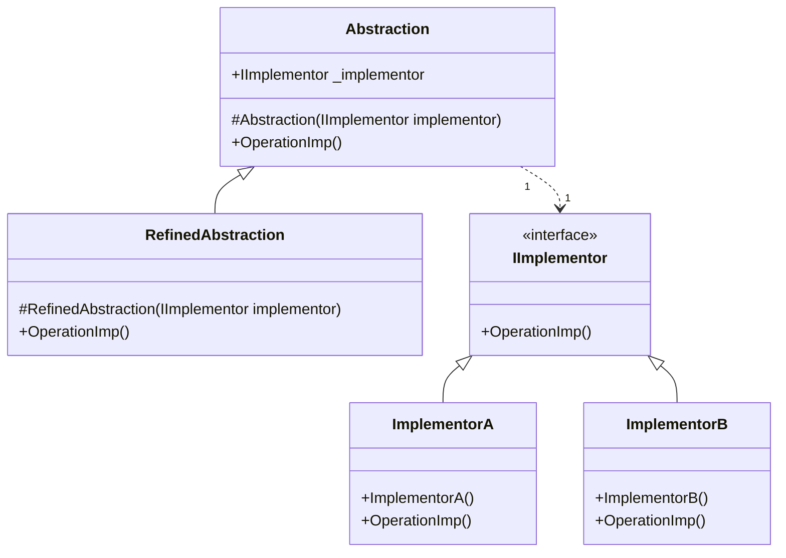

# Design Pattern - Bridge

+ 將抽象與實作解耦合，使得兩邊可以獨立的變化。



+ Abstraction
  + 抽象體的介面。
  + 內部會擁有 IImplementor 物件的欄位(一個或以上)。
  + 可以透建構子注入或是屬性注入方式取得
  + 不一定是 interface 或 abstract class，有時可能會是個單純的實作類別，這個狀況下，RefinedAbstraction 就不一定會存在。
+ RefinedAbstraction
  + 擴充 Abstraction 所定義介面的實作類別。
+ IImplementor
  + 定義實作部分的共同介面，通常和 Abstraction 有很大的差異。IImplementor 只包含基本操作，讓 Abstraction 可以利用 IImplementor 的具體實作類別去組合出更高階的操作。
  + 通常是 interface 或 abstract class
+ ConcreateImplementor
  + 圖中的 ImplementorA 和 ImplementorB，為 IImplementor 的具體實作。

此例中，RefindAbstraction 才是面對外界的介面

```csharp
public abstract class Abstraction
{
    protected IImplementor _implementor;

    protected Abstraction(IImplementor implementor)
    {
        _implementor = implementor;
    }

    public abstract void Operation();
}
```

```csharp
public class RefinedAbstraction : Abstraction
{
    public RefinedAbstraction(IImplementor implementor)
        : base(implementor)
    { }

    public override void Operation()
    {
        if (_implementor != null)
        {
            _implementor.OperationImp();
        }
    }
}
```

```csharp
public interface IImplementor
{
    void OperationImp();
}

public class ImplementorA : IImplementor
{
    public void OperationImp()
    {
        Console.WriteLine("Implementor A");
    }
}

public class ImplementorB : IImplementor
{
    public void OperationImp()
    {
        Console.WriteLine("Implementor B");
    }
}
```

<br/>client 端程式
```csharp
RefinedAbstraction refinedAbstraction = new RefinedAbstraction(new ImplementorA());
refinedAbstraction.Operation();
```

## 另一個例子，計算 BMI
Human 抽象類別，裡面包含 BMI 的計算
```csharp
public abstract class Human
{
    public double Weight { get; set; }

    public double Height { get; set; }

    private bool _calculated = false;
    private double _bmi = 0;

    public double BMI
    {
        get
        {
            if (!_calculated)
            {
                GetBMIValue();
            }
            return _bmi;
        }
    }

    public string Result
    {
        get
        {
            return GetResult();
        }
    }

    private void GetBMIValue()
    {
        _calculated = true;
        if (Weight > 0 && Height > 0)
        {
            _bmi = Weight / Math.Pow(Height, 2);
        }
        else
        {
            _bmi = -1;
        }
    }

    protected abstract string GetResult();
}
```

<br/>Man 類別，繼承 Human
```csharp
public class Man : Human
{
    protected override string GetResult()
    {
        if (BMI != -1)
        {
            if (BMI > 25)
            {
                return "太胖";
            }
            else if (BMI < 20)
            {
                return "太瘦";
            }
            else
            {
                return "適中";
            }
        }
        else
        {
            return "體重或身高不得小於0";
        }
    }
}
```

<br/>Woman 類別，繼承 Human
```csharp
public class Woman : Human
{
    protected override string GetResult()
    {
        if (BMI > 22)
        {
            return "太胖";
        }
        else if (BMI < 18)
        {
            return "太瘦";
        }
        else
        {
            return "適中";
        }
    }
}
```


<br/>就如同[多用組合，少用繼承](composition_inheritance.md)所解釋的，這會讓基底類別很肥大。
<br/>所以採用 bridge 模式，從繼承改用組合

Human 抽象類別
```csharp
public class Human
{
    // 這邊不一樣
    private IBMIComment _comment;

    public Human(IBMIComment comment)
    {
        _comment = comment;
    }

    public double Weight  { get; set; }

    public double Height  { get; set; }

    private bool _calculated = false;
    private double _bmi = 0;

    public double BMI
    {
        get
        {
            if (!_calculated)
            {
                GetBMIValue();
            }
            return _bmi;
        }
    }

    public string Result
    {
        get
        {
            return GetResult();
        }
    }

    private void GetBMIValue()
    {
        _calculated = true;
        if (Weight > 0 && Height > 0)
        {
            _bmi = Weight / Math.Pow(Height, 2);
        }
        else
        {
            _bmi = -1;
        }
    }

    //這邊不一樣
    public string GetResult()
    {
        return _comment.GetResult(BMI);
    }
}
```

<br/>BMI 抽象類別
```csharp
public interface IBMIComment
{
    string GetResult(double bmi);
}
```

<br/>男生 BMI 的實作
```csharp
public class ManComment : IBMIComment
{
    public string GetResult(double bmi)
    {
        if (bmi > 25)
        {
            return "太胖";
        }
        else if (bmi < 20)
        {
            return "太瘦";
        }
        else
        {
            return "適中";
        }
    }
}
```

<br/>女生 BMI 的實作
```csharp
public class WomanComment : IBMIComment
{
    public string GetResult(double bmi)
    {
        if (bmi > 22)
        {
            return "太胖";
        }
        else if (bmi < 18)
        {
            return "太瘦";
        }
        else
        {
            return "適中";
        }
    }
}
```