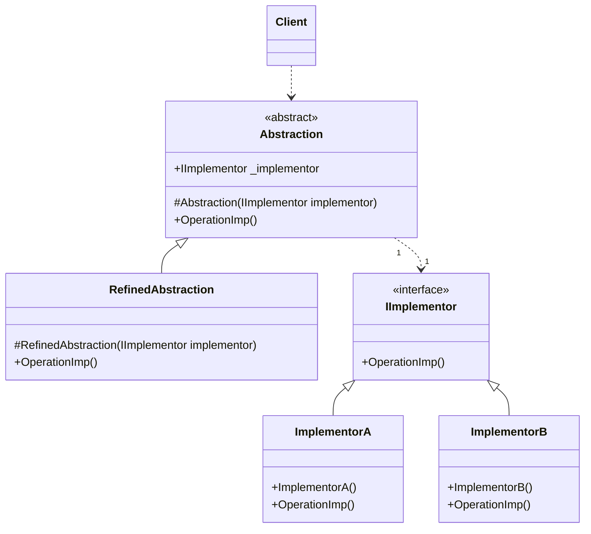

# Design Pattern - Bridge

- [Design Pattern - Bridge](#design-pattern---bridge)
  - [概觀](#概觀)
  - [類別圖](#類別圖)
    - [pseudo code](#pseudo-code)
  - [範例 - BMI 重構](#範例---bmi-重構)
    - [原本寫法](#原本寫法)
    - [採用 bridge 模式，從繼承改用組合](#採用-bridge-模式從繼承改用組合)
  - [Bridge + Adapter](#bridge--adapter)

---
## 概觀
+ 將抽象與實作解耦合，使得兩邊可以獨立的變化。

---
## 類別圖


+ Abstraction
  + 抽象體的介面。
  + 內部會擁有 IImplementor 物件的欄位(一個或以上)。
  + 可以透建構子注入或是屬性注入方式取得
  + 不一定是 interface 或 abstract class，有時可能會是個單純的實作類別，這個狀況下，RefinedAbstraction 就不一定會存在。
+ RefinedAbstraction
  + 擴充 Abstraction 所定義介面的實作類別。
+ IImplementor
  + 定義實作部分的共同介面，通常和 Abstraction 有很大的差異。IImplementor 只包含基本操作，讓 Abstraction 可以利用 IImplementor 的具體實作類別去組合出更高階的操作。
  + 通常是 interface 或 abstract class
+ ConcreateImplementor
  + 圖中的 ImplementorA 和 ImplementorB，為 IImplementor 的具體實作。

<br/>

### pseudo code
Abstraction 抽象類別
```csharp
public abstract class Abstraction
{
    protected IImplementor _implementor;

    protected Abstraction(IImplementor implementor)
    {
        _implementor = implementor;
    }

    public abstract void Operation();
}
```

<br/>RefinedAbstraction 類別
```csharp
public class RefinedAbstraction : Abstraction
{
    public RefinedAbstraction(IImplementor implementor)
        : base(implementor)
    { }

    public override void Operation()
    {
        if (_implementor != null)
        {
            _implementor.OperationImp();
        }
    }
}
```

<br/>IImplementor 介面
```csharp
public interface IImplementor
{
    void OperationImp();
}
```

<br/>IImplementor 子類別
```csharp
public class ImplementorA : IImplementor
{
    public void OperationImp()
    {
        Console.WriteLine("Implementor A");
    }
}

public class ImplementorB : IImplementor
{
    public void OperationImp()
    {
        Console.WriteLine("Implementor B");
    }
}
```

<br/>client 端程式
```csharp
Abstraction ab = new RefinedAbstraction(new ImplementorA());
ab.Operation();
```

## 範例 - BMI 重構
+ 利用 Bridge Pattern 重構，讓繼承轉為聚合

<br/>

### 原本寫法
Human 抽象類別，裡面包含 BMI 的計算
```csharp
public abstract class Human
{
    public double Weight { get; set; }

    public double Height { get; set; }

    private bool _calculated = false;
    private double _bmi = 0;

    public double BMI
    {
        get
        {
            if (!_calculated)
            {
                GetBMIValue();
            }
            return _bmi;
        }
    }

    public string Result
    {
        get
        {
            return GetResult();
        }
    }

    private void GetBMIValue()
    {
        _calculated = true;
        if (Weight > 0 && Height > 0)
        {
            _bmi = Weight / Math.Pow(Height, 2);
        }
        else
        {
            _bmi = -1;
        }
    }

    protected abstract string GetResult();
}
```

<br/>Man 類別，繼承 Human
```csharp
public class Man : Human
{
    protected override string GetResult()
    {
        if (BMI != -1)
        {
            if (BMI > 25)
            {
                return "太胖";
            }
            else if (BMI < 20)
            {
                return "太瘦";
            }
            else
            {
                return "適中";
            }
        }
        else
        {
            return "體重或身高不得小於0";
        }
    }
}
```

<br/>Woman 類別，繼承 Human
```csharp
public class Woman : Human
{
    protected override string GetResult()
    {
        if (BMI > 22)
        {
            return "太胖";
        }
        else if (BMI < 18)
        {
            return "太瘦";
        }
        else
        {
            return "適中";
        }
    }
}
```


<br/>就如同[多用組合，少用繼承](composition_inheritance.md)所解釋的，這會讓基底類別很肥大。

<br/>

### 採用 bridge 模式，從繼承改用組合

Human 抽象類別
```csharp
public class Human
{
    // 這邊不一樣
    private IBMIComment _comment;

    public Human(IBMIComment comment)
    {
        _comment = comment;
    }

    public double Weight  { get; set; }

    public double Height  { get; set; }

    private bool _calculated = false;
    private double _bmi = 0;

    public double BMI
    {
        get
        {
            if (!_calculated)
            {
                GetBMIValue();
            }
            return _bmi;
        }
    }

    public string Result
    {
        get
        {
            return GetResult();
        }
    }

    private void GetBMIValue()
    {
        _calculated = true;
        if (Weight > 0 && Height > 0)
        {
            _bmi = Weight / Math.Pow(Height, 2);
        }
        else
        {
            _bmi = -1;
        }
    }

    //這邊不一樣
    public string GetResult()
    {
        return _comment.GetResult(BMI);
    }
}
```

<br/>BMI 抽象類別
```csharp
public interface IBMIComment
{
    string GetResult(double bmi);
}
```

<br/>男生 BMI 的實作
```csharp
public class ManComment : IBMIComment
{
    public string GetResult(double bmi)
    {
        if (bmi > 25)
        {
            return "太胖";
        }
        else if (bmi < 20)
        {
            return "太瘦";
        }
        else
        {
            return "適中";
        }
    }
}
```

<br/>女生 BMI 的實作
```csharp
public class WomanComment : IBMIComment
{
    public string GetResult(double bmi)
    {
        if (bmi > 22)
        {
            return "太胖";
        }
        else if (bmi < 18)
        {
            return "太瘦";
        }
        else
        {
            return "適中";
        }
    }
}
```
---
## Bridge + Adapter
+ 擴張 Macro Command 範例，除了原有寫入檔案的功能外，現在又要整合 Socket 送資料的功能。
+ 在 Command 的實作中採用 Bridge Pattern。

<br/>FileProcess 類別，既有類別
```csharp
public class FileProcess
{
    public void Write(string path, byte[] data)
    {
        File.WriteAllBytes(path, data);
    }

    public byte[] Read(string path)
    {
        if (File.Exists(path))
        {
            return File.ReadAllBytes(path);
        }
        else
        {
            throw new FileNotFoundException();
        }
    }
}
```

<br/>Base64Processor 類別，既有類別
```csharp
public class Base64Processor
{
    public byte[] Decode(byte[] base64Bytes)
    {
        var bytes = Convert.FromBase64String(Encoding.UTF8.GetString(base64Bytes));
        return bytes;
    }

    public byte[] Encode(byte[] data)
    {
        return Encoding.UTF8.GetBytes(Convert.ToBase64String(data));
    }
}
```

<br/>DESCryptoProcessor 類別，既有類別
```csharp
public class DESCryptoProcessor
{
    private byte[] key;
    private byte[] iv;
    private DESCryptoServiceProvider des;
    public DESCryptoProcessor()
    {
        key = new byte[] { 0x01, 0xFF, 0x02, 0xAA, 0x55, 0xBB, 0x19, 0x20 };
        iv = new byte[] { 0x11, 0xF3, 0x43, 0x0A, 0x35, 0xE9, 0x82, 0x80 };
        des = new DESCryptoServiceProvider();
        des.Key = key;
        des.IV = iv;
    }
    public byte[] DecryptData(byte[] encryptBytes)
    {
        byte[] outputBytes = null;
        using (MemoryStream memoryStream = new MemoryStream(encryptBytes))
        {
            using (CryptoStream decryptStream = new CryptoStream(memoryStream, des.CreateDecryptor(), CryptoStreamMode.Read))
            {
                MemoryStream outputStream = new MemoryStream();
                decryptStream.CopyTo(outputStream);
                outputBytes = outputStream.ToArray();
            }
        }
        return outputBytes;
    }
    public byte[] EncryptData(byte[] data)
    {
        byte[] outputBytes = null;
        using (MemoryStream memoryStream = new MemoryStream())
        {
            using (CryptoStream encryptStream = new CryptoStream(memoryStream, des.CreateEncryptor(), CryptoStreamMode.Write))
            {
                MemoryStream inputStream = new MemoryStream(data);
                inputStream.CopyTo(encryptStream);
                encryptStream.FlushFinalBlock();
                outputBytes = memoryStream.ToArray();
            }
        }
        return outputBytes;
    }
}
```

<br/>AESCryptoProcessor 類別，既有類別
```csharp
public class AESCryptoProcessor
{
    private byte[] key;
    private byte[] iv;
    private AesCryptoServiceProvider aes;
    public AESCryptoProcessor()
    {
        key = new byte[] { 0x01, 0xFF, 0x02, 0xAA, 0x55, 0xBB, 0x19, 0x20, 0x01, 0xFF, 0x02, 0xAA, 0x55, 0xBB, 0x19, 0x20 };
        iv = new byte[] { 0x11, 0xF3, 0x43, 0x0A, 0x35, 0xE9, 0x82, 0x80, 0x11, 0xF3, 0x43, 0x0A, 0x35, 0xE9, 0x82, 0x80 };
        aes = new AesCryptoServiceProvider();
        aes.Key = key;
        aes.IV = iv;
    }
    public byte[] DecryptData(byte[] encryptBytes)
    {
        byte[] outputBytes = null;
        using (MemoryStream memoryStream = new MemoryStream(encryptBytes))
        {
            using (CryptoStream decryptStream = new CryptoStream(memoryStream, aes.CreateDecryptor(), CryptoStreamMode.Read))
            {
                MemoryStream outputStream = new MemoryStream();
                decryptStream.CopyTo(outputStream);
                outputBytes = outputStream.ToArray();
            }
        }
        return outputBytes;
    }
    public byte[] EncryptData(byte[] data)
    {
        byte[] outputBytes = null;
        using (MemoryStream memoryStream = new MemoryStream())
        {
            using (CryptoStream encryptStream = new CryptoStream(memoryStream, aes.CreateEncryptor(), CryptoStreamMode.Write))
            {
                MemoryStream inputStream = new MemoryStream(data);
                inputStream.CopyTo(encryptStream);
                encryptStream.FlushFinalBlock();
                outputBytes = memoryStream.ToArray();
            }
        }
        return outputBytes;
    }
}
```

<br/>GZipFileProcessor 類別，既有類別
```csharp
public class GZipFileProcessor
{
    public byte[] Decompress(byte[] compressedBytes)
    {
        byte[] outputBytes = null;
        MemoryStream input = new MemoryStream(compressedBytes);
        outputBytes = Decompress(input).ToArray();
        return outputBytes;
    }

    private MemoryStream Decompress(Stream compressed)
    {
        var decompressed = new MemoryStream();
        using (var zip = new GZipStream(compressed, CompressionMode.Decompress, true))
        {
            zip.CopyTo(decompressed);
        }
        decompressed.Seek(0, SeekOrigin.Begin);
        return decompressed;
    }

    public byte[] Compress(byte[] data)
    {
        byte[] outputBytes = null;
        MemoryStream input = new MemoryStream(data);
        outputBytes = Compress(input).ToArray();
        return outputBytes;
    }

    private MemoryStream Compress(Stream decompressed)
    {
        var compressed = new MemoryStream();
        using (var zip = new GZipStream(compressed, CompressionLevel.Fastest, true))
        {
            decompressed.CopyTo(zip);
        }
        compressed.Seek(0, SeekOrigin.Begin);
        return compressed;
    }
}
```

<br/>TcpCommunication 類別，Tcp Adapter
```csharp
public class TcpCommunication :  IDisposable
{
    private Socket client;

    public TcpCommunication()
    {
        client = new Socket(AddressFamily.InterNetwork, SocketType.Stream, ProtocolType.Tcp);
        //...設定 client 所需的資訊
    }

    public bool Connect(string target)
    {
        string[] data = target.Split(':');
        IPAddress ip;
        int port;
        if (IPAddress.TryParse(data[0], out ip) && int.TryParse(data[1], out port))
        {
            client.Connect(ip, port);
        }
        return client.Connected;
    }

    public void Disconnect()
    {
        if (client.Connected)
        {
            client.Disconnect(true);
        }
    }

    public void Dispose()
    {
        if (client != null)
        {
            client.Dispose();
        }
    }

    public byte[] Receive()
    {
        if (client.Connected)
        {
            byte[] buffer = new byte[1024];
            int receiveSize = client.Receive(buffer);
            Array.Resize(ref buffer, receiveSize);
            return buffer;
        }
        else
        {
            return null;
        }
    }

    public void Send(byte[] buffer)
    {
        if (client.Connected)
        {
            client.Send(buffer);
        }
    }
}
```

<br/>IBytesProcessAdapter 介面，為 FileProcess 和 TcpCommunication 建立 Adapter，才能讓 Bridge 可以使用共用抽象
同時擔任 Adapter 的抽象 和 Bridge 的 Implementor 的抽象
```csharp
public interface IBytesProcessAdapter
{
    void Write(string path, byte[] data);
    byte[] Read(string path);
    void Close();
}
```

<br/> FileProcessAdapter 實作
```csharp
public class FileProcessAdapter : IBytesProcessAdapter
{
    private FileProcess _target = new FileProcess();

    public void Close()
    { }

    public byte[] Read(string path)
    {
        return _target.Read(path);
    }

    public void Write(string path, byte[] data)
    {
        _target.Write(path, data);
    }
}
```

<br/> TcpProcessAdapter 實作
```csharp
public class TcpProcessAdapter : IBytesProcessAdapter
{
    private TcpCommunication _target = new TcpCommunication();
    private bool _connected = false;

    public byte[] Read(string path)
    {
        if (!_connected)
        {
            _target.Connect(path);
            _connected = true;
        }
        return _target.Receive();
    }

    public void Write(string path, byte[] data)
    {
        if (!_connected)
        {
            _target.Connect(path);
            _connected = true;
        }
        _target.Send(data);
    }

    public void Close()
    {
        _target.Disconnect();
    }
}
```

<br/>BytesCommand 介面
```csharp
public abstract class BytesCommand
{
    protected IBytesProcessAdapter _implementor;

    protected BytesCommand(IBytesProcessAdapter adapter)
    {
        _implementor = adapter;
    }
}
```

<br/>同時擔任 Command 的抽象 和 Bridge 的 Abstraction
```csharp
public abstract class BytesWriteCommand : BytesCommand
{
    protected BytesWriteCommand(IBytesProcessAdapter adapter) : base(adapter)
    { }

    public abstract void Execute(string path, byte[] data);
}

public abstract class BytesReadCommand : BytesCommand
{
    public BytesReadCommand(IBytesProcessAdapter adapter) : base(adapter)
    { }

    public abstract byte[] Execute(string path);
}
```

<br/>Command 實作
```csharp
public class Base64AesWriteCommand : BytesWriteCommand
{
    private Base64Processor _base64Processor;
    private AESCryptoProcessor _aesProcessor;

    public Base64AesWriteCommand(IBytesProcessAdapter adapter) : base(adapter)
    {
        _aesProcessor = new AESCryptoProcessor();
        _base64Processor = new Base64Processor();
    }

    public override void Execute(string path, byte[] data)
    {
        _implementor.Write(path, _aesProcessor.EncryptData(_base64Processor.Encode(data)));
    }
}

public class Base64AesReadCommand : BytesReadCommand
{
    private Base64Processor _base64Processor;
    private AESCryptoProcessor _aesProcessor;

    public Base64AesReadCommand(IBytesProcessAdapter adapter) : base(adapter)
    {
        _aesProcessor = new AESCryptoProcessor();
        _base64Processor = new Base64Processor();
    }

    public override byte[] Execute(string path)
    {
        return _base64Processor.Decode(_aesProcessor.DecryptData(_implementor.Read(path)));
    }
}
```

<br/>Invoker 類別
```csharp
public class Invoker
{
    public BytesWriteCommand WriteCommand { get; set; }
    public BytesReadCommand ReadCommand { get; set; }

    public void Write(string path, byte[] data)
    {
        WriteCommand.Execute(path, data);
    }

    public byte[] Read(string path)
    {
        return ReadCommand.Execute(path);
    }
}
```

<br/>Base64AesClient 類別
```csharp
public class Base64AesClient
{
    public static Invoker CreateFileInvoker()
    {
        var invoker = new Invoker();
        IBytesProcessAdapter adapter = new FileProcessAdapter();
        invoker.WriteCommand = new Base64AesWriteCommand(adapter);
        invoker.ReadCommand = new Base64AesReadCommand(adapter);
        return invoker;
    }

    public static Invoker CreateTcpInvoker()
    {
        var invoker = new Invoker();
        IBytesProcessAdapter adapter = new TcpProcessAdapter();
        invoker.WriteCommand = new Base64AesWriteCommand(adapter);
        invoker.ReadCommand = new Base64AesReadCommand(adapter);
        return invoker;
    }
}
```

<br/>Client 端程式
```csharp
string newline = Environment.NewLine;
string path = "127.0.0.1:7";
string expected = "測試 文字" + newline + "Base64" + newline + "檔案存取";
var writebytes = Encoding.UTF8.GetBytes(expected);
var invoker = Base64AesClient.CreateTcpInvoker();
invoker.Write(path, writebytes);

string actual = Encoding.UTF8.GetString(invoker.Read(path));
Console.WriteLine(actual);
```