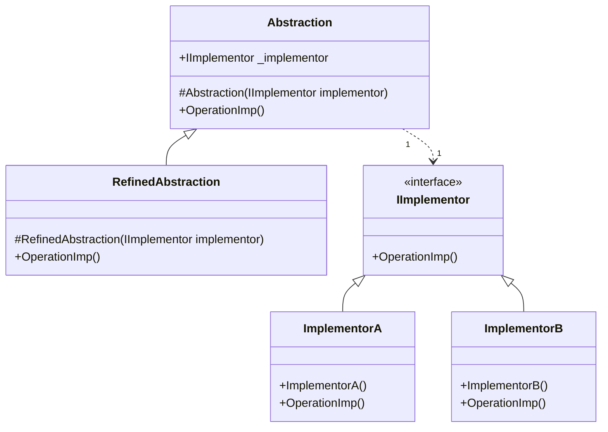

# Design Pattern - Bridge

```mermaid
classDiagram
class Abstraction {
    +IImplementor _implementor
    #Abstraction(IImplementor implementor)
    +OperationImp()
}
class RefinedAbstraction {
    #RefinedAbstraction(IImplementor implementor)
    +OperationImp()
}

class IImplementor {
    <<interface>>
    +OperationImp()
}
class ImplementorA {
    +ImplementorA()
    +OperationImp()
}
class ImplementorB {
    +ImplementorB()
    +OperationImp()
}

Abstraction <|-- RefinedAbstraction
Abstraction "1"..> "1" IImplementor
IImplementor <|-- ImplementorA
IImplementor <|-- ImplementorB
```