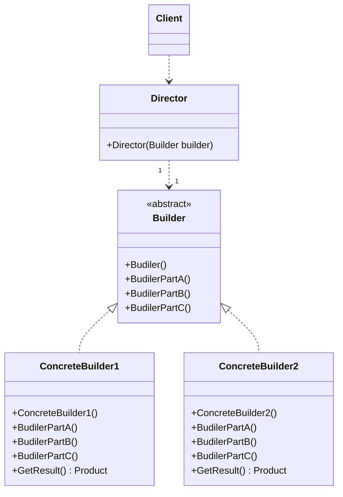

# Design Pattern - Builder

- [Design Pattern - Builder](#design-pattern---builder)
  - [概觀](#概觀)
  - [類別圖](#類別圖)
    - [pseudo code](#pseudo-code)
  - [範例 - 撰寫讀寫檔功能](#範例---撰寫讀寫檔功能)

---
## 概觀
+ 將一個複雜物件的建構與它的表示分離，使得同樣的建構過程可以創建出不同的配置或佈局。
+ Builder 提供建構物件的方法
+ 最重要的人物是 Director

## 類別圖


+ Builder
  + 建造者的抽象介面，規範各個零件的生成方法(Creation Method)。
  + 有可能是 interface 或 abstract class。
+ ConcreteBuilder
  + Builder 介面的具體實作，負責建構 Product 的各個零件。
  + 規範 Product 由哪些具體零件來組裝。
  + 定義外部呼叫者如何取得完成的零件，如圖中的GetResult Method。
+ Director
  + 利用 Builder 完成最後的零件組裝順序。
+ Product
  + 要被產生的複雜物件，至於這個物件的內部結構及組裝程序，由 ConcreteBuilder 定義。

在下列範例程式碼中，Director 依賴抽象 Builder。
但是 GetResult 函式放在 Builder 子類別，因為不同的 ConcreteBuilder 產出的 Product 可能互相沒有關係，所以 Client 端可能需明確地指定 Builder 子類別

<br/>

### pseudo code
Product 類別
```csharp
public class Product
{
    public string PropertyA { get; set; }
    public string PropertyB { get; set; }
    public int PropertyC { get; set; }
}
```

<br/>Builder 抽象類別
```csharp
public abstract class Builder
{
    public abstract void BuildPartA();
    public abstract void BuildPartB();
    public abstract void BuildPartC();
}
```

<br/>ConcreteBuilder1
```csharp
public class ConcreteBuilder1 : Builder
{
    private Product _result;

    public ConcreteBuilder1()
    {
        _result = new Product();
    }

    public Product GetResult()
    {
        return _result;
    }

    public override void BuildPartA()
    {
        _result.PropertyA = "Product A";
    }

    public override void BuildPartB()
    {
        _result.PropertyB = "Parts A-B";
    }

    public override void BuildPartC()
    {
        _result.PropertyC = 100;
    }
}
```

<br/>ConcreteBuilder2
```csharp
public class ConcreteBuilder2 : Builder
{
    private Product _result;

    public ConcreteBuilder2()
    {
        _result = new Product();
    }

    public Product GetResult()
    {
        return _result;
    }

    public override void BuildPartA()
    {
        _result.PropertyA = "Product B";
    }

    public override void BuildPartB()
    {
        _result.PropertyB = "Parts B-B";
    }

    public override void BuildPartC()
    {
        _result.PropertyC = 100;
    }
}
```

<br/>Director 類別，依賴 Builder 抽象類別
```csharp
public class Director
{
    public Director(Builder builder)
    {
        builder.BuildPartA();
        builder.BuildPartB();
        builder.BuildPartC();
    }
}
```

<br/>Client 端程式
```csharp
Builder builder = new ConcreteBuilder1();
Director director = new Director(builder);
var result = builder.GetResult();
```
---

## 範例 - 撰寫讀寫檔功能
撰寫讀寫檔功能，寫檔時可以依需求先做 Base64、壓縮、AED 加密，或是 Base64、壓縮、DES 加密或是 壓縮、Base64、AED 加密
1. Decorators 建立 Builder
2. 建立 Director 完成建立的過程

<br/>IFileProcess 介面
```csharp
public interface IFileProcess
{
    void Write(string path, byte[] data);
    byte[] Read(string path);
}
```

<br/>FileProcess 類別，單純的讀寫檔案
```csharp
public class FileProcess : IFileProcess
{
    public void Write(string path, byte[] data
    {
        File.WriteAllBytes(path, data);
    }

    public byte[] Read(string path)
    {
        if (File.Exists(path))
        {
            return File.ReadAllBytes(path);
        }
        else
        {
            throw new FileNotFoundException();
        }
    }
}
```

<br/>Decorator 抽象類別，內含 FileProcess 實體
```csharp
public abstract class FileDecorator : IFileProcess
{
    protected readonly IFileProcess _fileProcess;

    protected FileDecorator(IFileProcess fileProcess)
    {
        _fileProcess = fileProcess;
    }

    public abstract byte[] Read(string path);
    public abstract void Write(string path, byte[] data);
}
```

<br/>Decorator 子類別，Base64，Read、Write 的順序是相反的
```csharp
public class Base64FileDecorator : FileDecorator
{
    public Base64FileDecorator(IFileProcess fileProcess) : base(fileProcess)
    { }

    public override byte[] Read(string path)
    {
        var base64Bytes = _fileProcess.Read(path);
        return Decode(base64Bytes);
    }

    private byte[] Decode(byte[] base64Bytes)
    {
        var bytes = Convert.FromBase64String(Encoding.UTF8.GetString(base64Bytes));
        return bytes;
    }

    public override void Write(string path, byte[] data)
    {
        var base64Bytes = Encode(data);
        _fileProcess.Write(path, base64Bytes);
    }

    private byte[] Encode(byte[] data)
    {
        return Encoding.UTF8.GetBytes(Convert.ToBase64String(data));
    }
}
```

<br/>Decorator 子類別，DES加密，Read、Write 的順序是相反的
```csharp
public class DESCryptoFileDecorator : FileDecorator
{
    private byte[] key;
    private byte[] iv;
    private DESCryptoServiceProvider des;
    public DESCryptoFileDecorator(IFileProcess fileProcess) : base(fileProcess)
    {
        key = new byte[] { 0x01, 0xFF, 0x02, 0xAA, 0x55, 0xBB, 0x19, 0x20 };
        iv = new byte[] { 0x11, 0xF3, 0x43, 0x0A, 0x35, 0xE9, 0x82, 0x80 };
        des = new DESCryptoServiceProvider();
        des.Key = key;
        des.IV = iv;
    }

    public override byte[] Read(string path)
    {
        byte[] encryptBytes = _fileProcess.Read(path);
        return DecryptData(encryptBytes);
    }

    private byte[] DecryptData(byte[] encryptBytes)
    {
        byte[] outputBytes = null;
        using (MemoryStream memoryStream = new MemoryStream(encryptBytes))
        {
            using (CryptoStream decryptStream = new CryptoStream(memoryStream, des.CreateDecryptor(), CryptoStreamMode.Read))
            {
                MemoryStream outputStream = new MemoryStream();
                decryptStream.CopyTo(outputStream);
                outputBytes = outputStream.ToArray();
            }
        }
        return outputBytes;
    }

    public override void Write(string path, byte[] data)
    {
        byte[] outputBytes = EncryptData(data);
        _fileProcess.Write(path, outputBytes);
    }

    private byte[] EncryptData(byte[] data)
    {
        byte[] outputBytes = null;
        using (MemoryStream memoryStream = new MemoryStream())
        {

            using (CryptoStream encryptStream = new CryptoStream(memoryStream, des.CreateEncryptor(), CryptoStreamMode.Write))
            {
                MemoryStream inputStream = new MemoryStream(data);
                inputStream.CopyTo(encryptStream);
                encryptStream.FlushFinalBlock();
                outputBytes = memoryStream.ToArray();
            }
        }

        return outputBytes;
    }
}

```

<br/>Decorator 子類別，AES加密，Read、Write 的順序是相反的
```csharp
public class AESCryptoFileDecorator : FileDecorator
{
    private byte[] key;
    private byte[] iv;
    private AesCryptoServiceProvider aes;

    public AESCryptoFileDecorator(IFileProcess fileProcess) : base(fileProcess)
    {
        key = new byte[] { 0x01, 0xFF, 0x02, 0xAA, 0x55, 0xBB, 0x19, 0x20, 0x01, 0xFF, 0x02, 0xAA, 0x55, 0xBB, 0x19, 0x20 };
        iv = new byte[] { 0x11, 0xF3, 0x43, 0x0A, 0x35, 0xE9, 0x82, 0x80, 0x11, 0xF3, 0x43, 0x0A, 0x35, 0xE9, 0x82, 0x80 };
        aes = new AesCryptoServiceProvider();
        aes.Key = key;
        aes.IV = iv;
    }

    public override byte[] Read(string path)
    {
        byte[] encryptBytes = _fileProcess.Read(path);
        return DecryptData(encryptBytes);
    }

    private byte[] DecryptData(byte[] encryptBytes)
    {
        byte[] outputBytes = null;
        using (MemoryStream memoryStream = new MemoryStream(encryptBytes))
        {
            using (CryptoStream decryptStream = new CryptoStream(memoryStream, aes.CreateDecryptor(), CryptoStreamMode.Read))
            {
                MemoryStream outputStream = new MemoryStream();
                decryptStream.CopyTo(outputStream);
                outputBytes = outputStream.ToArray();
            }
        }
        return outputBytes;
    }

    public override void Write(string path, byte[] data)
    {
        byte[] outputBytes = EncryptData(data);
        _fileProcess.Write(path, outputBytes);
    }

    private byte[] EncryptData(byte[] data)
    {
        byte[] outputBytes = null;
        using (MemoryStream memoryStream = new MemoryStream())
        {
            using (CryptoStream encryptStream = new CryptoStream(memoryStream, aes.CreateEncryptor(), CryptoStreamMode.Write))
            {
                MemoryStream inputStream = new MemoryStream(data);
                inputStream.CopyTo(encryptStream);
                encryptStream.FlushFinalBlock();
                outputBytes = memoryStream.ToArray();
            }
        }

        return outputBytes;
    }
}
```

<br/>Gzip 壓縮裝飾器
```csharp
public class GZipFileDecorator : FileDecorator
{
    public GZipFileDecorator(IFileProcess fileProcess) : base(fileProcess)
    { }

    public override byte[] Read(string path)
    {
        byte[] compressedBytes = _fileProcess.Read(path);
        return Decompress(compressedBytes);
    }

    private byte[] Decompress(byte[] compressedBytes)
    {
        byte[] outputBytes = null;
        MemoryStream input = new MemoryStream(compressedBytes);
        outputBytes = Decompress(input).ToArray();

        return outputBytes;
    }

    private MemoryStream Decompress(Stream compressed)
    {
        var decompressed = new MemoryStream();
        using (var zip = new GZipStream(compressed, CompressionMode.Decompress, true))
        {
            zip.CopyTo(decompressed);
        }
        decompressed.Seek(0, SeekOrigin.Begin);
        return decompressed;
    }

    public override void Write(string path, byte[] data)
    {
        byte[] outputBytes = Compress(data);
        _fileProcess.Write(path, outputBytes);
    }

    private byte[] Compress(byte[] data)
    {
        byte[] outputBytes = null;
        MemoryStream input = new MemoryStream(data);
        outputBytes = Compress(input).ToArray();
        return outputBytes;
    }

    private MemoryStream Compress(Stream decompressed)
    {
        var compressed = new MemoryStream();
        using (var zip = new GZipStream(compressed, CompressionLevel.Fastest, true))
        {
            decompressed.CopyTo(zip);
        }
        compressed.Seek(0, SeekOrigin.Begin);
        return compressed;
    }
}
```

<br/>FileProcessBuilder 抽象類別
```csharp
public abstract class FileProcessBuilder
{
    protected IFileProcess _fileProcess;

    protected FileProcessBuilder()
    {
        _fileProcess = new FileProcess();
    }

    public abstract void BuildEncode();
    public abstract void BuildCrypto();
    public abstract void BuildCompress();

    public IFileProcess GetFileProcess()
    {
        return _fileProcess;
    }
}
```

<br/>DESBuilder 類別
```csharp
public class DESBuilder : FileProcessBuilder
{
    public override void BuildCompress()
    {
        _fileProcess = new GZipFileDecorator(_fileProcess);
    }

    public override void BuildCrypto()
    {
        _fileProcess = new DESCryptoFileDecorator(_fileProcess);
    }

    public override void BuildEncode()
    {
        _fileProcess = new Base64FileDecorator(_fileProcess);
    }
}
```

<br/>AESBuilder 類別
```csharp
public class AESBuilder : FileProcessBuilder
{
    public override void BuildCompress()
    {
        _fileProcess = new GZipFileDecorator(_fileProcess);
    }

    public override void BuildCrypto()
    {
        _fileProcess = new AESCryptoFileDecorator(_fileProcess);
    }

    public override void BuildEncode()
    {
        _fileProcess = new Base64FileDecorator(_fileProcess);
    }
}
```

<br/>FileProcessDirector 類別，只要調換順序，就可得到不同結果
<br/>此例為先 base64，再壓縮，再加密
```csharp
public class FileProcessDirector
{
    public FileProcessDirector(FileProcessBuilder builder)
    {
        builder.BuildEncode();
        builder.BuildCompress();
        builder.BuildCrypto();           
    }
}
```

<br/>Client 端程式
```csharp
string path = "1.txt";
if (File.Exists(path))
{
    File.Delete(path);
}
string newline = Environment.NewLine;
string expected = "測試 文字" + newline + "GZip" + newline + "加密" + newline + "Base64" + newline + "檔案存取";
var writebytes = Encoding.UTF8.GetBytes(expected);
FileProcessBuilder writeBuilder = new DESBuilder();
FileProcessDirector writeDirector = (new FileProcessDirector(writeBuilder));
IFileProcess writeProcess = writeBuilder.GetFileProcess();

writeProcess.Write(path, writebytes);

FileProcessBuilder readBuilder = new DESBuilder();
FileProcessDirector readDirector = (new FileProcessDirector(readBuilder));
IFileProcess readProcess = readBuilder.GetFileProcess();
var actual = Encoding.UTF8.GetString(readProcess.Read(path));
```