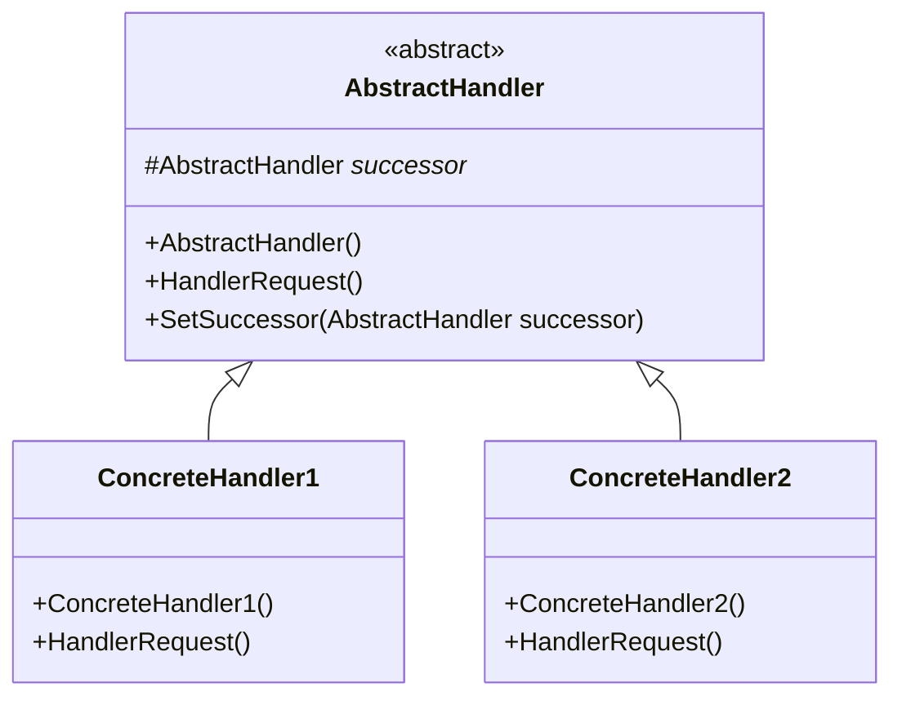

# Design Pattern - Chain of Responsibility

+ 讓多個物件都有機會處理請求，從而避免請求發送者和接受者之間的耦合關係。將這些物件串成一條鏈，並沿著這條鏈處理和傳遞請求，直到有物件決定不再傳遞下去為止。
+ 鏈太長的時候，容易有效能問題；偵錯上也比較複雜，但是比起巢狀判斷式還是容易多了。
+ Chain Of Responsibility 和 Strategy 很像，如果你知道該由哪個物件去處理請求，可直接設計成 Strategy，直接將請求丟給該件件；如果你不知道該由哪個物去處理請求，用 Chain Of Responsibility，讓請求在物件間傳遞，讓物件自己決定是否處理此請求或要不要繼續傳遞請求



+ AbstractHandler
  + 制定處理訊息的介面，可以是 interface 或 abstract class
  + 具有一個指向下一個處理訊息執行個體(後繼者)的欄位(field)。
  + 有時會在抽象層實作將訊息傳遞到後繼者的程式碼，但有時會在 ConcreteHandler 中實作此功能。
+ ConcreteHandler
  + 實作 AbstractHandler 的具體類別，具體實作如何處理訊息。
  + 如果訊息需要傳遞給後繼者，則繼續傳遞，若不需要則返回。
+ Client
  + 將要處理的訊息傳遞給第一個 ConcreteHandler。

<br/>用 FakeDataSource 模擬假資料，驗證資料的正確性，項目如下
+ 總長需為 29
+ index 0~2 需為 965
+ index 13~20 需為日期格式
+ index 21~28 需為日期格式

FakeDataSource 如下程式碼
```csharp
public class FakeDataSource
{
    private static List<string> _data;
    public static List<string> Data
    {
        get
        {
            if (_data == null)
            {
                CreateData();
            }
            return _data;
        }
    }

    /// <summary>
    /// 總長需為 29
    ///  0~2 需為 965,
    ///  13~20 需為日期格式,
    ///  21~28 需為日期格式,
    /// </summary>
    private static void CreateData()
    {
        _data = new List<string>()
       {
          "96523009085172015092719900402",
          "96523009119722015092719571104",
          "68000000000000000000000000000",
          "69500000000002015182919830912",
          "9999889",
          "96523009085172015092719900402",
          "96523009085172015092799999999"
       };
    }
}
```

<br/>一開始容易寫成巢狀 if(如下圖)，不易讀且難維護
```csharp
public class FormatChecker
{
    public CheckResult Check(string source)
    {
        // 巢狀 if, 不易讀且難維護
        var result = new CheckResult() { Source = source };
        if (source.Length == 29)
        {
            if (source.Substring(0, 3) == "965")
            {
                DateTime firstDate;
                if (DateTime.TryParseExact(source.Substring(13, 8), "yyyyMMdd", System.Globalization.CultureInfo.InvariantCulture, System.Globalization.DateTimeStyles.None, out firstDate))
                {
                    DateTime secondDate;
                    if (DateTime.TryParseExact(source.Substring(21, 8), "yyyyMMdd", System.Globalization.CultureInfo.InvariantCulture, System.Globalization.DateTimeStyles.None, out secondDate))
                    {
                        result.Result = true;
                    }
                }
            }
        }
        return result;
    }
```

<br/>有幾種改善方法：
+ 每跑完一個 if 即判斷是否結束，減少越寫越裡面的巢狀 if
+ 每個檢查皆指定給委派，再將委派全放到一個 List，跑此 List 內的所有委派即算檢查
+ 採用本例，轉成 Chain Of Responsibility 模式

不管採用何種方式，皆需確認每個檢查都要回傳相同型別的物件

## 轉成 Chain Of Responsibility 模式

<br/>FormatChecker 抽象類別，各個子類別需實作 InternalCheck 去實現自己的檢查
```csharp
public abstract class FormatChecker
{
    protected FormatChecker _successor;
    protected abstract bool InternalCheck(string source);

    public CheckResult Check(string source)
    {
        // 檢查結果為 true, 若沒有後繼者,表示檢查結束, 若有後繼者則繼續往下處理
        // 檢查結果為 false, 則跳出, 不再處理
        if (InternalCheck(source))
        {
            if (_successor != null)
            {
                return _successor.Check(source);
            }
            else
            {
                return new CheckResult() { Source = source, Result = true };
            }
        }
        else
        {
            return new CheckResult() { Source = source, Result = false };
        }
    }

    protected FormatChecker(FormatChecker successor)
    {
        _successor = successor;
    }
}

public class CheckResult
{
    public string Source { get; set; }
    public bool Result { get; set; }
}
```

<br/>FormatChecker 子類別，實作長度檢查
```csharp
public class LengthChecker : FormatChecker
{
    public LengthChecker(FormatChecker successor) : base(successor)
    { }
    protected override bool InternalCheck(string source)
    {
        return source.Length == 29;
    }
}
```

<br/>FormatChecker 子類別，實作開頭檢查
```csharp
public class HeadChecker : FormatChecker
{
    public HeadChecker(FormatChecker successor) : base(successor)
    { }
    protected override bool InternalCheck(string source)
    {
        string head = source.Substring(0, 3);
        return head == "965";
    }
}
```

<br/>FormatChecker 子類別，實作第一個日期檢查
```csharp
public class FirstDateChecker : FormatChecker
{
    public FirstDateChecker(FormatChecker successor) : base(successor)
    { }
    protected override bool InternalCheck(string source)
    {
        var dateString = source.Substring(13, 8);
        DateTime date;
        return DateTime.TryParseExact(dateString, "yyyyMMdd", System.Globalization.CultureInfo.InvariantCulture, System.Globalization.DateTimeStyles.None, out date);
    }
}
```

<br/>FormatChecker 子類別，實作第二個日期檢查
```csharp
public class SecondDateChecker : FormatChecker
{
    public SecondDateChecker(FormatChecker successor) : base(successor)
    { }
    protected override bool InternalCheck(string source)
    {
        var dateString = source.Substring(21, 8);
        DateTime date;
        return DateTime.TryParseExact(dateString, "yyyyMMdd", System.Globalization.CultureInfo.InvariantCulture, System.Globalization.DateTimeStyles.None, out date);
    }
}
```

<br/>由 ChainContext 組成責任鏈
```csharp
public class ChainContext
{
    public static FormatChecker GetCheckers()
    {
        return new LengthChecker(new HeadChecker(new FirstDateChecker(new SecondDateChecker(null))));
    }
}
```

<br/>Client 端程式
```csharp
var checker = ChainContext.GetCheckers();
var results = new List<CheckResult>();

foreach (var item in FakeDataSource.Data)
{
    results.Add(checker.Check(item));
}

foreach (var item in results)
{
    Console.WriteLine($"Source : {item.Source} , Result is {item.Result}");
}
```

<br/>實作過程中可以先把每個檢查寫成函式，比較方便作架構的修改

## 每個檢查皆指定給委派，再將委派全放到一個 List，跑此 List 內的所有委派即算檢查

<br/>由 FormatChecker 組成委派
```csharp
public class FormatChecker
{
    private List<Func<string, bool>> _checkers;

    public CheckResult Check(string source)
    {
        CreateCheckers();
        var isErrorDetected = _checkers.Any((x) => x.Invoke(source) == false);
        if (isErrorDetected)
        {
            return new CheckResult() { Source = source, Result = false };
        }
        else
        {
            return new CheckResult() { Source = source, Result = true };
        }
    }

    private void CreateCheckers()
    {
        if (_checkers == null)
        {
            _checkers = new List<Func<string, bool>>();
            _checkers.Add((x) => x.Length == 29);
            _checkers.Add((x) =>
            {
                string head = x.Substring(0, 3);
                return head == "965";
            });
            _checkers.Add((x) =>
            {
                var dateString = x.Substring(13, 8);
                DateTime date;
                return DateTime.TryParseExact(dateString, "yyyyMMdd", System.Globalization.CultureInfo.InvariantCulture, System.Globalization.DateTimeStyles.None, out date);
            });
            _checkers.Add((x) =>
            {
                var dateString = x.Substring(21, 8);
                DateTime date;
                return DateTime.TryParseExact(dateString, "yyyyMMdd", System.Globalization.CultureInfo.InvariantCulture, System.Globalization.DateTimeStyles.None, out date);
            });
        }
    }
}

public class CheckResult
{
    public string Source { get; set; }
    public bool Result { get; set; }
}
```

<br/>Client 端程式
```csharp
var checker = new FormatChecker();
var results = new List<CheckResult>();

foreach (var item in FakeDataSource.Data)
{
    results.Add(checker.Check(item));
}

foreach (var item in results)
{
    Console.WriteLine($"Source : {item.Source} , Result is {item.Result}");
}
```