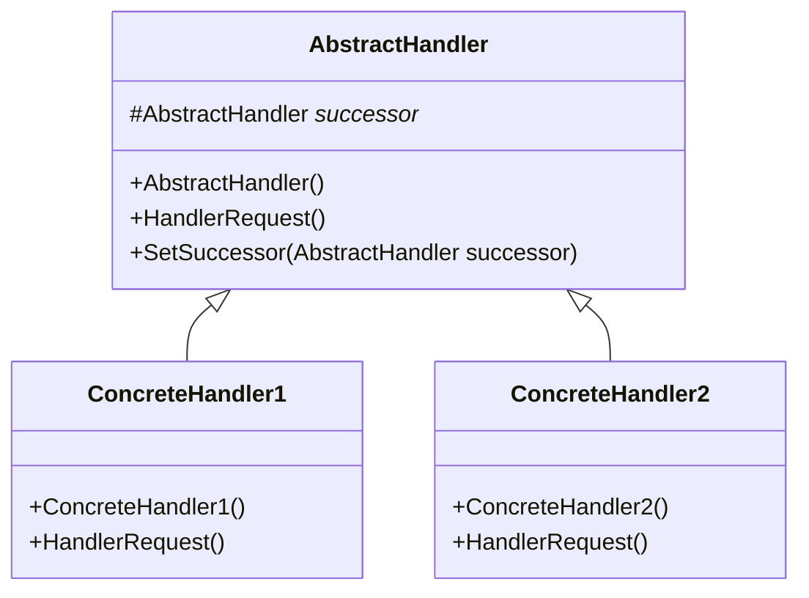

# Design Pattern - Chain of Responsibility

```mermaid
classDiagram
class AbstractHandler {
    #AbstractHandler _successor_
    +AbstractHandler()
    +HandlerRequest()
    +SetSuccessor(AbstractHandler successor)
}

class ConcreteHandler1 {
    +ConcreteHandler1()
    +HandlerRequest()
}

class ConcreteHandler2 {
    +ConcreteHandler2()
    +HandlerRequest()
}

AbstractHandler <|-- ConcreteHandler1
AbstractHandler <|-- ConcreteHandler2
```