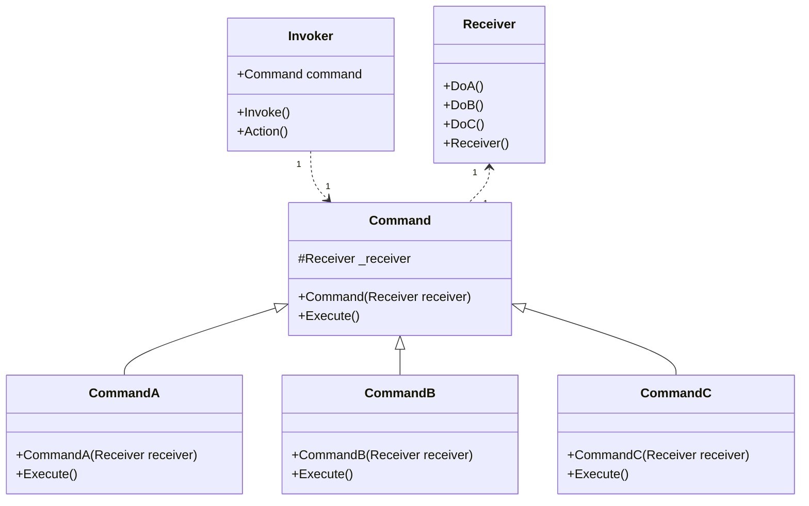

# Design Pattern - Command

- [Design Pattern - Command](#design-pattern---command)
  - [概觀](#概觀)
  - [+ 將命令的請求方與執行方解耦。](#-將命令的請求方與執行方解耦)
  - [類別圖](#類別圖)
    - [pseudo code](#pseudo-code)
  - [依序執行的 Command Pattern](#依序執行的-command-pattern)
  - [具有復原功能的 Command Pattern](#具有復原功能的-command-pattern)
  - [Macro Command](#macro-command)

---
## 概觀
+ 將一個請求封裝成一個物件，讓你能夠使用各種不同的訊息、佇列、紀錄以及支援復原功能加以參數化。
+ 將命令的請求方與執行方解耦。
---
## 類別圖


+ Command
  + 定義一個執行命令的抽象介面，通常為 interface 或 abstract class。
+ ConcreteCommand
  + 繫結對應的操作與Receiver(接收者，也就是真正執行命令的角色)
  + 實作執行命令的程式(圖中的 Execute method)，呼叫Receiver 執行對應的操作。
+ Receiver
  + 真正執行命令的角色，了解如何依照收到的訊息執行命令
  + 可以是任何的類別，不一定有抽象的需要。
+ Invoker
  + 建造要要執行的命令。
  + 指揮 Command 執行命令。
  + 如果要擴充功能：命令重覆執行、復原功能(搭配 Momento)，只要修改這裡

<br/>

### pseudo code
Command 抽象類別
```csharp
public abstract class Command
{
    protected Receiver Receiver { get; set; }

    protected Command(Receiver receiver)
    {
        Receiver = receiver;
    }

    public abstract void execute();
}
```

<br/>ConcreteCommand 類別，實作執行命令的程式
```csharp
public class CommandA : Command
{
    public CommandA(Receiver receiver) : base(receiver)
    { }
    public override void execute()
    {
        Receiver.DoA();
    }
}

public class CommandB : Command
{
    public CommandB(Receiver receiver) : base(receiver)
    { }
    public override void execute()
    {
        Receiver.DoB();
    }
}

public class CommandC : Command
{
    public CommandC(Receiver receiver) : base(receiver)
    { }
    public override void execute()
    {
        Receiver.DoC();
    }
}
```

<br/>Reciever 類別，真正執行命令的角色
```csharp
public class Receiver
{
    public void DoA()
    {
        Console.WriteLine("A");
    }

    public void DoB()
    {
        Console.WriteLine("B");
    }

    public void DoC()
    {
        Console.WriteLine("C");
    }
}
```

<br/>Invodker 類別
```csharp
public class Invoker
{
    private Command _command;

    public void SetCommnad(Command command)
    {
        _command = command;
    }

    public void Action()
    {
        _command.execute();
    }
}
```

<br/>Client 端程式
```csharp
var invoker = new Invoker();
var receiver = new Receiver();
var command = new CommandA(receiver);
invoker.SetCommnad(command);
invoker.Action();
```
---
## 依序執行的 Command Pattern
+ 前述的 Invoker 內部是單一個 Command 型別欄位(屬性)，呼叫 Action method 只能執行一個Command。
+ 若改為集合，就可以讓 Invoker 一次執行多個命令。

<br/>CheckResult 類別，統一回傳的型別
```csharp
public class CheckResult
{
    public string Source { get; set; }
    public bool Result { get; set; }
}
```

<br/>CheckCommand 抽象類別
```csharp
public abstract class CheckCommand
{
    protected FormatChecker Checker
    { get; private set; }

    protected CheckCommand(FormatChecker checker)
    {
        Checker = checker;
    }

    public abstract CheckResult Execute(string source);
}
```

<br/>CheckCommand 子類別
```csharp
public class CheckLengthCommand : CheckCommand
{
    public CheckLengthCommand(FormatChecker checker) : base(checker)
    { }

    public override CheckResult Execute(string source)
    {
        return Checker.CheckLength(source);
    }
}

public class CheckHeadCommand : CheckCommand
{
    public CheckHeadCommand(FormatChecker checker) : base(checker)
    { }

    public override CheckResult Execute(string source)
    {
        return Checker.CheckHead(source);
    }
}

public class CheckFirstDateCommand : CheckCommand
{
    public CheckFirstDateCommand(FormatChecker checker) : base(checker)
    { }

    public override CheckResult Execute(string source)
    {
        return Checker.CheckFirstDate(source);
    }
}

public class CheckSecondDateCommand : CheckCommand
{
    public CheckSecondDateCommand(FormatChecker checker) : base(checker)
    { }

    public override CheckResult Execute(string source)
    {
        return Checker.CheckSecondDate(source);
    }
}
```

<br/>FormatChecker 類別，就是 Receiver
```csharp
public class FormatChecker
{
    public CheckResult CheckLength(string source)
    {
        var result = (source.Length == 29);
        return new CheckResult() { Source = source, Result = result };
    }

    public CheckResult CheckHead(string source)
    {
        string head = source.Substring(0, 3);
        var result = (head == "965");
        return new CheckResult() { Source = source, Result = result };
    }

    public CheckResult CheckFirstDate(string source)
    {
        var dateString = source.Substring(13, 8);
        DateTime date;
        var result = DateTime.TryParseExact(dateString, "yyyyMMdd", System.Globalization.CultureInfo.InvariantCulture,
                       System.Globalization.DateTimeStyles.None, out date);
        return new CheckResult() { Source = source, Result = result };
    }

    public CheckResult CheckSecondDate(string source)
    {
        var dateString = source.Substring(21, 8);
        DateTime date;
        var result = DateTime.TryParseExact(dateString, "yyyyMMdd", System.Globalization.CultureInfo.InvariantCulture,
                       System.Globalization.DateTimeStyles.None, out date);
        return new CheckResult() { Source = source, Result = result };
    }
}
```

<br/>Invoker 類別
```csharp
public class Invoker
{
    private List<CheckCommand> _commands = new List<CheckCommand>();

    public void AddCommand(CheckCommand command)
    {
        _commands.Add(command);
    }

    public void RemoveCommand(CheckCommand command)
    {
        _commands.Remove(command);
    }

    public CheckResult Action(string source)
    {
        CheckResult result = null;
        foreach (var command in _commands)
        {
            result = command.Execute(source);
            if (result.Result == false)
            {
                break;
            }
        }
        return result;
    }
}
```

<br/>Client 類別 
```csharp
public class Client
{
    public static Invoker CreateInvoker()
    {
        FormatChecker checker = new FormatChecker();
        Invoker invoker = new Invoker();
        invoker.AddCommand(new CheckLengthCommand(checker));
        invoker.AddCommand(new CheckHeadCommand(checker));
        invoker.AddCommand(new CheckFirstDateCommand(checker));
        invoker.AddCommand(new CheckSecondDateCommand(checker));
        return invoker;
    }
}
```

<br/>Client 端程式
```csharp
List<CheckResult> results = new List<CheckResult>();
Invoker invoker = Client.CreateInvoker();
foreach (var item in FakeDataSource.Data)
{
    results.Add(invoker.Action(item));
}

foreach (var item in results)
{
    Console.WriteLine($"Source : {item.Source } , Result ={item.Result}");
}
```
---
## 具有復原功能的 Command Pattern
+ 一樣使用 Command 集合，但在這種情境下的集合代表的是歷史紀錄，用以作為復原時使用。
+ 這種情境多半搭配 Memento Pattern。

<br/>Calculator 類別，這個就是 Receiver
```csharp
public class Calculator
{
    private double _currentValue;
    private Dictionary<string, Func<double, double>> _oprations;

    public Calculator()
    {
        _currentValue = 0;
        CreateOperations();
    }

    public void Operate(string myOperator, double operand)
    {
        if (_oprations.ContainsKey(myOperator))
        {
            _currentValue= _oprations[myOperator].Invoke(operand);               
            Console.WriteLine($"{myOperator} {operand} 之後目前的值為 {_currentValue}");
        }
        else
        {
            throw new ArgumentOutOfRangeException();
        }
    }

    private void CreateOperations()
    {
        _oprations = new Dictionary<string, Func<double, double>>();
        _oprations.Add("+", (x) => _currentValue + x);
        _oprations.Add("-", (x) => _currentValue - x);
        _oprations.Add("*", (x) => _currentValue * x);
        _oprations.Add("/", (x) => _currentValue / x);
    }
}
```

<br/>ICommand 介面
```csharp
public interface ICommand
{
     void Execute();
     void UnExecute();
}
```

<br/>Command 實作
```csharp
public class CalculatorCommand : ICommand
{
    private Calculator _calculator;
    private double _operand;
    private string _operator;

    public CalculatorCommand(Calculator calculator, string myOperator, double operand)
    {
        _calculator = calculator;
        _operator = myOperator;
        _operand = operand;
    }

    public void Execute()
    {
        _calculator.Operate(_operator, _operand);
    }

    public void UnExecute()
    {
        _calculator.Operate(ReverseOperator(), _operand);
    }

    private string ReverseOperator()
    {
        switch (_operator)
        {
            case "+":
                return "-";
            case "-":
                return "+";
            case "*":
                return "/";
            case "/":
                return "*";  
            default:
                throw new ArgumentOutOfRangeException();
        }
    }
}
```

<br/>Invoker 類別
```csharp
public class Invoker
{
    private Calculator _calculator;
    private List<ICommand> _historyCommands;
    private int _executeCount;

    public Invoker()
    {
        _calculator = new Calculator();
        _historyCommands = new List<ICommand>();
        _executeCount = 0;
    }

    public void Compute(string myOperator, double operand)
    {
        ICommand command = new CalculatorCommand(_calculator, myOperator, operand);
        command.Execute();
        _historyCommands.Add(command);
        _executeCount++;
    }

    public void Undo(int levels)
    {
        for (int i = 0; i < levels; i++)
        {
            if (_executeCount > 0)
            {
                int index = _executeCount - 1;
                ICommand command = _historyCommands[index];
                command.UnExecute();
                _executeCount = index;
            }
        }
    }

    public void Redo(int levels)
    {
        for (int i = 0; i < levels; i++)
        {
            if (_executeCount < _historyCommands.Count - 1)
            {
                ICommand command = _historyCommands[_executeCount];
                command.Execute();
                _executeCount = _executeCount + 1;
            }
        }
    }
}
```

<br/>Client 端程式
```csharp
Invoker invoker = new Invoker();
invoker.Compute("+", 50);
invoker.Compute("-", 25);
invoker.Compute("*", 20);
invoker.Compute("/", 4);
Console.WriteLine("Undo");
invoker.Undo(3);
Console.WriteLine("Redo");
invoker.Redo(2);
```
---

## Macro Command
+ 巨集式的命令，這樣情境通常是一個 Commmand 呼叫多個 Receivers 來協同完成工作。
+ 這種情境下的 Receivers 會直接定義在Command 的具體實作類別內部，而不是由建構子注入。

<br/>用 FakeDataSource 模擬假資料，如下程式碼
```csharp
public class FakeDataSource
{
    private static List<string> _data;

    public static List<string> Data
    {
        get
        {
            if (_data == null)
            {
                CreateData();
            }
            return _data;
        }
    }

    private static void CreateData()
    {
        _data = new List<string>()
       {
          "96523009085172015092719900402",
          "96523009119722015092719571104",
          "68000000000000000000000000000",
          "69500000000002015182919830912",
          "9999889",
          "96523009085172015092719900402",
          "96523009085172015092799999999"
       };
    }
}
```

<br/>IFileWriteCommand 介面
```csharp
public interface IFileWriteCommand
{
    void Execute(string path, byte[] data);
}
```

<br/>FileWriteCommand 子類別
```csharp
public class Base64AesWriteCommand : IFileWriteCommand
{
    private Base64Processor _base64Processor;
    private AESCryptoProcessor _aesProcessor;
    private FileProcess _fileprocess;

    public Base64AesWriteCommand()
    {
        _aesProcessor = new AESCryptoProcessor();
        _base64Processor = new Base64Processor();
        _fileprocess = new FileProcess();
    }

    public void Execute(string path, byte[] data)
    {
        _fileprocess.Write(path, _aesProcessor.EncryptData(_base64Processor.Encode(data)));
    }
}
```

<br/>IFileReadCommand 介面
```csharp
public interface IFileReadCommand
{
    byte[] Execute(string path);
}
```

<br/>FileReadCommand 子類別
```csharp
public class Base64AesReadCommand : IFileReadCommand
{
    private Base64Processor _base64Processor;
    private AESCryptoProcessor _aesProcessor;
    private FileProcess _fileprocess;

    public Base64AesReadCommand()
    {
        _aesProcessor = new AESCryptoProcessor();
        _base64Processor = new Base64Processor();
        _fileprocess = new FileProcess();
    }

    public byte[] Execute(string path)
    {
        return _base64Processor.Decode(_aesProcessor.DecryptData(_fileprocess.Read(path)));
    }
}
```

<br/>Invoker 類別
```csharp
public class Invoker
{
    internal IFileWriteCommand WriteCommand { get; set; }
    internal IFileReadCommand ReadCommand { get; set; }

    public void Write(string path, byte[] data)
    {
        WriteCommand.Execute(path, data);
    }

    public byte[] Read(string path)
    {
        return ReadCommand.Execute(path);
    }
}
```

<br/>Base64AesClient 類別
```csharp
public class Base64AesClient
{
    public static Invoker CreateInvoker()
    {
        var invoker = new Invoker();
        invoker.WriteCommand = new Base64AesWriteCommand();
        invoker.ReadCommand = new Base64AesReadCommand();
        return invoker;
    }
}
```

<br/>Client 端程式
```csharp
[TestClass()]
public class Base64AesClientTests
{
    private string newline = Environment.NewLine;
    private void DeleteExistFile(string path)
    {
        if (File.Exists(path))
        {
            File.Delete(path);
        }
    }

    [TestMethod()]
    public void Base64Aes_RW_Test()
    {
        string path = "base64.txt";
        DeleteExistFile(path);
        string expected = "測試 文字" + newline + "Base64" + newline + "檔案存取";
        var writebytes = Encoding.UTF8.GetBytes(expected);
        var invoker = Base64AesClient.CreateInvoker();
        invoker.Write(path, writebytes);
        string actual = Encoding.UTF8.GetString(invoker.Read(path));
        Assert.AreEqual(expected, actual);
    }
}
```