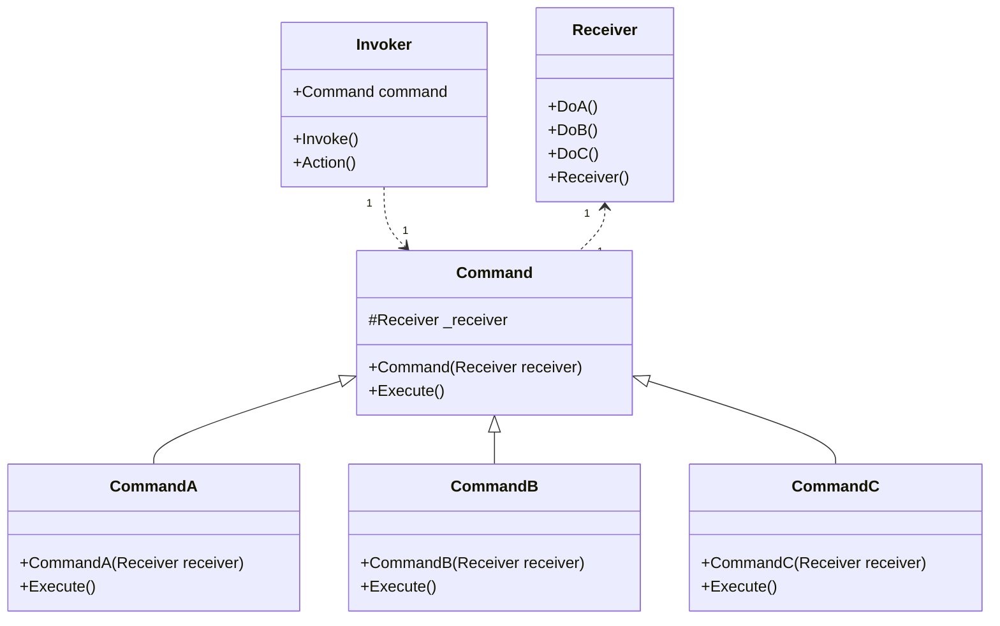

# Design Pattern - Command

+ 將一個請求封裝成一個物件，讓你能夠使用各種不同的訊息、佇列、紀錄以及支援復原功能加以參數化。
+ 將命令的請求方與執行方解耦。



+ Command
  + 定義一個執行命令的抽象介面，通常為 interface 或 abstract class。
+ ConcreteCommand
  + 繫結對應的操作與Receiver(接收者，也就是真正執行命令的角色)
  + 實作執行命令的程式(圖中的 Execute method)，呼叫Receiver 執行對應的操作。
+ Receiver
  + 真正執行命令的角色，了解如何依照收到的訊息執行命令
  + 可以是任何的類別，不一定有抽象的需要。
+ Invoker
  + 建造要要執行的命令。
  + 指揮 Command 執行命令。
  + 如果要擴充功能：命令重覆執行、復原功能(搭配 Momento)，只要修改這裡

<br/Command 抽象類別
```csharp
public abstract class Command
{
    protected Receiver Receiver { get; set; }

    protected Command(Receiver receiver)
    {
        Receiver = receiver;
    }

    public abstract void execute();
}
```

<br/ConcreteCommand 類別，實作執行命令的程式
```csharp
public class CommandA : Command
{
    public CommandA(Receiver receiver) : base(receiver)
    { }
    public override void execute()
    {
        Receiver.DoA();
    }
}

public class CommandB : Command
{
    public CommandB(Receiver receiver) : base(receiver)
    { }
    public override void execute()
    {
        Receiver.DoB();
    }
}

public class CommandC : Command
{
    public CommandC(Receiver receiver) : base(receiver)
    { }
    public override void execute()
    {
        Receiver.DoC();
    }
}
```

<br/>Reciever 類別，真正執行命令的角色
```csharp
public class Receiver
{
    public void DoA()
    {
        Console.WriteLine("A");
    }

    public void DoB()
    {
        Console.WriteLine("B");
    }

    public void DoC()
    {
        Console.WriteLine("C");
    }
}
```

<br/>Invodker 類別
```csharp
public class Invoker
{
    private Command _command;

    public void SetCommnad(Command command)
    {
        _command = command;
    }

    public void Action()
    {
        _command.execute();
    }
}
```

<br/>Client 端程式
```csharp
var invoker = new Invoker();
var receiver = new Receiver();
var command = new CommandA(receiver);
invoker.SetCommnad(command);
invoker.Action();
```

todo: command 檢查檔案格式(在雲端硬碟)