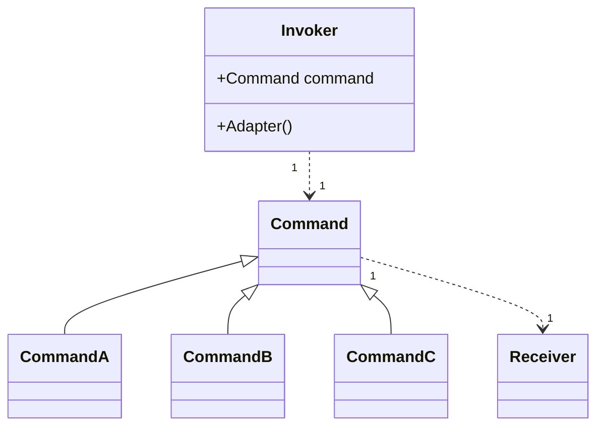

# Design Pattern - Command

```mermaid
classDiagram
class Invoker {
    +Command command
    +Adapter()
}
class Command
class CommandA
class CommandB
class CommandC
class Receiver

Invoker "1" ..> "1" Command
Command <|-- CommandA
Command <|-- CommandB
Command <|-- CommandC
Command "1"..> "1" Receiver
```