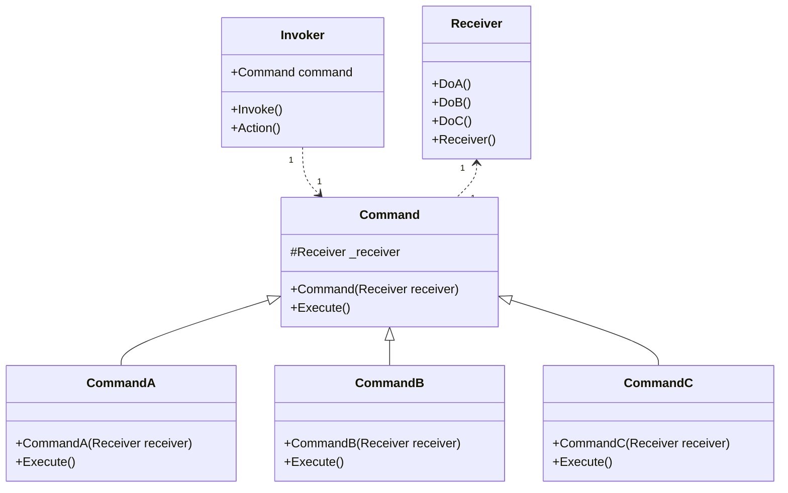

# Design Pattern - Command

```mermaid
classDiagram
class Invoker {
    +Command command
    +Invoke()
    +Action()
}

class Command {
    #Receiver _receiver
    +Command(Receiver receiver)
    +Execute()
}

class CommandA {
    +CommandA(Receiver receiver)
    +Execute()
}

class CommandB {
    +CommandB(Receiver receiver)
    +Execute()
}

class CommandC {
    +CommandC(Receiver receiver)
    +Execute()
}

class Receiver {
    +DoA()
    +DoB()
    +DoC()
    +Receiver()
}

Invoker "1" ..> "1" Command
Command <|-- CommandA
Command <|-- CommandB
Command <|-- CommandC
Receiver "1" <.. "1" Command
```