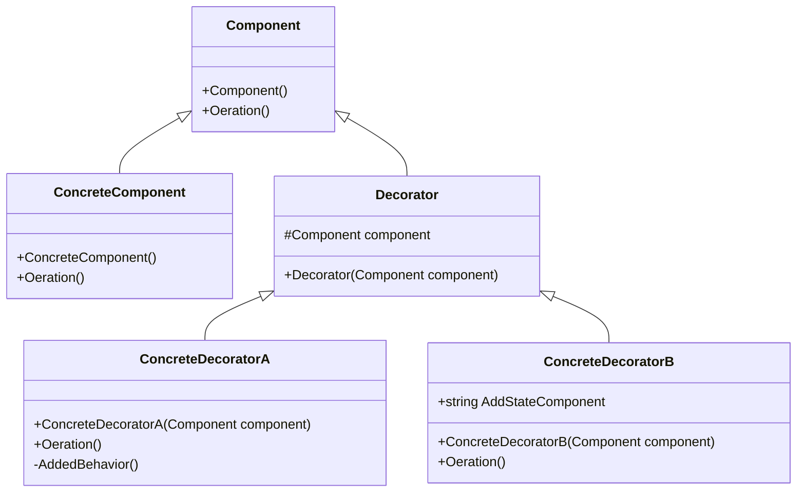

# Design Pattern - Decorator

```mermaid
classDiagram
class Component {
    +Component()
    +Oeration()
}

class ConcreteComponent {
    +ConcreteComponent()
    +Oeration()
}

class Decorator {
    #Component component
    +Decorator(Component component)
}

class ConcreteDecoratorA {
    +ConcreteDecoratorA(Component component)
    +Oeration()
    -AddedBehavior()
}

class ConcreteDecoratorB {
    +string AddStateComponent
    +ConcreteDecoratorB(Component component)
    +Oeration()
}

Component <|-- ConcreteComponent
Component <|-- Decorator
Decorator <|-- ConcreteDecoratorA
Decorator <|-- ConcreteDecoratorB
```