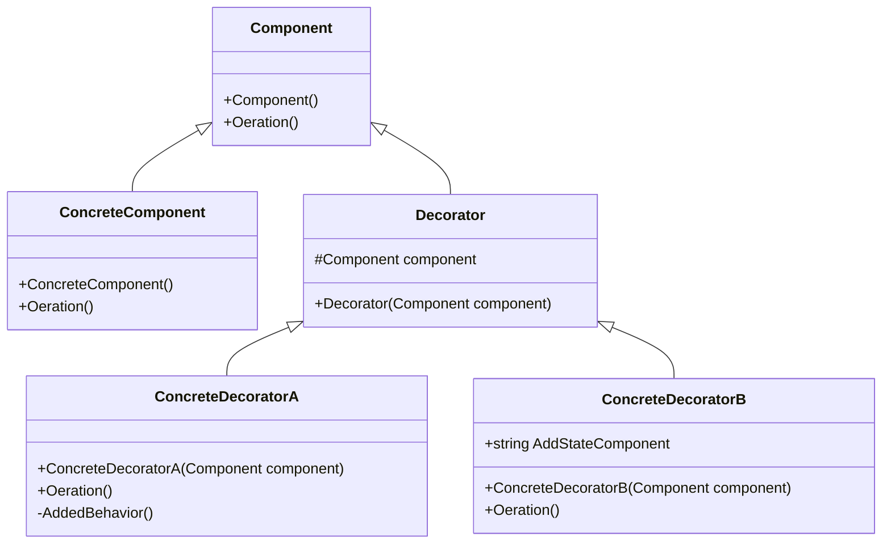

# Design Pattern - Decorator

+ 動態地為物件附加一些額外的職責，同時把持相同的介面。就擴展功能而言，裝飾模式提供了繼承機制的彈性替代方案。
+ 單獨加入職責給某個物件，而不是加入到整個類別。
+ 尤其對舊有物件要加入新職責的時候特別有用。
+ 可以層層套疊。

由1、2點可知道，這個模式不是繼承

```mermaid
classDiagram
class Component {
    +Component()
    +Oeration()
}

class ConcreteComponent {
    +ConcreteComponent()
    +Oeration()
}

class Decorator {
    #Component component
    +Decorator(Component component)
}

class ConcreteDecoratorA {
    +ConcreteDecoratorA(Component component)
    +Oeration()
    -AddedBehavior()
}

class ConcreteDecoratorB {
    +string AddStateComponent
    +ConcreteDecoratorB(Component component)
    +Oeration()
}

Component <|-- ConcreteComponent
Component <|-- Decorator
Decorator <|-- ConcreteDecoratorA
Decorator <|-- ConcreteDecoratorB
```