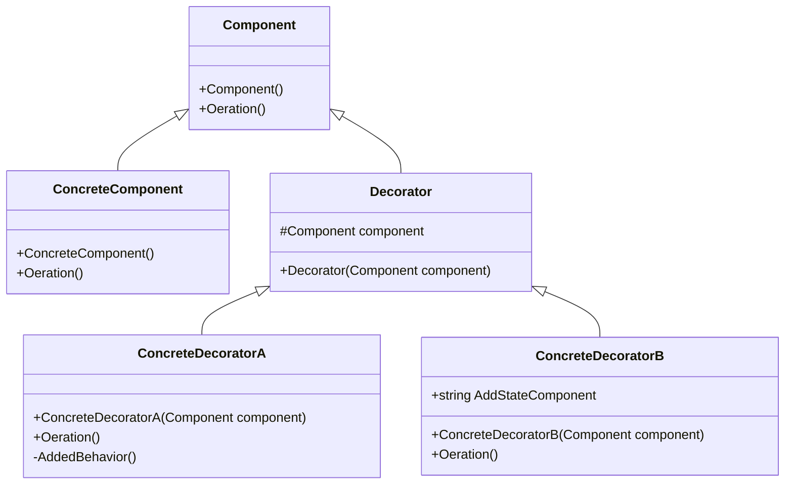

# Design Pattern - Decorator

+ 動態地為物件附加一些額外的職責，同時把持相同的介面。就擴展功能而言，裝飾模式提供了繼承機制的彈性替代方案。
+ 單獨加入職責給某個物件，而不是加入到整個類別。
+ 尤其對舊有物件要加入新職責的時候特別有用。
+ 可以層層套疊。

由1、2點可知道，這個模式不是繼承



+ Component
  + 成為被添加職責物件的介面。
  + 成為Decorator (裝飾器)的介面。
  + 可能是個 interface 或是 abstract class
+ ConcreteComponent
  + Component 的具體實作，定義一個基本功能的物件，讓 Decorator 可以裝飾他(也就是增加職責)。
+ Decorator
  + 依照Component 所設計的抽象的裝飾器，通常為 abstract class。
  + 內部會具有指向Component 的欄位。
  + 通常會使用建構式注入被裝飾的物件。
+ ConcreteDecorator
  + Decorator 的具體實作，主要功能為增加職責到被裝飾的物件上，如圖中的ConcreteDecoratorA 與 ConcreteDecoratorB。

<br/>Component 基底類別，可被 Decorator 動態增加職責的介面
```csharp
public abstract class Component
{
    public abstract void Operation();
}
```

<br/>實作的 Component
```csharp
public class ConcreteComponent : Component
{
    public override void Operation()
    {
        Console.WriteLine("ConcreteComponent operation");
    }
}
```

<br/>Decorator 介面
```csharp
public abstract class Decorator : Component
{
    // 包含 Component 實體
    protected Component _component;

    protected Decorator(Component component)
    {
        _component = component;
    }
}
```

<br/>Decorator 實作 A
```csharp
public class ConcreteDecoratorA : Decorator
{
    public ConcreteDecoratorA(Component component) : base(component)
    { }

    public override void Operation()
    {
        _component.Operation();
        AddedBehavior();
    }

    private void AddedBehavior()
    {
        Console.WriteLine("ConcreteDecoratorA AddBehavior");
    }
}
```

<br/>Decorator 實作 B
```csharp
public class ConcreteDecoratorB : Decorator
{
    public string AddedState
    {
        get;
        set;
    }

    public ConcreteDecoratorB(Component component) : base(component)
    {
        AddedState = "ConcreteDecoratorB State";
    }

    public override void Operation()
    {
        _component.Operation();
        Console.WriteLine(AddedState);
    }
}
```

<br/>Client 端程式，可層層堆疊
```csharp
Component c = new ConcreteComponent();
Component da = new ConcreteDecoratorA(c);
Component db = new ConcreteDecoratorB(da);
db.Operation();
```

todo: command 檢查檔案格式(在雲端硬碟)