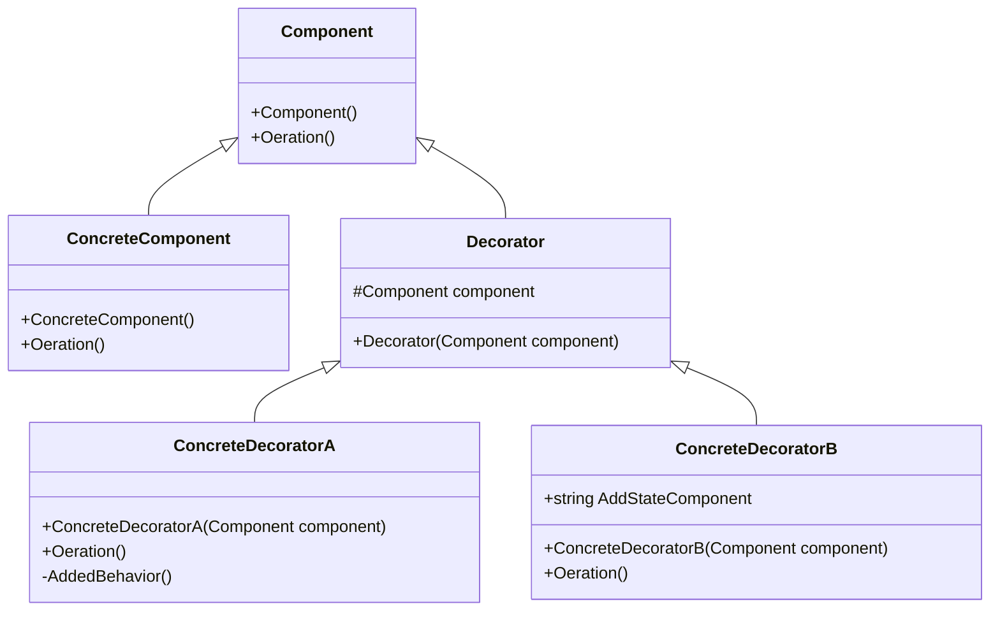

# Design Pattern - Decorator

+ 動態地為物件附加一些額外的職責，同時把持相同的介面。就擴展功能而言，裝飾模式提供了繼承機制的彈性替代方案。
+ 單獨加入職責給某個物件，而不是加入到整個類別。
+ 尤其對舊有物件要加入新職責的時候特別有用。
+ 可以層層套疊。

由1、2點可知道，這個模式不是繼承

## 類別圖


+ Component
  + 成為被添加職責物件的介面。
  + 成為Decorator (裝飾器)的介面。
  + 可能是個 interface 或是 abstract class
+ ConcreteComponent
  + Component 的具體實作，定義一個基本功能的物件，讓 Decorator 可以裝飾他(也就是增加職責)。
+ Decorator
  + 依照Component 所設計的抽象的裝飾器，通常為 abstract class。
  + 內部會具有指向Component 的欄位。
  + 通常會使用建構式注入被裝飾的物件。
+ ConcreteDecorator
  + Decorator 的具體實作，主要功能為增加職責到被裝飾的物件上，如圖中的ConcreteDecoratorA 與 ConcreteDecoratorB。

<br/>Component 基底類別，可被 Decorator 動態增加職責的介面
```csharp
public abstract class Component
{
    public abstract void Operation();
}
```

<br/>實作的 Component
```csharp
public class ConcreteComponent : Component
{
    public override void Operation()
    {
        Console.WriteLine("ConcreteComponent operation");
    }
}
```

<br/>Decorator 介面
```csharp
public abstract class Decorator : Component
{
    // 包含 Component 實體
    protected Component _component;

    protected Decorator(Component component)
    {
        _component = component;
    }
}
```

<br/>Decorator 實作 A
```csharp
public class ConcreteDecoratorA : Decorator
{
    public ConcreteDecoratorA(Component component) : base(component)
    { }

    public override void Operation()
    {
        _component.Operation();
        AddedBehavior();
    }

    private void AddedBehavior()
    {
        Console.WriteLine("ConcreteDecoratorA AddBehavior");
    }
}
```

<br/>Decorator 實作 B
```csharp
public class ConcreteDecoratorB : Decorator
{
    public string AddedState
    {
        get;
        set;
    }

    public ConcreteDecoratorB(Component component) : base(component)
    {
        AddedState = "ConcreteDecoratorB State";
    }

    public override void Operation()
    {
        _component.Operation();
        Console.WriteLine(AddedState);
    }
}
```

<br/>Client 端程式，可層層堆疊
```csharp
Component c = new ConcreteComponent();
Component da = new ConcreteDecoratorA(c);
Component db = new ConcreteDecoratorB(da);
db.Operation();
```

## Decorator 存取檔案
令人抓狂的需求變動：本來已經有一個讀寫檔案的功能，現在需求要增加能夠處理Base 64 編碼、加密或壓縮。

<br/>既有的 FileProcess 類別，無法更動程式碼
```csharp
public class FileProcess
{
    public void Write(string path, byte[] data)
    {
        File.WriteAllBytes(path, data);
    }

    public byte[] Read(string path)
    {
        if (File.Exists(path))
        {
            return File.ReadAllBytes(path);
        }
        else
        {
            throw new FileNotFoundException();
        }
    }
}
```

<br/>剛開始你只需要單純讀寫檔案
```csharp
private string path = "1.txt";
private string source = "ABCDEFD 這是一本書";

private void Phase1_Process()
{
    FileProcess writeProcess = new FileProcess();
    writeProcess.Write(path, Encoding.UTF8.GetBytes(source));

    FileProcess readProcess = new FileProcess();
    string result = Encoding.UTF8.GetString(readProcess.Read(path));
    Console.WriteLine(result);
}
```

<br/>後來老闆說要在儲存的時候改成 base64 string，於是你就改成這樣
```csharp
private static void Phase2_Process()
{
    FileProcess writeProcess = new FileProcess();
    string base64ForWrite = Convert.ToBase64String(Encoding.UTF8.GetBytes(source));
    writeProcess.Write(path, Encoding.UTF8.GetBytes(base64ForWrite));

    FileProcess readProcess = new FileProcess();
    string base64ForRead = Encoding.UTF8.GetString(readProcess.Read(path));
    string result = Encoding.UTF8.GetString(Convert.FromBase64String(base64ForRead));
    Console.WriteLine(result);
}
```

<br/>接著你的老闆又說要加密
```csharp
private static void Phase3_Process()
{
    // 於是你就抓狂了.....
}
```

### Decorator with Adapter

<br/>既有的 FileProcess 類別，無法更動程式碼
```csharp
public class FileProcess
{
    public void Write(string path, byte[] data)
    {
        File.WriteAllBytes(path, data);
    }
    
    public byte[] Read(string path)
    {
        if (File.Exists(path))
        {
            return File.ReadAllBytes(path);
        }
        else
        {
            throw new FileNotFoundException();
        }
    }
}
```

1. 先為既有的 FileProcess 建立一個 Adapter。
2. 接著再以 Adapter 介面建立 Decorator

<br/>Adapter 的公開介面，同時也是 Decorator 抽象類別要實作的介面
```csharp
public interface IFileProcess
{
    void Write(string path, byte[] data);
    byte[] Read(string path);
}
```

<br/>Adapter 的實作，介接已存在的 FileProcess 類別
```csharp
public class FileProcessAdapter : IFileProcess
{
    private FileProcess _fileProcess;

    public FileProcessAdapter()
    {
        _fileProcess = new Original.FileProcess();
    }

    public byte[] Read(string path)
    {
        return _fileProcess.Read(path);
    }

    public void Write(string path, byte[] data)
    {
        _fileProcess.Write(path, data);
    }
}
```

<br/>Decorator 的抽象類別
```csharp
public abstract class FileDecorator : IFileProcess
{
    protected readonly IFileProcess _fileProcess;

    protected FileDecorator(IFileProcess fileProcess)
    {
        _fileProcess = fileProcess;
    }

    public abstract byte[] Read(string path);
    public abstract void Write(string path, byte[] data);
}
```
<br/>Base64 裝飾器
```csharp
public class Base64FileDecorator : FileDecorator
{
    public Base64FileDecorator(IFileProcess fileProcess) : base(fileProcess)
    { }

    public override byte[] Read(string path)
    {
        var base64Bytes = _fileProcess.Read(path);
        return Decode(base64Bytes);
    }

    private byte[] Decode(byte[] base64Bytes)
    {
        var bytes = Convert.FromBase64String(Encoding.UTF8.GetString(base64Bytes));
        return bytes;
    }

    public override void Write(string path, byte[] data)
    {
        var base64Bytes = Encode(data);
        _fileProcess.Write(path, base64Bytes);
    }

    private byte[] Encode(byte[] data)
    {
        return Encoding.UTF8.GetBytes(Convert.ToBase64String(data));
    }
}
```

<br/>Des 加密裝飾器
```csharp
public class DESCryptoFileDecorator : FileDecorator
{
    private byte[] key;
    private byte[] iv;
    private DESCryptoServiceProvider des;

    public DESCryptoFileDecorator(IFileProcess fileProcess) : base(fileProcess)
    {
        key = new byte[] { 0x01, 0xFF, 0x02, 0xAA, 0x55, 0xBB, 0x19, 0x20 };
        iv = new byte[] { 0x11, 0xF3, 0x43, 0x0A, 0x35, 0xE9, 0x82, 0x80 };
        des = new DESCryptoServiceProvider();
        des.Key = key;
        des.IV = iv;
    }

    public override byte[] Read(string path)
    {
        byte[] encryptBytes = _fileProcess.Read(path);
        return DecryptData(encryptBytes);
    }

    private byte[] DecryptData(byte[] encryptBytes)
    {
        byte[] outputBytes = null;
        using (MemoryStream memoryStream = new MemoryStream(encryptBytes))
        {
            using (CryptoStream decryptStream = new CryptoStream(memoryStream, de
            {
                MemoryStream outputStream = new MemoryStream();
                decryptStream.CopyTo(outputStream);
                outputBytes = outputStream.ToArray();
            }
        }
        return outputBytes;
    }

    public override void Write(string path, byte[] data)
    {
        byte[] outputBytes = EncryptData(data);
        _fileProcess.Write(path, outputBytes);
    }

    private byte[] EncryptData(byte[] data)
    {
        byte[] outputBytes = null;
        using (MemoryStream memoryStream = new MemoryStream())
        {
            using (CryptoStream encryptStream = new CryptoStream(memoryStream, de
            {
                MemoryStream inputStream = new MemoryStream(data);
                inputStream.CopyTo(encryptStream);
                encryptStream.FlushFinalBlock();
                outputBytes = memoryStream.ToArray();
            }
        }
        return outputBytes;
    }
}
```

<br/>Aes 加密裝飾器
```csharp
public class AESCryptoFileDecorator : FileDecorator
{
    private byte[] key;
    private byte[] iv;
    private AesCryptoServiceProvider aes;
    public AESCryptoFileDecorator(IFileProcess fileProcess) : base(fileProcess)
    {
        key = new byte[] { 0x01, 0xFF, 0x02, 0xAA, 0x55, 0xBB, 0x19, 0x20, 0x01, 0xFF, 0x02, 0xAA, 0x55, 0xBB, 0x19, 0x20 };
        iv = new byte[] { 0x11, 0xF3, 0x43, 0x0A, 0x35, 0xE9, 0x82, 0x80, 0x11, 0xF3, 0x43, 0x0A, 0x35, 0xE9, 0x82, 0x80 };
        aes = new AesCryptoServiceProvider();
        aes.Key = key;
        aes.IV = iv;
    }

    public override byte[] Read(string path)
    {
        byte[] encryptBytes = _fileProcess.Read(path);
        return DecryptData(encryptBytes);
    }

    private byte[] DecryptData(byte[] encryptBytes)
    {
        byte[] outputBytes = null;
        using (MemoryStream memoryStream = new MemoryStream(encryptBytes))
        {
            using (CryptoStream decryptStream = new CryptoStream(memoryStream, aes.CreateDecryptor(), CryptoStreamMode.Read))
            {
                MemoryStream outputStream = new MemoryStream();
                decryptStream.CopyTo(outputStream);
                outputBytes = outputStream.ToArray();
            }
        }
        return outputBytes;
    }

    public override void Write(string path, byte[] data)
    {
        byte[] outputBytes = EncryptData(data);
        _fileProcess.Write(path, outputBytes);
    }

    private byte[] EncryptData(byte[] data)
    {
        byte[] outputBytes = null;
        using (MemoryStream memoryStream = new MemoryStream())
        {
            using (CryptoStream encryptStream = new CryptoStream(memoryStream, aes.CreateEncryptor(), CryptoStreamMode.Write))
            {
                MemoryStream inputStream = new MemoryStream(data);
                inputStream.CopyTo(encryptStream);
                encryptStream.FlushFinalBlock();
                outputBytes = memoryStream.ToArray();
            }
        }
        return outputBytes;
    }
}
```

<br/>Gzip 壓縮裝飾器
```csharp
public class GZipFileDecorator : FileDecorator
{
    public GZipFileDecorator(IFileProcess fileProcess) : base(fileProcess)
    { }

    public override byte[] Read(string path)
    {
        byte[] compressedBytes = _fileProcess.Read(path);
        return Decompress(compressedBytes);
    }

    private byte[] Decompress(byte[] compressedBytes)
    {
        byte[] outputBytes = null;
        MemoryStream input = new MemoryStream(compressedBytes);
        outputBytes = Decompress(input).ToArray();
        return outputBytes;
    }

    private MemoryStream Decompress(Stream compressed)
    {
        var decompressed = new MemoryStream();
        using (var zip = new GZipStream(compressed, CompressionMode.Decompress, true))
        {
            zip.CopyTo(decompressed);
        }
        decompressed.Seek(0, SeekOrigin.Begin);
        return decompressed;
    }

    public override void Write(string path, byte[] data)
    {
        byte[] outputBytes = Compress(data);
        _fileProcess.Write(path, outputBytes);
    }

    private byte[] Compress(byte[] data)
    {
        byte[] outputBytes = null;
        MemoryStream input = new MemoryStream(data);
        outputBytes = Compress(input).ToArray();
        return outputBytes;
    }

    private MemoryStream Compress(Stream decompressed)
    {
        var compressed = new MemoryStream();
        using (var zip = new GZipStream(compressed, CompressionLevel.Fastest, true))
        {
            decompressed.CopyTo(zip);
        }
        compressed.Seek(0, SeekOrigin.Begin);
        return compressed;
    }
}
```

<br/>Client 端程式
```csharp
private string path = "1.txt";
private string source = "ABCDEFD 這是一本書";

FileProcessAdapter fpAdapter = new FileProcessAdapter();
FileDecorator fileDecorator = new DESCryptoFileDecorator(new GZipFileDecorator(new Base64FileDecorator(fpAdapter)));

fileDecorator.Write(path, Encoding.UTF8.GetBytes(source));

var result = Encoding.UTF8.GetString(fileDecorator.Read(path));
Console.WriteLine(result);
```