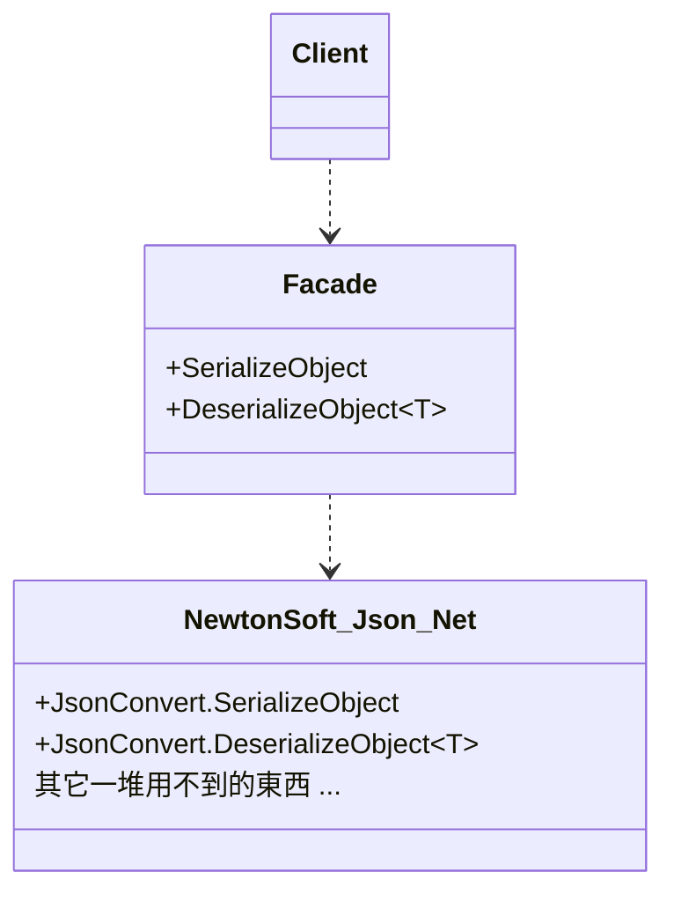

# Design Pattern - Facade

+ 為子系統的一堆介面定義一個統一的高層介面，讓子系統更加容易使用
+ 降低呼叫端與複雜子系統的依賴
+ 更容易使用一個複雜的子系統
+ 降低複雜的呼叫操作



+ 子系統
  + 真正實作功能的地方
  + 已存在且穩定度高
  + 和Facade 不會循環參考
+ Facade
  + 知道子系統的公開介面
  + 作為Client 程式碼與子系統的溝通橋樑
  + 通常是具體類別，特殊情況下也有可能使用介面(interface)或抽象類別(abstract class)形式。

使你參數數量都沒變，也可以用 facade 模式再包一層，有幾個好處
1. 之後若決定不用 JsonConverter 只要改2個地方
2. 讓 intellisense 不要跳那麼多選項，不容易搞混，容易選到自己要的
```csharp
public class MyJsonConver
{
    public static string Serialize(object source)
    {
        return JsonConvert.SerializeObject(source);
    }
    public static T DeserializeObject<T>(string source)
    {
        return JsonConvert.DeserializeObject<T>(source);
    }
}
```