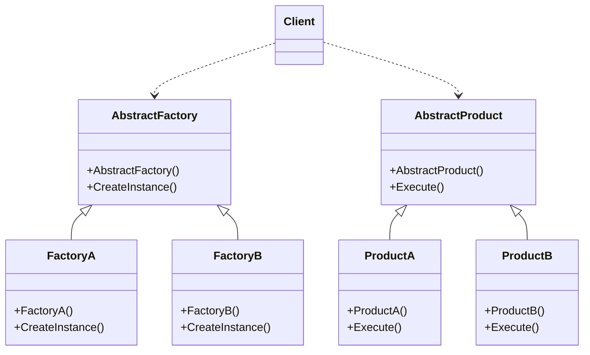

# Design Pattern - Factory Method

+ 定義一個可以用來創建物件的介面，讓這個創建介面的子類別去決定該實例化哪一個產品的實作類別。
+ 工廠方法讓一個產品類別的實例化遞延到其子工廠類別。
+ 降低客戶端程式碼與產品類別的耦合度。

## 類別圖


+ AbastractFactory
  + 定義工廠的共用介面，介面主要職責為產生符合 AbstractProduct 介面的執行個體。
  + 就是會定義幾個產生屬於同一產品族的操作職責。
+ AbstractProduct
  + 定義產品的共用介面，工廠所生成的物件必須符合此介面。
  + 通常為介面(interface)或是抽象類別(abstract class)
  + 抽象工廠的應用場景通常會有兩個以上的AbstractProduct
+ Product
  + 依照 AbstractProduct 介面實作的具體產品類別(圖中的ProductA1、ProductB1 與ProductA2、ProductB2 )。
+ Factory
  + 依照 AbstractFactory 介面實作的具體工廠類別(圖中的Factory1 和Factory2)，具現實際產生具體產品的職責。

<br/>工廠類別
```csharp
public abstract class AbstractFactory
{
    public abstract AbstractProduct CreateInstance();
}

public class FactoryA : AbstractFactory
{
    public override AbstractProduct CreateInstance()
    {
        return new ProductA();
    }
}

public class FactoryB : AbstractFactory
{
    public override AbstractProduct CreateInstance()
    {
        return new ProductB();
    }
}
```

<br/>產品類別
```csharp
public abstract class AbstractProduct
{
    public abstract void Execute();
}

public class ProductA : AbstractProduct
{
    public override void Execute()
    { }
}

public class ProductB : AbstractProduct
{
    public override void Execute()
    { }
}
```

<br/>Client 端程式碼
```csharp
AbstractFactory factory = new FactoryA()
AbstractProduct product = factory.CreateInstance();
product.Execute();
```

## Factory Method for Adapter
+ 為前面的 Communication Adapter 建立 Factory Method，分離創建 ICommunication 的過程。

<br/>工廠類別
```csharp
public interface IFactory
{
    ICommunication GetInstance();
}

public class TcpFactory : IFactory
{
    public ICommunication GetInstance()
    {
        return new TcpCommunication();
    }
}

public class SerialPortFactory : IFactory
{
    public ICommunication GetInstance()
    {
        return new SerialCommunication();
    }
}
```

<br/>產品介面
```csharp
public interface ICommunication
{
    bool Connect(string target);
    void Disconnect();
    void Send(byte[] buffer);
    byte[] Receive();
}
```

<br/>產品類別實作，Tcp Adapter，虛擬碼
```csharp
public class TcpCommunication : ICommunication
{
    public bool Connect(string target)
    {
        Console.WriteLine(string.Format("Tcp 連接到 : {0} ", target));
        return true;
    }

    public void Disconnect()
    {
        Console.WriteLine("Tcp 連接關閉");
    }

    public byte[] Receive()
    {
        byte[] result = new byte[] { 0x11, 0x12, 0x13, 0x14 };
        return result;
    }

    public void Send(byte[] buffer)
    {
        string data = BitConverter.ToString(buffer);
        Console.WriteLine(string.Format("Tcp 送出 : {0} ", data));
    }
}
```

<br/>產品類別實作，Serialport Adapter, 虛擬碼
```csharp
public class SerialCommunication : ICommunication
{
    public bool Connect(string target)
    {
        Console.WriteLine(string.Format("開啟 Serial Port : {0} ", target));
        return true;
    }

    public void Disconnect()
    {
        Console.WriteLine("關閉 Serial Port");
    }

    public byte[] Receive()
    {
        byte[] result = new byte[] { 0x01, 0x02, 0x03, 0x04 };
        return result;
    }

    public void Send(byte[] buffer)
    {
        string data = BitConverter.ToString(buffer);
        Console.WriteLine(string.Format("Serial Port 送出 : {0} ", data));
    }
}
```

<br/>Client端程式碼
```csharp
ICommunication commucation = (new TcpFactory()).GetInstance();
commucation.Connect("192.168.1.1:5555");
```

### 第二種寫法

<br/>工廠類別，搭配 Template Method
```csharp
public abstract class Factory
{
    protected abstract Type RealType { get; }
    
    public ICommunication GetInstance()
    {
        return (ICommunication)Activator.CreateInstance(RealType);
    }
}

public class TcpFactory : Factory
{
    protected override Type RealType
    {
        get
        {
            return typeof(TcpCommunication);
        }
    }
}

public class SerialPortFactory : Factory
{
    protected override Type RealType
    {
        get
        {
            return typeof(SerialCommunication);
        }
    }
}
```

<br/>Client端程式碼
```csharp
ICommunication commucation = (new SerialPortFactory()).GetInstance();
commucation.Connect("COM2");
```