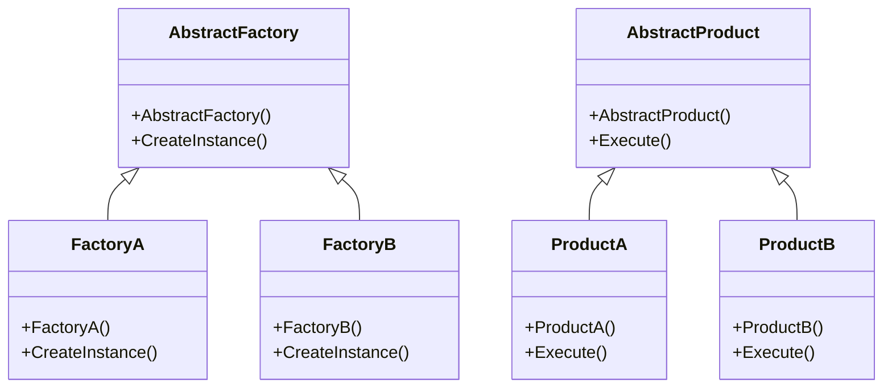

# Design Pattern - Factory Method

```mermaid
classDiagram
class AbstractFactory {
    +AbstractFactory()
    +CreateInstance()
}

class FactoryA {
    +FactoryA()
    +CreateInstance()
}

class FactoryB {
    +FactoryB()
    +CreateInstance()
}

class AbstractProduct {
    +AbstractProduct()
    +Execute()
}

class ProductA {
    +ProductA()
    +Execute()
}

class ProductB {
    +ProductB()
    +Execute()
}

AbstractFactory <|-- FactoryA
AbstractFactory <|-- FactoryB

AbstractProduct <|-- ProductA
AbstractProduct <|-- ProductB
```