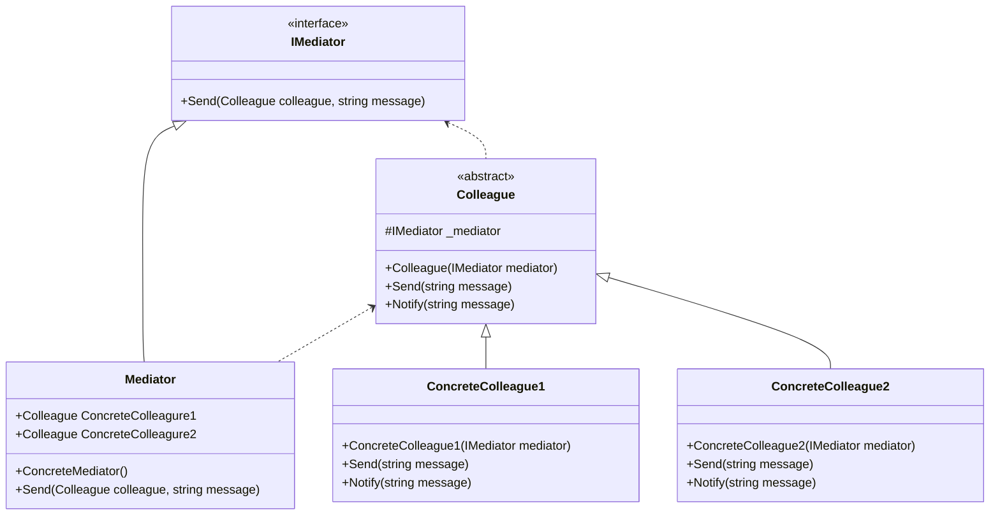

# Design Pattern - Mediator

- [Design Pattern - Mediator](#design-pattern---mediator)
  - [概觀](#概觀)
  - [類別圖](#類別圖)
    - [pseudo code](#pseudo-code)
  - [另一個寫法](#另一個寫法)

---
## 概觀
+ 定義一個中介物件，將另外一群物件的互動方式封裝起來，中介者使得這一群物件之間可以不需要直接認識對方，也不需要直接互動，降低他們的耦合關係，並且能夠獨立地改變他們之間的互動操作。
+ 將一對多的關係改變為一對一。(以 Line 為例，你的 line 是連到伺服器，不是連到與你聊天的每個人)
+ 常常與 Observer pattern 在一起使用。

---
## 類別圖


+ Mediator
  + 定義如何與 Colleague 通訊的介面
  + 不一定是 interface 或 abstract class，有時可以直接使用具體實作的 class。
+ ConcreteMediator
  + Mediator 的具體實作，用來整合每個加入的 Colleague，實作群體行為。
  + 會依賴 Colleague，並且維護這些物件。
+ Colleague
  + 每一個 Colleague 要和其他的 Colleague 通訊時，必須透過 Mediator。

<br/>

### pseudo code
IMediator 介面
```csharp
public interface IMediator
{
    void Send(Colleague colleague, string message);
}
```

<br/>Mediator 子類別
```csharp
public class ConcreteMediator : IMediator
{
    public ConcreteColleague1 Colleague1 { private get; set; }
    public ConcreteColleague2 Colleague2 { private get; set; }
    
    public void Send(Colleague colleague, string message)
    {
        if (colleague == Colleague1)
        {
            Colleague2.Notify(message);
        }
        else
        {
            Colleague1.Notify(message);
        }
    }
}
```

<br/>Colleague 抽象類別
```csharp
public abstract class Colleague
{
    protected IMediator _mediator;

    protected Colleague(IMediator mediator)
    {
        _mediator = mediator;
    }

    public abstract void Send(string message);
    public abstract void Notify(string message);
}
```

<br/>ConcreteColleague 類別
```csharp
public class ConcreteColleague1 : Colleague
{
    public ConcreteColleague1(IMediator mediator) : base(mediator)
    { }

    public override void Notify(string message)
    {
        Console.WriteLine(string.Format("C1 get {0}", message));
    }

    public override void Send(string message)
    {
        _mediator.Send(this, message);
    }
}

public class ConcreteColleague2 : Colleague
{
    public ConcreteColleague2(IMediator mediator) : base(mediator)
    { }

    public override void Notify(string message)
    {
        Console.WriteLine(string.Format("C2 get {0}", message));
    }

    public override void Send(string message)
    {
        _mediator.Send(this, message);
    }
}
```

<br/>Client 端程式
```csharp
ConcreteMediator mediator = new ConcreteMediator();

var c1 = new ConcreteColleague1(mediator);
var c2 = new ConcreteColleague2(mediator);
mediator.Colleague1 = c1;
mediator.Colleague2 = c2;

c1.Send("XYZ");
c2.Send("12345");
```
---
## 另一個寫法
+ Mediator 的抽象可以省略，尤其當一個 Colleague 只會和一個 Mediator 通訊的時候。
+ 利用事件來當作變更通知。

<br/>ConcreteMediator 類別
```csharp
public class ConcreteMediator
{
    private List<Colleague> _colleague;

    public ConcreteMediator()
    {
        _colleague = new List<Colleague>();
    }

    public void AddColleague(Colleague colleague)
    {
        if (!_colleague.Any((x) => x == colleague))
        {
            colleague.MessageSended += Colleague_MessageSended;
            _colleague.Add(colleague);
        }
    }

    public void RemoveColleague(Colleague colleague)
    {
        if (_colleague.Any((x) => x == colleague))
        {
            colleague.MessageSended -= Colleague_MessageSended;
            _colleague.Remove(colleague);
        }
    }

    private void Colleague_MessageSended(object sender, string e)
    {
        var items = _colleague.Where((x) => x != sender);
        foreach (var item in items)
        {
            item.Notify(e);
        }
    }
}
```

<br/>Colleague 類別
```csharp
public class ConcreteColleague1 : Colleague
{
    public override void Notify(string message)
    {
        Console.WriteLine(string.Format("C1 get {0}", message));
    }
}

public class ConcreteColleague2 : Colleague
{
    public override void Notify(string message)
    {
        Console.WriteLine(string.Format("C2 get {0}", message));
    }
}
```

<br/>Client 端程式
```csharp
ConcreteMediator mediator = new ConcreteMediator();

var c1 = new ConcreteColleague1();
var c2 = new ConcreteColleague2();
mediator.AddColleague(c1);
mediator.AddColleague(c2);

c1.Send("XYZ");
c2.Send("12345");
```