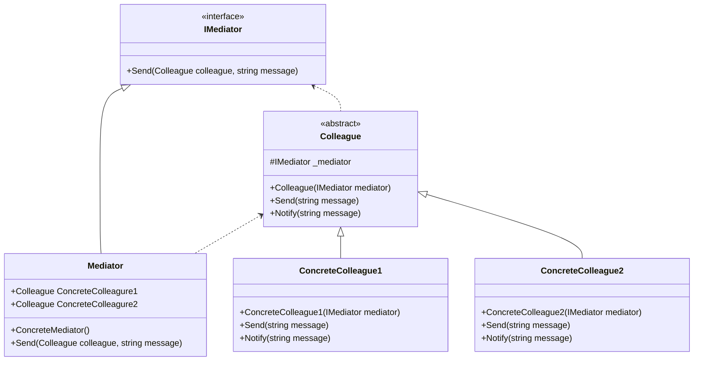

# Design Pattern - Mediator

+ 定義一個中介物件，將另外一群物件的互動方式封裝起來，中介者使得這一群物件之間可以不需要直接認識對方，也不需要直接互動，降低他們的耦合關係，並且能夠獨立地改變他們之間的互動操作。
+ 將一對多的關係改變為一對一。(以 Line 為例，你的 line 是連到伺服器，不是連到與你聊天的每個人)
+ 常常與 Observer pattern 在一起使用。

