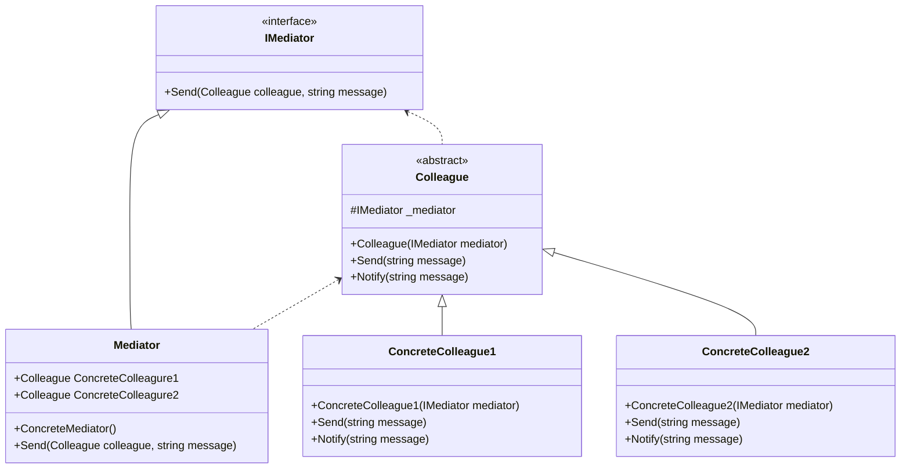

# Design Pattern - Mediator

```mermaid
classDiagram
class IMediator {
    <<interface>>
    +Send(Colleague colleague, string message)
}

class Mediator {
    +Colleague ConcreteColleagure1
    +Colleague ConcreteColleagure2
    +ConcreteMediator()
    +Send(Colleague colleague, string message)
}

class Colleague {
    <<abstract>>
    #IMediator _mediator
    +Colleague(IMediator mediator)
    +Send(string message)
    +Notify(string message)
}

class ConcreteColleague1 {
    +ConcreteColleague1(IMediator mediator)
    +Send(string message)
    +Notify(string message)
}

class ConcreteColleague2 {
    +ConcreteColleague2(IMediator mediator)
    +Send(string message)
    +Notify(string message)
}


IMediator <|-- Mediator
Colleague <|-- ConcreteColleague1
Colleague <|-- ConcreteColleague2

IMediator <.. Colleague
Colleague <.. Mediator
```
