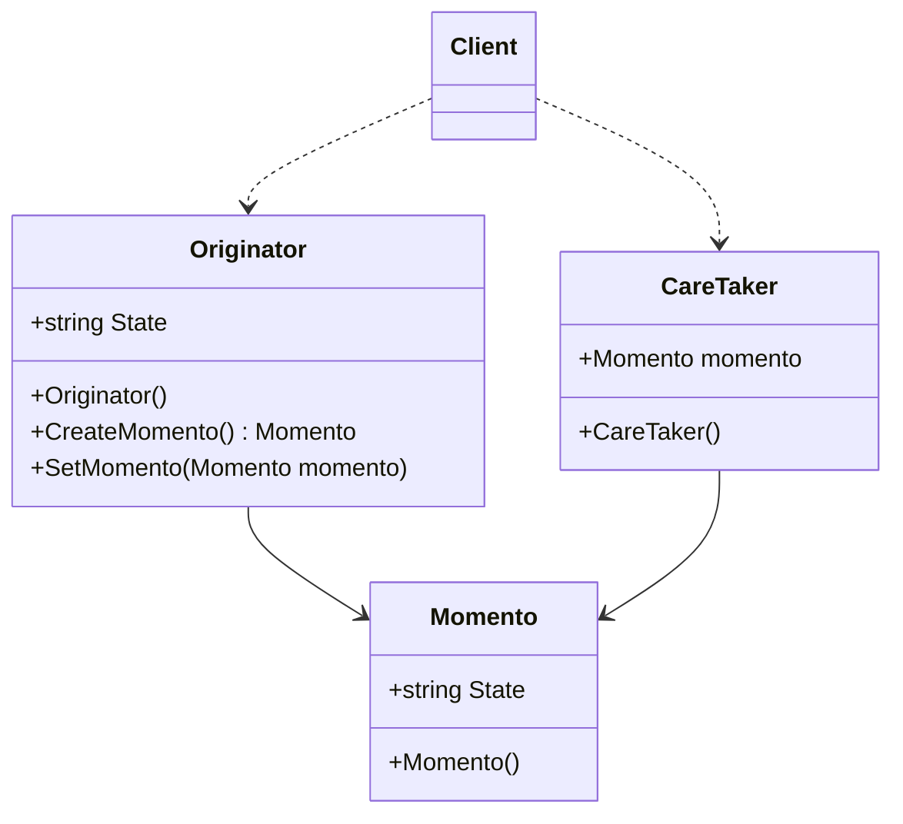

# Design Pattern - Momento

## todo 農夫渡河

## 類別圖
+ 在不破壞封裝性的前提下，捕獲一個物件的內部狀態，並在該物件外保存這個狀態，這樣就可以將物件恢復到之前的狀態。
+ 就像玩遊戲，打王前先儲存進度，打王中不幸死掉，就載入之前進度
+ 可搭配 Stack，可做到連續倒退2次以上的步驟



+ Moment
  + 用來儲存 Originator 執行個體的內部狀況資訊的儲存量是依據 Originator 狀況。
+ Originator
  + 根據自己的內部狀態建立 Memento 物件。
  + 利用 Memento 物件回復自己的狀態。
+ Caretaker
  + 負責 Memento 物件的安全
  + 絕不會操弄或檢視 Memento 的內容。

<br/>Momento 類別
```csharp
public class Memento
{
    public string State { get; private set; }

    public Memento(string state)
    {
        State = state;
    }
}
```

<br/>Caretaker 類別
```csharp
public class Caretaker
{
    public Memento Memento { get; set; }
}
```

<br/>Originator 類別
```csharp
public class Originator
{
    public string State { get; set; }

    // 建立備忘錄
    public Memento CreateMemento()
    {
        return new Memento(State);
    }

    // 還原備忘錄
    public void SetMemento(Memento memento)
    {
        State = memento.State;
    }

    public void ShowState()
    {
        Console.WriteLine(State);
    }
}
```

<br/>Client 端程式
```csharp
Originator originator = new Originator();
originator.State = "Dog";

// 儲存狀態
Caretaker careTacker = new Caretaker();
careTacker.Memento = originator.CreateMemento();

// 改變狀態
originator.State = "Cat";
originator.ShowState();

// 回覆狀態
originator.SetMemento(careTacker.Memento);
originator.ShowState();
```