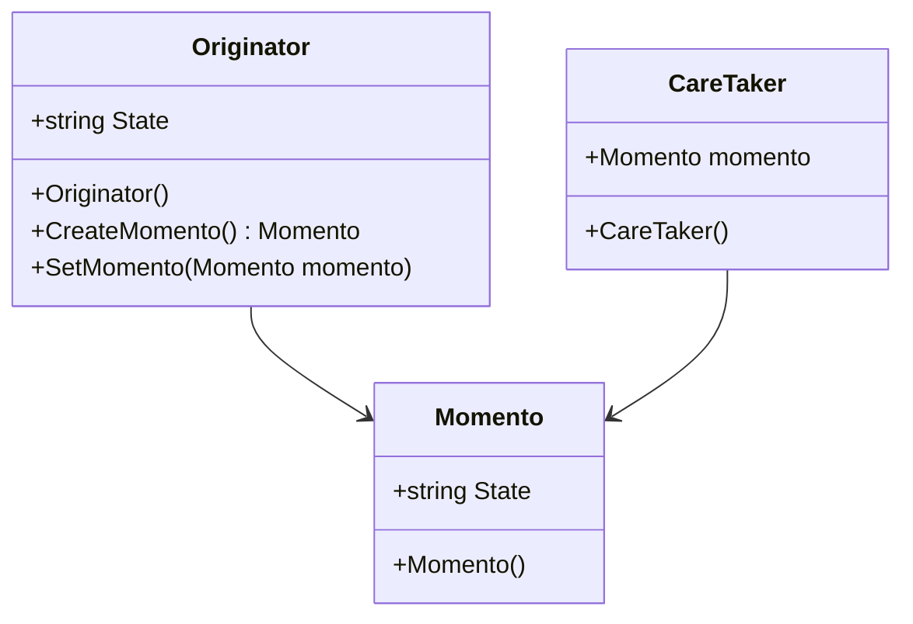

# Design Pattern - Momento

+ 在不破壞封裝性的前提下，捕獲一個物件的內部狀態，並在該物件外保存這個狀態，這樣就可以將物件恢復到之前的狀態。
+ 就像玩遊戲，打王前先儲存進度，打王中不幸死掉，就載入之前進度
+ 可搭配 Stack，可做到連續倒退2次以上的步驟



+ Moment
  + 用來儲存 Originator 執行個體的內部狀況資訊的儲存量是依據 Originator 狀況。
+ Originator
  + 根據自己的內部狀態建立 Memento 物件。
  + 利用 Memento 物件回復自己的狀態。
+ Caretaker
  + 負責 Memento 物件的安全
  + 絕不會操弄或檢視 Memento 的內容。

<br/>Momento 類別
```csharp
public class Memento
{
    public string State { get; private set; }
    public Memento(string state)
    {
        State = state;
    }
}
```

<br/>Caretaker 類別
```csharp

```

<br/>Momento 類別
```csharp

```

<br/>Originator 類別
```csharp

```

<br/>Client 端程式
```csharp

```