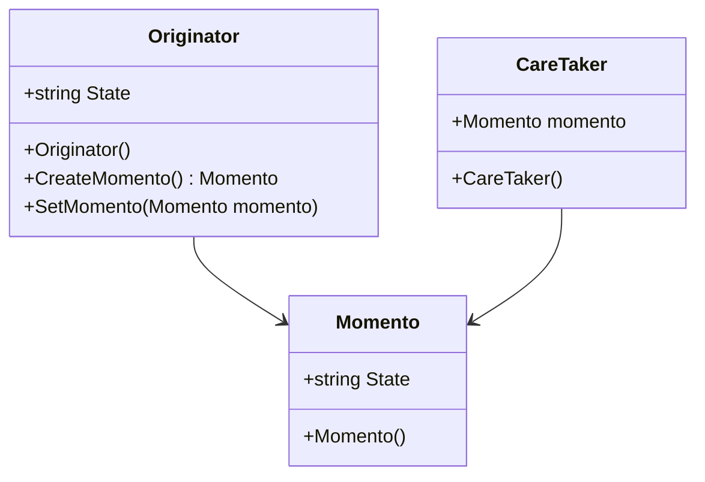

# Design Pattern - Momento

```mermaid
classDiagram
class Originator {
    +string State
    +Originator()
    +CreateMomento() Momento
    +SetMomento(Momento momento)
}

class Momento {
    +string State
    +Momento()
}

class CareTaker {
    +Momento momento
    +CareTaker()
}

Originator --> Momento
CareTaker --> Momento
```