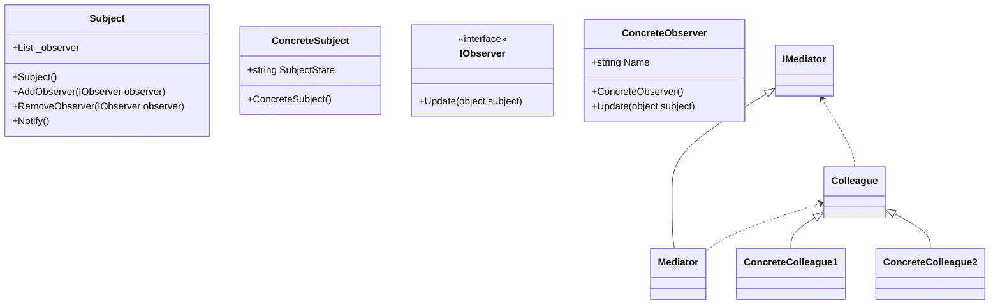

# Design Pattern - Obsersver

```mermaid
classDiagram
class Subject {
    +List<IObserver> _observer
    +Subject()
    +AddObserver(IObserver observer)
    +RemoveObserver(IObserver observer)
    +Notify()
}

class ConcreteSubject {
    +string SubjectState
    +ConcreteSubject()
}

class IObserver {
    <<interface>>
    +Update(object subject)
}

class ConcreteObserver {
    +string Name
    +ConcreteObserver()
    +Update(object subject)
}

IMediator <|-- Mediator
Colleague <|-- ConcreteColleague1
Colleague <|-- ConcreteColleague2

IMediator <.. Colleague
Colleague <.. Mediator
```