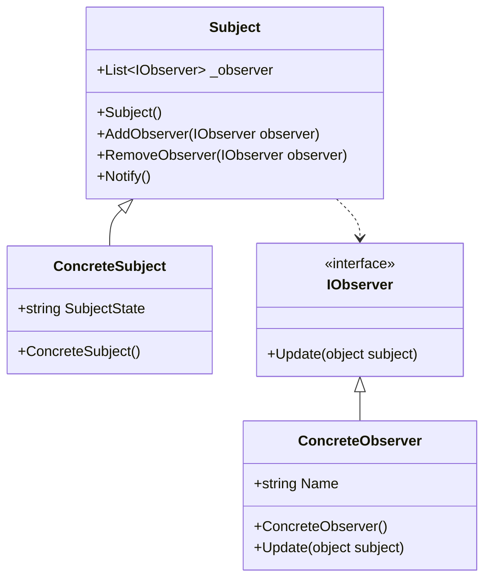

# Design Pattern - Obsersver

- [Design Pattern - Obsersver](#design-pattern---obsersver)
  - [類別圖](#類別圖)
    - [pseudo code](#pseudo-code)
  - [變形作法](#變形作法)
  - [在 C# 可使用委派(delegate)、事件(event)](#在-c-可使用委派delegate事件event)
    - [委派](#委派)
    - [事件](#事件)

---

## 類別圖

+ Subject
  + 被觀察的對象，也就是通知者的抽象介面，通常是 abstract class
  + 具備 IObserver 的集合欄位。
  + 提供公開的新增/刪除 IObserver 的操作行為介面，圖中的AddObserver 和 RemoveObserver method。
  + 提供通知的操作行為，圖中的 Notify Method，這個內部實作會呼叫 IObserver 的 Update 以使得 IObserver 可以接收變更通知。
+ ConcreteSubject
  + Subject 的具體實作，儲存特定的狀態。
  + 當有需要時，呼叫 Notify 通知所有觀察者。
+ IObserver
  + 提供觀察者的抽象介面，可能是 interface 或是 abstract class
  + 定義一個公開的自我更新介面，也就是 Update Method，以便 Subject 能夠呼叫更新通知。
+ ConcreteObserver
  + 具有一個指向 ConcreteSubject 物件的欄位。
  + 實作 IObserver 的 Update Method。

<br/>

### pseudo code
IObserver 介面，觀察者的抽象
```csharp
public interface IObserver
{
    void Update();
}
```

<br/>ConcreteObserver 類別，實作觀察者
```csharp
public class ConcreteObserver : IObserver
{
    private ConcreteSubject _subject;

    public string Name { get; set; }

    public ConcreteObserver(ConcreteSubject subject)
    {
        _subject = subject;
        _subject.AddObserver(this);
    }

    public void Update()
    {
        Console.WriteLine(string.Format("{0} Update Subject State : {1}", Name, _subject.SubjectState));
    }
}
```

<br/>Subject 抽象類別，被觀察者(通知者)的抽象
```csharp
public abstract class Subject
{
    private List<IObserver> _observers;

    public Subject()
    {
        _observers = new List<IObserver>();
    }

    public void AddObserver(IObserver observer)
    {
        _observers.Add(observer);
    }

    public void RemoveObserver(IObserver observer)
    {
        _observers.Remove(observer);
    }

    protected void Notify()
    {
        foreach (var observer in _observers)
        {
            observer.Update();
        }
    }
}
```

<br/>ConcreteSubject 類別，實作通知者
```csharp
public class ConcreteSubject : Subject
{
    private string _subjectState;

    public string SubjectState
    {
        get
        {
            return _subjectState;
        }
        set
        {
            if (value != _subjectState)
            {
                _subjectState = value;
                Notify();
            }
        }
    }
}
```

<br/>Client 端程式
```csharp
ConcreteSubject s = new ConcreteSubject();
ConcreteObserver o1 = new ConcreteObserver(s) { Name = "A" };
ConcreteObserver o2 = new ConcreteObserver(s) { Name = "B" };

s.SubjectState = "This is a dog";
```
---
## 變形作法
+ ConcreteObserver(訂閱者) 不透過建構式持有ConcreteSubject(發行者)，而是透過 Update 方法的參數傳遞 ConcreteSubject。
+ 通常訂閱者持有的發行者不太會在執行時期發生變動，因此可能採取 object 型別作為傳入參數。

<br/>IObserver 介面，觀察者的抽象
```csharp
public interface IObserver
{
    void Update();
}
```

<br/>ConcreteObserver 類別，實作觀察者
```csharp
public class ConcreteObserver : IObserver
{
    public string Name { get; set; }

    public void Update(object subject)
    {
        var s = (ConcreteSubject)subject;
        Console.WriteLine(string.Format("{0} Update Subject State : {1}", Name, s.SubjectState));
    }
}
```

<br/>Subject 抽象類別，被觀察者(通知者)的抽象
```csharp
public abstract class Subject
{
    protected List<IObserver> _observers;

    protected Subject()
    {
        _observers = new List<IObserver>();
    }

    public void AddObserver(IObserver observer)
    {
        _observers.Add(observer);
    }

    public void RemoveObserver(IObserver observer)
    {
        _observers.Remove(observer);
    }

    protected void Notify()
    {
        foreach (var observer in _observers)
        {
            if (observer != null)
            {
                observer.Update(this);
            }
        }
    }
}
```

<br/>ConcreteSubject 類別，實作通知者
```csharp
public class ConcreteSubject : Subject
{
    private string _subjectState;

    public string SubjectState
    {
        get
        {
            return _subjectState;
        }
        set
        {
            if (value != _subjectState)
            {
                _subjectState = value;
                Notify();
            }
        }
    }
}
```

<br/>Client 端程式
```csharp
ConcreteSubject subject = new ConcreteSubject();
subject.AddObserver(new ConcreteObserver() { Name = "A" });
subject.AddObserver(new ConcreteObserver() { Name = "B" });
subject.AddObserver(new ConcreteObserver() { Name = "C" });

subject.SubjectState = "Where have all the flowers gone ?";
```
---
## 在 C# 可使用委派(delegate)、事件(event)
### 委派
ConcreteSubject 類別
```csharp
public delegate void NotifyHandler(ConcreteSubject subject);

public class ConcreteSubject
{
    private string _subjectState;

    public NotifyHandler Notify;

    public string SubjectState
    {
        get
        {
            return _subjectState;
        }
        set
        {
            if (value != _subjectState)
            {
                _subjectState = value;
                OnNotify();
            }
        }
    }

    private void OnNotify()
    {
        if (Notify != null)
        {
            Notify(this);
        }
    }
}
```

<br/>ConcreteObserver 類別
```csharp
public class ConcreteObserver
{
    public string Name { get; set; }

    public void Update(ConcreteSubject subject)
    {
        Console.WriteLine(string.Format("{0} Update Subject State : {1}", Name, subject.SubjectState));
    }
}
```

<br/>Client 端程式
```csharp
ConcreteSubject s = new ConcreteSubject();
s.Notify += new ConcreteObserver() { Name = "A" }.Update;
s.Notify += new ConcreteObserver() { Name = "B" }.Update;
s.Notify += new ConcreteObserver() { Name = "C" }.Update;

s.SubjectState = "How old are you ?";
```

### 事件
ConcreteSubject 類別
```csharp
public class ConcreteSubject
{
    private string _subjectState;

    public event EventHandler Notify;

    public string SubjectState
    {
        get
        {
            return _subjectState;
        }
        set
        {
            if (value != _subjectState)
            {
                _subjectState = value;
                OnNotify();
            }
        }
    }

    private void OnNotify()
    {
        if (Notify != null)
        {
            Notify(this, EventArgs.Empty);
        }
    }
}
```

<br/>ConcreteObserver 類別
```csharp
public class ConcreteObserver
{
    public string Name { get; set; }

    public void Update(object subject, EventArgs args)
    {
        var s = (ConcreteSubject)subject;
        Console.WriteLine(string.Format("{0} Update Subject State : {1}", Name, s.SubjectState));
    }
}
```

<br/>Client 端程式
```csharp
ConcreteSubject s = new ConcreteSubject();
s.Notify += new ConcreteObserver() { Name = "A" }.Update;
s.Notify += new ConcreteObserver() { Name = "B" }.Update;
s.Notify += new ConcreteObserver() { Name = "C" }.Update;

s.SubjectState = "All I have to do is dream.";
```

<br/>講師舉了其它例子
+ 在 C#要注意 memory leak，若 form2 是去訂閱 form1 的事件，在 form2 關閉時，需作 -= 委派或事件，不然記憶體不會被釋放
+ 實作自己的 Data Binding 的自動通知：實作 INotifyPropertyChanged