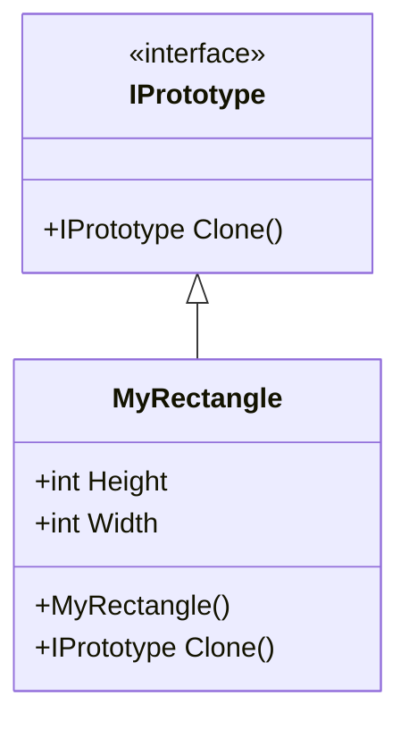

# Design Pattern - Prototype

```mermaid
classDiagram
class IPrototype {
    <<interface>>
    +IPrototype Clone()
}

class MyRectangle {
    +int Height
    +int Width
    +MyRectangle ()
    +IPrototype Clone()
}

IPrototype <|-- MyRectangle
```