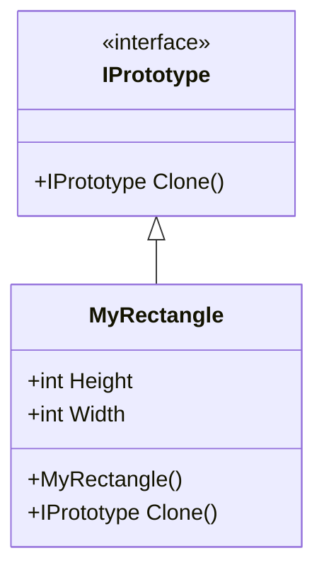

# Design Pattern - Prototype

## todo 農夫渡河

+ 使用原型執行個體指定創建的物件型別，並且透過複製來創建這些物件。
+ 提升複雜物件的創建。
+ 可與其他的創建模式結合。



+ IPrototype
  + 宣告一個自我複製的操作介面(此範例中為 Clone method)，讓Client 可以透過此呼叫複製執行個體。
  + 大部分是採interface 設計。
+ ConcretePrototype
  + 具體實作自我複製的操作介面(範例中的 MyRectangle)，藉以複製執行個體。
+ Client
  + 透過呼叫Clone method，產生新的執行個體。

## 自己實作 IPrototype 介面

<br/>自定義 IPrototype 介面
```csharp
public interface IPrototype
{
    IPrototype Clone();
}
```

<br/>MyRectangle 類別
```csharp
public class MyRectangle : IPrototype
{
    public int Height { get; set; }
    public int Width { get; set; }

    public IPrototype Clone()
    {
        MyRectangle o = new MyRectangle();
        o.Width = this.Width;
        o.Height = this.Height;
        return o;
    }
}
```

<br/>Client 端程式
```csharp
MyRectangle o1 = new MyRectangle();
o1.Height = 5;
o1.Width = 8;

var o2 = (MyRectangle)o1.Clone();
```

<br/>MyRectangle 類別，直接繼承 C# 提供的 ICloneable 類別，所以須實作 Clone 函式
```csharp
public class MyRectangle : ICloneable
{
    public int Height { get; set; }
    public int Width { get; set; }

    /// <summary>
    /// 這只是為了證明 MemberwiseClone 不會呼叫建構式
    /// </summary>
    public MyRectangle()
    {
        Console.WriteLine("呼叫建構式");
    }

    public object Clone()
    {
        return this.MemberwiseClone();
    }
}
```

<br/>Client 端程式
```csharp
MyRectangle o1 = new MyRectangle();
o1.Height = 5;
o1.Width = 8;

var o2 = (MyRectangle)o1.Clone();
```

## 淺層複製(Shallow Copy)
此為 C# 提供的函式的 MemberwiseClone 的實作內容，只會複製 Value Type 的 Property，如果該 Property 是 Reference Type，將不會被複製，只會複製參考而已，也就是，裡面物件也須實作 ICloneable
深層複製(Deep Copy)
Reference Type 的 Property 也會被複製一份

Deep Copy 作法
+ 每個物件皆實作 ICloneable
+ 序列化，某些物件無法被序列化
+ 反射

<br/>每個物件皆實作 ICloneable
<br/>Class1 類別，須實作 ICloneable
```csharp
public class MyClass1 : ICloneable
{
    public int X { get; set; }
    public int Y { get; set; }
    public object Clone()
    {
        return this.MemberwiseClone();
    }
}
```

<br/>Class2 類別，包含 Class1，在實作 ICloneable 中，須呼叫 Class1 的 Clone 函式，否則複製出來的 Class1 物件會指向原本的 Class1 物件
```csharp
public class MyClass2 : ICloneable
{
    public MyClass1 Data { get; set; }
    public string Id { get; set; }

    public MyClass2()
    {
        Data = new MyClass1();
    }

    public object Clone()
    {
        var result = (MyClass2)this.MemberwiseClone();

        //此處深入呼叫 Class1 的 Clone()
        //若是不處理 Data Property 的深層複製，就會出問題
        if (this.Data != null)
        {
            result.Data = (MyClass1)this.Data.Clone();
        }
        
        return result;
    }
}
```

<br/>Client 端程式
```csharp
MyClass2 o1 = new MyClass2();
o1.Data.X = 99;
var o2 = (MyClass2)o1.Clone();
Console.WriteLine("ReferenceEquals(o1.Data, o2.Data) = " + object.ReferenceEquals(o1.Data, o2.Data));
```

## JsonConver 序列化

<br/>要被複製的類別
```csharp
public class MyClass1
{
    public int X { get; set; }
    public int Y { get; set; }
}

public class MyClass2 : ICloneable
{
    public MyClass1 Data { get; set; }
    public string Id { get; set; }

    public MyClass2()
    {
        Data = new MyClass1();
    }

    public object Clone()
    {
        var json = JsonConvert.SerializeObject(this);
        return JsonConvert.DeserializeObject<MyClass2>(json);
    }
}
```

<br/>Client 端程式
```csharp
MyClass2 o1 = new MyClass2();
o1.Data.X = 888;

var o2 = (MyClass2)o1.Clone();

Console.WriteLine("ReferenceEquals(o1.Data, o2.Data) = " + object.ReferenceEquals(o1.Data, o2.Data));
```

## BinaryFormatter 序列化

<br/>Client 端程式
```csharp

```

## todo 全篇待整理