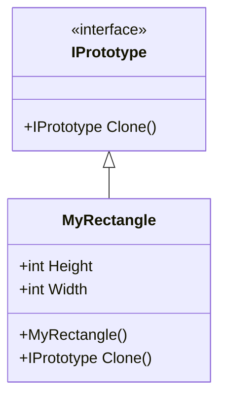
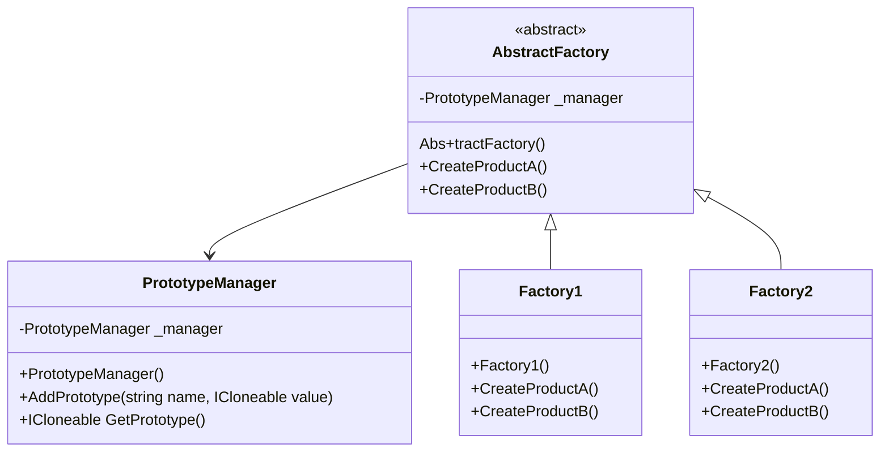

# Design Pattern - Prototype

## todo 農夫渡河

+ 使用原型執行個體指定創建的物件型別，並且透過複製來創建這些物件。
+ 提升複雜物件的創建。
+ 可與其他的創建模式結合。

## 類別圖


+ IPrototype
  + 宣告一個自我複製的操作介面(此範例中為 Clone method)，讓Client 可以透過此呼叫複製執行個體。
  + 大部分是採interface 設計。
+ ConcretePrototype
  + 具體實作自我複製的操作介面(範例中的 MyRectangle)，藉以複製執行個體。
+ Client
  + 透過呼叫Clone method，產生新的執行個體。

## 自己實作 IPrototype 介面

<br/>自定義 IPrototype 介面
```csharp
public interface IPrototype
{
    IPrototype Clone();
}
```

<br/>MyRectangle 類別
```csharp
public class MyRectangle : IPrototype
{
    public int Height { get; set; }
    public int Width { get; set; }

    public IPrototype Clone()
    {
        MyRectangle o = new MyRectangle();
        o.Width = this.Width;
        o.Height = this.Height;
        return o;
    }
}
```

<br/>Client 端程式
```csharp
MyRectangle o1 = new MyRectangle();
o1.Height = 5;
o1.Width = 8;

var o2 = (MyRectangle)o1.Clone();
```

## 善用 .Net Framework
+ ICloneable Interface
+ Object.MemberwiseClone Method
  + protected method
  + 建立物件的淺層複製
  + 會略過建構式
  + 深層複製的作法

### .Net 提供的 ICloneable 介面
MyRectangle 類別，直接繼承 C# 提供的 ICloneable 類別，所以須實作 Clone 函式
```csharp
public class MyRectangle : ICloneable
{
    public int Height { get; set; }
    public int Width { get; set; }

    /// <summary>
    /// 這只是為了證明 MemberwiseClone 不會呼叫建構式
    /// </summary>
    public MyRectangle()
    {
        Console.WriteLine("呼叫建構式");
    }

    public object Clone()
    {
        return this.MemberwiseClone();
    }
}
```

<br/>Client 端程式
```csharp
MyRectangle o1 = new MyRectangle();
o1.Height = 5;
o1.Width = 8;

var o2 = (MyRectangle)o1.Clone();
```

## 複製的作法有分淺層複製(Shallow Copy)和深層複製(Deep Copy)
Shallow Copy 只會複製 Value Type 的 Property，如果該 Property 是 Reference Type，將不會被複製，只會複製參考，也就是被複製出來的物件的 Reference Type 的 Property 跟原物件的相同 Reference Type 的 Property 會指向同一個參考。
<br/>Shallow Copy 可以用 C# 提供的函式的 MemberwiseClone 去達成，
<br/>Deep Copy 則是連所有的 Reference Type 的 Property 也會被複製一份，可以用以下做法：
+ 每個物件皆實作 ICloneable
+ 序列化，某些物件無法被序列化
+ 反射

### 每個物件皆實作 ICloneable
Class1 類別，須實作 ICloneable
```csharp
public class MyClass1 : ICloneable
{
    public int X { get; set; }
    public int Y { get; set; }

    public object Clone()
    {
        return this.MemberwiseClone();
    }
}
```

<br/>Class2 類別，包含 Class1，在實作 ICloneable 中，須呼叫 Class1 的 Clone 函式，否則複製出來的 Class1 物件會指向原本的 Class1 物件
```csharp
public class MyClass2 : ICloneable
{
    public MyClass1 Data { get; set; }
    public string Id { get; set; }

    public MyClass2()
    {
        Data = new MyClass1();
    }

    public object Clone()
    {
        var result = (MyClass2)this.MemberwiseClone();

        // 此處深入呼叫 Class1 的 Clone()
        // 若是不處理 Data Property 的深層複製，就會出問題
        if (this.Data != null)
        {
            result.Data = (MyClass1)this.Data.Clone();
        }
        
        return result;
    }
}
```

<br/>Client 端程式
```csharp
MyClass2 o1 = new MyClass2();
o1.Data.X = 99;
var o2 = (MyClass2)o1.Clone();

Console.WriteLine("ReferenceEquals(o1.Data, o2.Data) = " + object.ReferenceEquals(o1.Data, o2.Data));
```

### JsonConver 序列化

<br/>要被複製的類別
```csharp
public class MyClass1
{
    public int X { get; set; }
    public int Y { get; set; }
}

public class MyClass2 : ICloneable
{
    public MyClass1 Data { get; set; }
    public string Id { get; set; }

    public MyClass2()
    {
        Data = new MyClass1();
    }

    public object Clone()
    {
        var json = JsonConvert.SerializeObject(this);
        return JsonConvert.DeserializeObject<MyClass2>(json);
    }
}
```

<br/>Client 端程式
```csharp
MyClass2 o1 = new MyClass2();
o1.Data.X = 888;

var o2 = (MyClass2)o1.Clone();

Console.WriteLine("ReferenceEquals(o1.Data, o2.Data) = " + object.ReferenceEquals(o1.Data, o2.Data));
```

### BinaryFormatter 序列化

todo ...

### Prototype Manager

<br/>產品A 類別
```csharp
public abstract class AbstractProductA : ICloneable
{
    public virtual object Clone()
    {
        return this.MemberwiseClone();
    }
}

public class ProductA1 : AbstractProductA
{ }

public class ProductA2 : AbstractProductA
{ }
```

<br/>產品B 類別
```csharp
public abstract class AbstractProductB : ICloneable
{
    public virtual object Clone()
    {
        return this.MemberwiseClone();
    }
}

public class ProductB1 : AbstractProductB
{ }

public class ProductB2 : AbstractProductB
{ }
```

<br/>PrototypeManager 類別
```csharp
public class PrototypeManager
{
    private Dictionary<string, ICloneable> _objects;

    public PrototypeManager()
    {
        _objects = new Dictionary<string, ICloneable>();
    }

    public void AddPrototype(string name, ICloneable value)
    {
        if (_objects.ContainsKey(name) == false)
        {
            _objects.Add(name, value);
        }
    }

    public ICloneable GetPrototype(string name)
    {
        if (_objects.ContainsKey(name))
        {
            return (ICloneable)_objects[name].Clone();
        }
        throw new ArgumentOutOfRangeException();
    }
}
```

<br/>ProductsContext 類別
```csharp
public class ProductsContext
{
    private static PrototypeManager _manager;

    public static PrototypeManager Manager
    {
        get
        {
            if (_manager == null)
            {
                CreateManager();
            }
            return _manager;
        }
    }

    private static void CreateManager()
    {
        _manager = new PrototypeManager();
        _manager.AddPrototype("ProductA1", new ProductA1());
        _manager.AddPrototype("ProductA2", new ProductA2());
        _manager.AddPrototype("ProductB1", new ProductB1());
        _manager.AddPrototype("ProductB2", new ProductB2());
    }
}
```

<br/>Client 端程式
```csharp
var o = ProductsContext.Manager.GetPrototype("ProductA1");
Console.WriteLine(o.GetType().Name);
```

### Abstract Factory + Prototype Manager

#### 類別圖


<br/>工廠抽象類別
```csharp
public abstract class AbstractFactory
{
    protected PrototypeManager _manager;

    protected AbstractFactory()
    {
        _manager = new PrototypeManager();
        _manager.AddPrototype("ProductA1", new ProductA1());
        _manager.AddPrototype("ProductA2", new ProductA2());
        _manager.AddPrototype("ProductB1", new ProductB1());
        _manager.AddPrototype("ProductB2", new ProductA2());
    }

    public abstract AbstractProductA CreateProductA();
    public abstract AbstractProductB CreateProductB();
}
```

<br/>工廠一，產生同一族的產品 A 與 產品 B
```csharp
public class Factory1 : AbstractFactory
{
    public override AbstractProductA CreateProductA()
    {
        return (AbstractProductA)_manager.GetPrototype("ProductA1");
    }

    public override AbstractProductB CreateProductB()
    {
        return (AbstractProductB)_manager.GetPrototype("ProductB1");
    }
}
```

<br/>工廠二，產生同一族的產品 A 與 產品 B
```csharp
public class Factory2 : AbstractFactory
{
    public override AbstractProductA CreateProductA()
    {
        return (AbstractProductA)_manager.GetPrototype("ProductA2");
    }

    public override AbstractProductB CreateProductB()
    {
        return (AbstractProductB)_manager.GetPrototype("ProductB2");
    }
}
```

<br/>產品A 類別
```csharp
public abstract class AbstractProductA : ICloneable
{
    public virtual object Clone()
    {
        return this.MemberwiseClone();
    }
}

public class ProductA1 : AbstractProductA
{ }

public class ProductA2 : AbstractProductA
{ }
```

<br/>產品B 類別
```csharp
public abstract class AbstractProductB : ICloneable
{
    public virtual object Clone()
    {
        return this.MemberwiseClone();
    }
}

public class ProductB1 : AbstractProductB
{ }

public class ProductB2 : AbstractProductB
{ }
```

<br/>PrototypeManager 類別
```csharp
public class PrototypeManager
{
    private Dictionary<string, ICloneable> _objects;

    public PrototypeManager()
    {
        _objects = new Dictionary<string, ICloneable>();
    }

    public void AddPrototype(string name, ICloneable value)
    {
        if (_objects.ContainsKey(name) == false)
        {
            _objects.Add(name, value);
        }
    }

    public ICloneable GetPrototype(string name)
    {
        if (_objects.ContainsKey(name))
        {
            return (ICloneable)_objects[name].Clone();
        }
        throw new ArgumentOutOfRangeException();
    }
}
```

<br/>Client 端程式
```csharp
var factory = new Factory1();
var pa = factory.CreateProductA();
var pb = factory.CreateProductB();
Console.WriteLine(pa.GetType().Name);
Console.WriteLine(pb.GetType().Name);
```