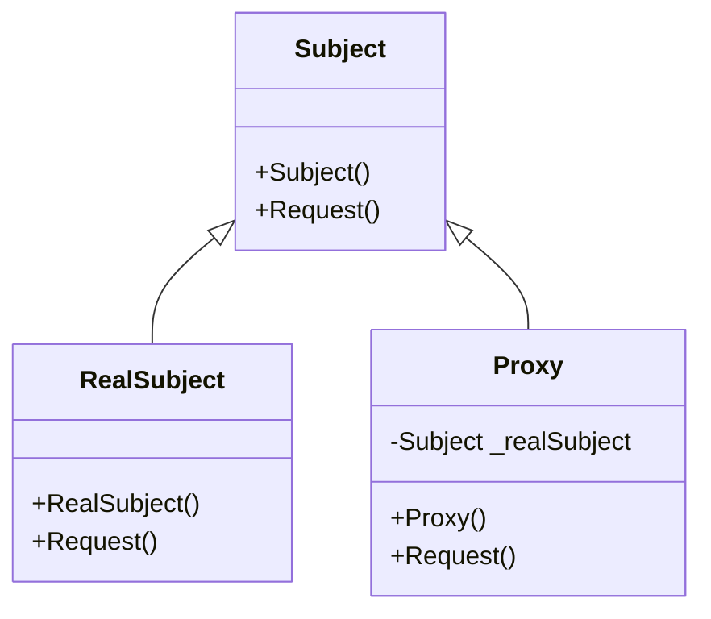

# Design Pattern - Proxy

```mermaid
classDiagram
class Subject {
    +Subject()
    +Request()
}

class RealSubject {
    +RealSubject()
    +Request()
}

class Proxy {
    -Subject _realSubject
    +Proxy()
    +Request()
}

Subject <|-- RealSubject
Subject <|-- Proxy
```